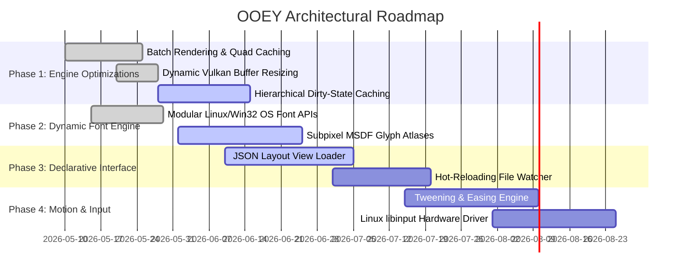

# 🎨 OOEY — Cross-Platform Modern C++20 UI Engine

[](https://en.cppreference.com/w/cpp/compiler_support/20)
[](#-multi-platform-windowing-backends)
[](#-quick-start)
[](#-running-tests)

> **OOEY** is a lightweight, highly decoupled, and reactive GUI framework designed in pure C++20. Engineered from the ground up to target everything from desktop windowing environments to bare-metal embedded framebuffers and browser canvas objects, OOEY separates platform mechanics from user-interface toolkit logic.

---

## 🌟 Key Features

### 🖥️ Decoupled Platform Windowing Backends
OOEY separates the OS event loop and surface creation from the UI logic. Platform windowing backends inherit from the `IWindowBackend` interface, allowing the engine to adapt effortlessly to any display server or environment:
*   **Linux Wayland (EGL):** Modern direct desktop rendering.
*   **Linux X11 (GLX):** Robust desktop rendering.
*   **Linux KMS/DRM Framebuffer:** Raw hardware rendering bypassing display servers for embedded/headless systems.
*   **Windows (Win32):** Native Win32 window handles.
*   **Emscripten (WebAssembly Canvas):** Compile once, run inside web browsers at full speed.

### ⚡ Multi-Target Graphics Pipeline
Visual components compile their visual definitions into standard `Geometry` streams (vertex/index data) instead of making raw graphics API calls. This enables switching render targets dynamically at runtime via `IRenderTarget`:
*   **Vulkan Renderer:** Modern, zero-allocation dynamic GPU buffers with optimized geometry quad-batching.
*   **OpenGL 3.3 / ES 2.0 Renderer:** Fast shader-based desktop and mobile hardware acceleration.
*   **Thread-Safe Software Rasterizer:** High-performance, pixel-level CPU renderer with lookup caches and bitwise-optimized alpha blending.

### 🧪 Pure MVVM-C Architecture
OOEY enforces a strict, opinionated Model-View-ViewModel-Controller layout:
*   **Model:** Raw data, operations, and platform status.
*   **ViewModel:** State holder exposing type-safe, reactive `Property<T>` objects.
*   **View:** Visual trees observing ViewModels. Changes synchronize instantly via RAII-based `ScopedSubscription` and `SubscriptionSink`, preventing memory leaks and object-lifetime issues.
*   **Controller:** Maps system pointer events, keyboard interactions, and custom drivers to view commands.

### 🔄 Flexbox-Style Layout Engine
No more absolute positioning coordinates. OOEY features a two-pass layout system (**Measure** and **Arrange**):
*   **Flex-based Containers:** Align items reactively with `Column`, `Row`, `Grid`, and `FlowLayout` controls.
*   **Sizing Anchors:** Define components using `MatchParent`, `WrapContent`, or explicit sizing rules that adapt dynamically to window resizing and screen rotation.

### 🔠 Modern Extensible Font Engine
Features a modular, dynamic text rasterization engine (`FontEngine` and `IFontBackend`):
*   **System Font Resolution:** Dynamically matches and rasterizes native system fonts (utilizing `Fontconfig` and `FreeType` on Linux, and OS APIs on Windows) via runtime dynamic symbol loading.
*   **Bitmap Fallback:** Includes a built-in bitmap fallback font ensuring the interface loads and displays text even if no system fonts or external font libraries are available.

### 🎨 Modular Styles & Themes
Decoupled style management allows the entire UI style to change on the fly.
*   **Dynamic Theme Manager:** Create custom color palettes (`dark`, `light`, `hacker`, `lofi`) and instantly repaint the visual tree without rebuilding the widget tree.

---

## 🏛️ Architectural Overview

```
                          +-------------------------+
                          |   Hardware / OS Input   |
                          | (Wayland, Win32, Mouse) |
                          +------------+------------+
                                       |
                                       v
                          +------------+------------+
                          |    InputProvider        |
                          +------------+------------+
                                       |
                                       v
                          +------------+------------+
                          |      Controller         |
                          +------------+------------+
                                       | (Triggers commands)
                                       v
+------------------+      +------------+------------+
|      Model       |<---->|     ViewModel (State)   |
| (Database, System|      | (Reactive Properties)   |
+------------------+      +------------+------------+
                                       |
                                       | (Subscribed UI Sync)
                                       v
                          +------------+------------+
                          |       View Tree         |
                          |   (Gooey Components)    |
                          +------------+------------+
                                       |
                                       | (Compiles primitives)
                                       v
                          +------------+------------+
                          |  Visual Geometry Stream |
                          +------------+------------+
                                       |
                                       v
                          +------------+------------+
                          |      IRenderTarget      |
                          | (Vulkan, GL, Software)  |
                          +-------------------------+
```

---

## 🛠️ Developer Code Example

Designing a reactive UI panel in OOEY is clean and expressive:

```cpp
#include "ooey/ooey.hpp"
#include "gooey/application.hpp"
#include "gooey/controls/column.hpp"
#include "gooey/controls/label.hpp"
#include "gooey/controls/button.hpp"

using namespace ooey;
using namespace gooey;
using namespace gooey::controls;

// 1. Define the state in a ViewModel
class CounterViewModel {
public:
    Property<std::string> display_text{"Clicks: 0"};
    Property<int> count{0};

    void increment() {
        count.set(count.get() + 1);
        display_text.set("Clicks: " + std::to_string(count.get()));
    }
};

// 2. Compose the View layout with reactive bindings
class CounterView : public Column {
private:
    std::shared_ptr<CounterViewModel> vm_;
    SubscriptionSink subscriptions_;

public:
    explicit CounterView(std::shared_ptr<CounterViewModel> vm) : vm_(vm) {
        set_width(SizePolicy::MatchParent);
        set_height(SizePolicy::MatchParent);
        set_padding(20);

        // Bindable dynamic label
        auto label = std::make_shared<Label>("Clicks: 0", Font{"sans-serif", 18});
        label->set_margin(0, 0, 0, 15);
        add_child(label);

        // Reactively synchronize the label when VM changes
        subscriptions_ += vm_->display_text.subscribe([label](const std::string& text) {
            label->set_text(text);
        });

        // Trigger VM command on button click
        auto button = std::make_shared<Button>(
            Rect{0, 0, 120, 40},
            Color{0, 120, 215},
            Color{0, 0, 0, 0},
            0.0f, 6, "Click Me!"
        );
        button->on_click([this]() { vm_->increment(); });
        add_child(button);
    }
};
```

---

## 🛸 Showcased Applications

The project comes packaged with interactive demos showcasing the engine's capabilities:

### 1. 📊 System Monitor Dashboard (`hello_sysinfo`)
A live hardware telemetry system reading CPU percentages, free/used memory statistics, active processes, and disk capacities.
*   **Reactive Flow Layouts:** Re-flows dashboard metrics dynamically into columns, rows, or grids based on window size.
*   **Theming Options:** Supports dynamically switching themes at the click of a button (`dark`, `light`, `hacker` green terminal, and `lofi` pastel hues).
*   **Source:** [examples/hello_sysinfo.cpp](file:///home/corey/code/ooey/examples/hello_sysinfo.cpp)

### 2. 🔠 System Font Matcher & Viewer (`hello_fonts`)
An interactive application listing all system-matched fonts dynamically loaded at runtime.
*   **Style Previews:** Displays font families in their actual stylings inside a scrollable list control.
*   **Dynamic Rendering:** Selecting a font updates a mockup text canvas instantly with custom rasterized glyphs.
*   **Source:** [examples/hello_fonts.cpp](file:///home/corey/code/ooey/examples/hello_fonts.cpp)

### 3. 🌀 Interactive MVVMC Layout (`hello_layout_mvvmc`)
Demonstrates responsive grids, cards, and input validation bindings under real-world usage scenarios.
*   **Source:** [examples/hello_layout_mvvmc.cpp](file:///home/corey/code/ooey/examples/hello_layout_mvvmc.cpp)

---

## 🕹️ Fun Use Cases & Vision

What can you build with OOEY?

*   📟 **Retro Cyber-Decks & IoT Displays:** Run high-performance, responsive interfaces directly on Raspberry Pi or BeagleBone consoles via Linux DRM/KMS bypasses, saving hundreds of megabytes of RAM by eliminating X11/Wayland.
*   🚗 **Automotive Head Units & Medical Dashboards:** Build rock-solid safety UI panels that adhere to strict zero-heap dynamic memory restrictions using OOEY's pre-allocated geometry cache buffers.
*   🎮 **Custom Portable Gaming Dashboards:** Create hardware-accelerated diagnostic HUDs and overlays using Vulkan render passes overlaying game outputs.
*   🌐 **Cross-Platform Single-Executable Utilities:** Standardize corporate tooling panels across Linux, Windows, and Web browsers, compiling a single lightweight native binary.

---

## 🗺️ Project Roadmap



1.  **Phase 1: Performance Foundation & Dirty-State Caching**
    *   Implement hierarchical dirty-flag geometry updates so only elements that alter states rebuild vertex caches.
    *   Enhance CPU software rasterizer scanline performance with SIMD-vectorized blitting.
2.  **Phase 2: High-Performance Fonts & Direct Embedded DRM**
    *   Transition system fonts into Multi-channel Signed Distance Fields (MSDF) textures for artifact-free scaling at 4K.
    *   Implement direct GPU rendering backends via EGL on Linux DRM/KMS to load completely headless.
3.  **Phase 3: Hot-Reloadable Markup (JSON) UI Engine**
    *   Introduce a layout compiler reading declarative JSON/XML interfaces.
    *   Implement a filesystem watcher in debug mode to swap UI structures in real-time without recompiling the application.
4.  **Phase 4: Smooth Animation Framework**
    *   Add a time-based interpolator directly to reactive `Property<T>` fields with easing transitions (Cubic, Bounce, Elastic).

---

## ⚡ Quick Start

### 📋 Prerequisites

To compile and run OOEY on Debian/Ubuntu/Fedora/ChromeOS, install the compiler toolchain, CMake, and developer headers for windowing:

```bash
# Debian / Ubuntu / Mint
sudo apt-get update
sudo apt-get install -y cmake build-essential libx11-dev libgl1-mesa-dev libglx-dev

# Fedora / RHEL
sudo dnf check-update
sudo dnf install -y cmake gcc-c++ libX11-devel mesa-libGL-devel
```

### ⚙️ Compiling the Project

Generate files and build out-of-source using CMake:

```bash
# 1. Generate build cache
cmake -B build -S .

# 2. Compile the libraries and example executables
cmake --build build -j$(nproc)
```

This compiles:
*   `build/ooey/libooey.a`: The platform and graphics core.
*   `build/gooey/libgooey.a`: The layout, widgets, and MVVM-C library.
*   `build/examples/*`: Interactive demo applications.

### 🚀 Running Demos

Run the hardware monitoring dashboard:
```bash
./build/examples/hello_sysinfo
```

Run the system font visualizer:
```bash
./build/examples/hello_fonts
```

### 🧪 Running Tests

Verify the engine by running the GoogleTest suite (39 tests checking bindings, properties, layouts, and math):
```bash
./build/tests/ooey_tests
```

---

## 📜 Coding Guidelines

Contributions to the codebase must follow the design standards defined in the project's [GEMINI.md](file:///home/corey/code/ooey/GEMINI.md) file:
*   **C++20 Rules:** No modules; stick to traditional header inclusions. Smart pointers over raw allocations.
*   **Explicit Move Semantics:** When taking ownership of pointers or callbacks, parameterize using rvalue references (`&&`).
*   **Naming Structure:** `PascalCase` for Classes/Structs; `snake_case` for methods/functions; `snake_case_` with a trailing underscore for private members.

---

*Formulated with passion for low-overhead, hardware-agnostic C++ visual design.*
