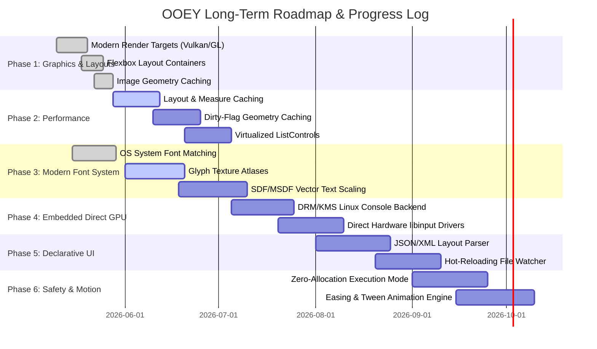

# Architectural Analysis & Technical Roadmap

**Date:** May 30, 2026

This document presents a comprehensive evaluation of the OOEY GUI Engine's architecture. It details what works well, documents the extensive features implemented so far, identifies critical performance/memory issues, and provides a clear technical roadmap for long-term project advancement.

---

## 1. What Works Well (Architectural Strengths)

The OOEY GUI Engine possesses several design decisions that align with modern graphical interface development. These elements provide a strong foundation for future expansion.

### A. Decoupled Platform and Rendering Abstractions
- **Structure:** The separation of `IWindowBackend` (window lifecycle, OS events) and `IRenderTarget` (canvas operations) is exceptionally clean.
- **Why it enables expansion:** This modularity permits the engine to support radically different windowing environments (X11, Wayland, raw Linux Framebuffer, Emscripten/WebAssembly) without altering the layout, widget tree, or application logic. Implementing a new platform backend requires implementing only these two core interfaces.

### B. Geometry-Based Retained Scene Graph
- **Structure:** Rendering primitives (e.g., `RectPrimitive`, `CirclePrimitive`, `SinusoidPrimitive`) do not invoke backend-specific APIs. Instead, they compile their visual layouts into a generic `Geometry` structure (containing vertex and index buffers) and submit them to `IRenderTarget::draw_geometry()`.
- **Why it enables expansion:** By restricting the rendering backend API surface to simple `Triangles` and `Lines` draw calls, target implementations remain small and maintainable. This architecture also makes it easy to swap immediate software rasterizers for hardware-accelerated GPU pipelines without changing a single line of widget code.

### C. Reactive MVVM-C Pipeline
- **Structure:** The Model-View-ViewModel-Controller (MVVM-C) implementation uses a reactive `Property<T>` template paired with `ScopedSubscription` lifecycle management.
- **Why it enables expansion:** State changes automatically flow to UI controls without requiring manual, error-prone event wiring. By using template-based subscription sinks, the architecture avoids memory leaks while keeping the API highly readable, expressive, and testable.

### D. Separation of Window Backends and UI Controls
- **Structure:** The framework is split into `ooey` (low-level driver layer) and `gooey` (high-level UI controls).
- **Why it enables expansion:** This separation allows the low-level platform code to be compiled independently. Embedded systems that do not need buttons, lists, or textboxes can link solely to the core `ooey` library, minimizing final binary footprints.

---

## 2. Completed Milestones & Current Progress

Since the initial architectural layout, several high-impact rendering, layout, and font capabilities have been successfully integrated:

### A. Modern Hardware-Accelerated Graphics Pipelines
*   **Vulkan Renderer (`VulkanRenderTarget`):** Implemented modern Vulkan 1.2 target. Features dynamic buffers with on-the-fly resizing to handle millions of vertices without buffer overflow segfaults.
*   **OpenGL ES 2.0 / 3.3 Target (`GlRenderTarget`):** Completed modern shader-based GL renderer, replacing legacy immediate-mode loops with optimized buffer mapping.
*   **Software Memory Rasterizer:** Optimizations for scanline filling, row pointers caching, and bitwise-exact alpha blending.

### B. Dynamic Font Resolution & Loading
*   **OS-Native Matching (`FontEngine` & `IFontBackend`):** Created a dynamic loader matching system-native `.ttf` and `.otf` fonts on Linux (using `Fontconfig` and `FreeType` symbols loaded at runtime) and Windows (GDI/DWrite integration), removing compile-time dependencies.
*   **Zero-Dependency Fallback:** Built-in standard bitmap font fallback to guarantee functional UI display even if system font directories are empty or missing.

### C. Flexbox-Style Layout Engine
*   **Two-Pass Resolution:** Introduced Measure (calculating widget constraints) and Arrange (solving absolute layout boundaries) passes.
*   **Flexible Alignments:** Added `Column`, `Row`, `Grid`, and `FlowLayout` container views matching CSS Flexbox specs, replacing static absolute coordinates with responsive designs.

### D. Rendering Optimizations
*   **Image Caching:** Cached downsampled image coordinate mappings, reducing dynamic heap allocations and batching image draw calls (a 3.3x speedup on Vulkan).
*   **Text Quad Batching:** Batched multiple glyph rendering arrays into a single GPU draw call per text string instead of spawning separate draw operations per character.

---

## 3. What is Still Missing (Framework Gaps)

To evolve OOEY into a highly competitive, production-ready framework, the following missing features need to be designed and implemented:

### A. Visual Tree Layout & Measure Caching
*   **The Issue:** Currently, `measure()` and `layout()` are executed recursively for the entire scene graph *on every frame* in the main application loop.
*   **The Solution:** Implement a layout caching system. Widgets should cache their measured dimensions. Layout recalculation should only occur when window dimensions change, items are added/removed, or a widget's text content is altered.

### B. Hierarchical Dirty-Flag Geometry Caching
*   **The Issue:** Scene graph primitives regenerate their geometry arrays and upload them to renderers every frame.
*   **The Solution:** Implement a hierarchical `dirty` flag system. Nodes only rebuild their geometry when visual properties (colors, positions, layout constraints) change. The renderer caches existing vertex/index handles and reuses them directly, saving PCIe bus bandwidth.

### C. True Glyph Texture Atlasing & SDF/MSDF Rendering
*   **The Issue:** Though fonts are matched dynamically, drawing text still uses a pixel-by-pixel draw callback loop for every character, translating into thousands of CPU iterations and coordinate push-backs per frame.
*   **The Solution:** Write a glyph texture atlas manager. Character bitmaps should be rasterized to a GPU texture once during startup or font load. Text rendering should be reduced to drawing a single combined quad stream mapped to texture coordinates (UVs). Upgrade to Multi-channel Signed Distance Fields (MSDF) to allow sharp, infinite scaling at all screen densities.

### D. Zero-Allocation Cycle Mode
*   **The Issue:** Safety-critical environments (automotive, medical) forbid heap allocations (`malloc`/`new`) in the active loop.
*   **The Solution:** Implement compile-time constraints or static pre-allocated memory pool backings for views and geometry streams, ensuring the rendering cycle runs fully allocation-free.

### E. Declarative UI Loader (JSON/XML) & Debug Hot-Reloading
*   **The Issue:** Developers must write raw C++ logic to compose and adjust layout structures.
*   **The Solution:** Build a layout parser reading JSON/XML view definitions mapping strings to UI factory constructors, coupled with a filesystem watcher in debug mode to swap UI trees at runtime without restarting.

### F. Tweening & Easing Animation Engine
*   **The Issue:** Component updates are instantaneous, with no native support for fluid motions.
*   **The Solution:** Attach time-based interpolators to reactive `Property<T>` properties with customizable easing curves (Bounce, Elastic, Cubic-Bezier).

---

## 4. Critical Performance, Memory & Lightweight Strategy

As applications scale in complexity (such as the `hello_sysinfo` dashboard), several performance and memory hot-spots must be managed:

### A. Footprint Analysis: Why the System Monitor Demo Uses ~100MB of RAM
During profiling of the `hello_sysinfo` application, memory usage rose to ~100MB of RSS. The following factors contribute to this memory footprint:
1.  **Graphics Driver & Compilation Contexts:** Loading Wayland, Vulkan, OpenGL, and X11 libraries dynamically introduces substantial runtime memory allocations. Specifically, the Mesa driver software fallback (LLVMpipe) allocates heavy internal heaps for compiler pipelines, command streams, and shader caches which immediately consume 60MB - 90MB of RAM.
2.  **Inefficient `/proc` Directory Crawling:** Every single second, the ViewModel polls `/proc` via `std::filesystem::directory_iterator`, opening `/proc/[pid]/comm` and `/proc/[pid]/status` for every active process. This creates hundreds of temporary file streams, allocates and resizes strings and vectors, and sorts lists, resulting in high heap allocation pressure and RSS bloat.
3.  **Pixel-by-Pixel Glyph Callback Overheads:** Because the font engine iterates every pixel of a glyph to trigger rasterization callbacks, drawing a 25-line list containing hundreds of characters generates millions of coordinate conversions, vertex calculations, and lambda allocations every second, causing severe cache thrashing and memory bloat.
4.  **No Event-Driven Idle Throttling:** The application runs the measure, layout, and raster loops at VSync (60Hz) or uncapped speed, even when visual data has not changed. Running CPU-heavy font drawing 60 times a second for metric values that update once a second consumes excessive CPU and RAM.

### B. Lightweight Remediation Strategy
To maintain OOEY's signature lightweight profile, implementations must address the following:
*   **Implement Virtualized Lists:** For large lists (like the system process list), only measure, layout, and draw the items currently visible within the scroll window, instead of instantiating widgets for thousands of items.
*   **Unify Polling & Telemetry:** In telemetry dashboards, decouple data-gathering threads from the UI rendering thread. Cache process metrics and read them in a non-allocating circular buffer.
*   **Throttled Idle Mode:** If the view state is idle (no pointer events, no animators active, no VM updates), pause rendering or drop the frame rate to 1 FPS to conserve power and memory.

---

## 5. Technical Roadmap & Milestone Phases

The sequential pathway to implementing the missing features while preserving OOEY's performance edge is organized into the following phases:

### Detailed Execution Tasks

#### Phase 1: Modern Graphics & Core Layouts (Completed)
- Implement modern `GlRenderTarget` and `VulkanRenderTarget`.
- Create `Measure` and `Arrange` passes with `Column`, `Row`, `Grid`, and `FlowLayout` controls.
- Integrate dynamic Linux/Win32 OS font matchers.

#### Phase 2: Rendering Performance & Layout Caching (Short-term)
- Write layout result caching in `gooey::View` to bypass layout trees on static frames.
- Add `dirty` states to scene graph nodes, skipping VBO data updates for clean elements.
- Implement virtual scrolling in `ListControl` to recycle visual slots, bypassing layout/drawing for non-visible rows.

#### Phase 3: Modern Font System (Short-term)
- Implement a static glyph texture atlas populated at startup or lazily during char matches.
- Replace pixel drawing callbacks with quad vertex/index buffer arrays mapped to texture UV coordinates.
- Incorporate MSDF generation pipelines for crisp text rendering.

#### Phase 4: Bare-Metal Console Deployment (Medium-term)
- Develop Linux DRM/KMS backend utilizing GBM (Generic Buffer Manager) and EGL contexts.
- Write direct event processing drivers reading `/dev/input/event*` devices, bypassing X11/Wayland.

#### Phase 5: Declarative Interfaces (Medium-term)
- Integrate JSON/XML serialization libraries.
- Match string tokens to component factories.
- Build filesystem event watcher to dynamically re-compile scene trees in-flight.

#### Phase 6: Safety Constraints & Animations (Long-term)
- Establish static memory pools, disabling dynamic memory expansion post-initialization.
- Add animation ticks to main loops, running cubic-bezier interpolations directly on bound `Property<T>` objects.

---

> [!NOTE]
> All developments must strictly adhere to the C++20 formatting, snake_case methods, and RAII pointer allocations defined in [coding-standards.md](file:///home/corey/code/ooey/docs/coding-standards.md) and [GEMINI.md](file:///home/corey/code/ooey/GEMINI.md).
