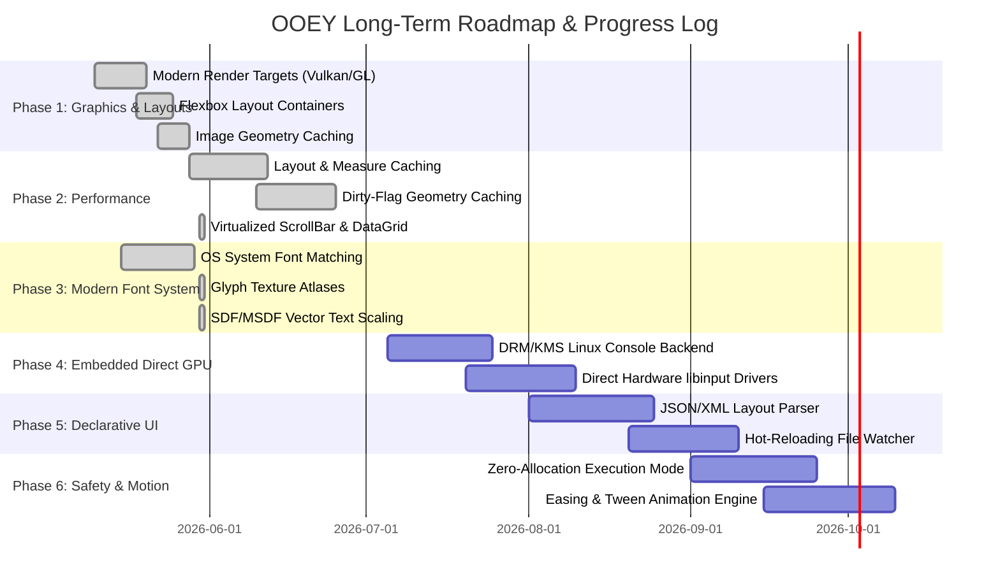

# Architectural Analysis & Technical Roadmap

**Date:** May 30, 2026

This document presents a comprehensive evaluation of the OOEY GUI Engine's architecture. It details what works well, documents the extensive features implemented so far, identifies critical performance/memory issues, and provides a clear technical roadmap for long-term project advancement.

---

## 1. What Works Well (Architectural Strengths)

The OOEY GUI Engine possesses several design decisions that align with modern graphical interface development. These elements provide a strong foundation for future expansion.

### A. Decoupled Platform and Rendering Abstractions
- **Structure:** The separation of `IWindowBackend` (window lifecycle, OS events) and `IRenderTarget` (canvas operations) is exceptionally clean.
- **Why it enables expansion:** This modularity permits the engine to support radically different windowing environments (X11, Wayland, raw Linux Framebuffer, Emscripten/WebAssembly) without altering the layout, widget tree, or application logic. Implementing a new platform backend requires implementing only these two core interfaces.

### B. Geometry-Based Retained Scene Graph
- **Structure:** Rendering primitives (e.g., `RectPrimitive`, `CirclePrimitive`, `SinusoidPrimitive`) do not invoke backend-specific APIs. Instead, they compile their visual layouts into a generic `Geometry` structure (containing vertex and index buffers) and submit them to `IRenderTarget::draw_geometry()`.
- **Why it enables expansion:** By restricting the rendering backend API surface to simple `Triangles` and `Lines` draw calls, target implementations remain small and maintainable. This architecture also makes it easy to swap immediate software rasterizers for hardware-accelerated GPU pipelines without changing a single line of widget code.

### C. Reactive MVVM-C Pipeline
- **Structure:** The Model-View-ViewModel-Controller (MVVM-C) implementation uses a reactive `Property<T>` template paired with `ScopedSubscription` lifecycle management.
- **Why it enables expansion:** State changes automatically flow to UI controls without requiring manual, error-prone event wiring. By using template-based subscription sinks, the architecture avoids memory leaks while keeping the API highly readable, expressive, and testable.

### D. Separation of Window Backends and UI Controls
- **Structure:** The framework is split into `ooey` (low-level driver layer) and `gooey` (high-level UI controls).
- **Why it enables expansion:** This separation allows the low-level platform code to be compiled independently. Embedded systems that do not need buttons, lists, or textboxes can link solely to the core `ooey` library, minimizing final binary footprints.

---

## 2. Completed Milestones & Current Progress

Since the initial architectural layout, several high-impact rendering, layout, and font capabilities have been successfully integrated:

### A. Modern Hardware-Accelerated Graphics Pipelines
*   **Vulkan Renderer (`VulkanRenderTarget`):** Implemented modern Vulkan 1.2 target. Features dynamic buffers with on-the-fly resizing to handle millions of vertices without buffer overflow segfaults.
*   **OpenGL ES 2.0 / 3.3 Target (`GlRenderTarget`):** Completed modern shader-based GL renderer, replacing legacy immediate-mode loops with optimized buffer mapping.
*   **Software Memory Rasterizer:** Optimizations for scanline filling, row pointers caching, and bitwise-exact alpha blending.

### B. Dynamic Font Resolution & Loading
*   **OS-Native Matching (`FontEngine` & `IFontBackend`):** Created a dynamic loader matching system-native `.ttf` and `.otf` fonts on Linux (using `Fontconfig` and `FreeType` symbols loaded at runtime) and Windows (GDI/DWrite integration), removing compile-time dependencies.
*   **Zero-Dependency Fallback:** Built-in standard bitmap font fallback to guarantee functional UI display even if system font directories are empty or missing.

### C. Flexbox-Style Layout Engine
*   **Two-Pass Resolution:** Introduced Measure (calculating widget constraints) and Arrange (solving absolute layout boundaries) passes.
*   **Flexible Alignments:** Added `Column`, `Row`, `Grid`, and `FlowLayout` container views matching CSS Flexbox specs, replacing static absolute coordinates with responsive designs.

### D. Rendering Optimizations
*   **Image Caching:** Cached downsampled image coordinate mappings, reducing dynamic heap allocations and batching image draw calls (a 3.3x speedup on Vulkan).
*   **Text Quad Batching:** Batched multiple glyph rendering arrays into a single GPU draw call per text string instead of spawning separate draw operations per character.

### E. Two-Pass Layout Caching & Invalidation
*   **Centralized View Wrappers:** Introduced non-virtual public `measure()` and `layout()` wrappers in `gooey::mvvmc::View` that check constraints and boundary dimensions against cached measurements before delegating to layout computations.
*   **Invalidation Bubble:** Added parent pointer tracking to dynamically bubble layout invalidation up the view hierarchy when children or text content is modified.
*   **Widget Migrations:** Ported all standard widgets (`Button`, `Label`, `TextBox`, `ListControl`, `Column`, `Row`, `Grid`, `FlowLayout`, and `ImageControl`) to override the layout/measure do-hooks and utilize the invalidation system.

### F. Hierarchical Dirty-Flag Geometry Caching
*   **Visual Primitive Caching:** Scene graph primitives cache compiled geometry vectors on the CPU, only rebuilding them when styling or layout properties change.
*   **Vulkan Persistent Cache Buffers:** Implemented persistent allocations of GPU vertex/index buffers keyed on shape addresses (`cache_key`), bypassing dynamic PCIe bus transfers. Included collision bypass detection for stack-reused addresses (temporary primitives) to ensure correct rendering.
*   **Epoch-Based Garbage Collection:** Unused cached GPU geometry buffers are automatically reaped after 300 unused frames.

### G. Custom Composed ScrollBar & Virtualized DataGrid Controls
*   **Custom ScrollBar Widget:** A composable, orientation-configurable control managing a drag-and-drop thumb with precise value-to-pixel mapping. Supports mouse-drag tracking, track-click page jumping, and dynamic styling from stylesheets.
*   **Virtualized DataGrid Control:** A high-performance grid driven by the reactive MVVM-C pattern. Calculates the visible rows in the viewport dynamically ($viewport\_height / row\_height$) and recycles existing text/background visual structures instead of instantiating new widgets. Integrates automatic dual scrollbars and applies clipping/culling to horizontal cell columns out of bounds.

### H. DPI-Aware Scaling System & High-Density Display Support
*   **Logical Pixels Abstraction:** Decoupled layout sizing, margins, padding, and font sizes from physical device coordinates by introducing a scale-independent logical coordinate space.
*   **Platform-Native Autodetection:** Implemented content scale factor query overrides across X11 (reading X resource database `Xft.dpi` and falling back to `GDK_SCALE`), Wayland (`GDK_SCALE`), Android (querying NDK asset manager configurations), and WebAssembly (retrieving browser device pixel ratios).
*   **Geometry Scaling Decorator:** Created the `ScaledRenderTarget` decorator to intercept drawing operations (rectangles, lines, text sizes, images) and scale coordinates on behalf of the underlying target.
*   **Input Rescaling:** Rescaled pointer inputs inside the `InputManager` to map incoming physical clicks/touches back to logical coordinates, ensuring hit-testing remains pixel-perfect.

### I. Android Native Activity & Vulkan Subclassing
*   **Pure C++ Application Loop:** Integrated `android_main.cpp` via NDK native-app-glue, hosting the application's standard entry point and mapping NativeActivity callbacks to window events.
*   **Linker Export Hooks:** Added compiler linker hooks to preserve and export the JNI entry point (`ANativeActivity_onCreate`) during static linker optimization, preventing startup crashes.
*   **Buffer Geometry Synchronization:** Enforced buffer synchronization by calling `ANativeWindow_setBuffersGeometry` on creation and size changes, locking screen buffer formats to `WINDOW_FORMAT_RGBA_8888` at logical resolutions.
*   **Subclassed Vulkan Pipeline:** Extracted software EGL locking structures from the base Android `WindowBackend` into virtual context hooks, implementing a hardware-accelerated `VulkanWindowBackend` subclass.

### J. Viewport Scrolling & Drag Interception
*   **`ScrollContainer` Layout Viewport:** Created a vertical scroll container that measures content heights using unconstrained boundaries, automatically loads scrollbars, and applies a dynamic `-scroll_offset_y` shift to layout bounds and input hit-test coordinates.
*   **Implicit Pointer Capture:** Modified input dispatch logic in `Controller` to lock subsequent `Moved` and `Released` events to the pressed widget, preventing scrollbar thumb tracking failures.
*   **Touch-Slop Swipe Interception:** Implemented scroll interception. If a user swipes vertically by $\ge 8$ logical pixels starting on any child widget (e.g. a button), the controller cancels the child press state and transfers pointer capture to the `ScrollContainer` to allow seamless scroll navigation.
*   **Unconstrained Sizing Fallback:** Resolved vertical layout infinite stretch loops by configuring `View::resolve_height` to automatically treat `MatchParent` height policies as wrap-content under unconstrained scrolling constraints ($\ge 50000$px).

### K. Responsive Mobile Reflow (`AdaptiveStack` & `FlowLayout`)
*   **Breakpoint Stack Container:** Built `AdaptiveStack` to transition between a horizontal `Row` and a vertical `Column` layout when the available constraint width drops below a breakpoint (default: 680px).
*   **Stretched Layouts:** Configured `AdaptiveStack` to automatically stretch fixed-width children horizontally to fill the display on narrow phone widths, ensuring full readability.
*   **Reflowing Flow Menus:** Integrated `FlowLayout` in the theme card to wrap buttons horizontally, automatically packaging them into a 2x2 grid on mobile screens while stacking as a column on desktop.

---

## 3. What is Still Missing (Framework Gaps)

To evolve OOEY into a highly competitive, production-ready framework, the following missing features need to be designed and implemented:

### A. Recursive Visual Clipping & GPU Scissoring [REMEDIATED/FULLY IMPLEMENTED]
*   **The Issue:** Elements inside the scrolling viewport are offset visually, but the framework performs no visual boundaries culling or scissor culling. Hidden rows, images, and labels scrolled out of bounds are still fully rasterized by the GPU/CPU targets, wasting draw cycles and bleeding into adjacent margins.
*   **The Solution:** Implement clipping rectangles in `IRenderTarget` using GPU hardware scissoring (`glScissor`/`vkCmdSetScissor`) or software row culling. Constrain rendering commands to the intersection bounds of the view's ancestor chain.
*   **Status:** Resolved. Extended `IRenderTarget` with a clipping stack (`push_clip`/`pop_clip`). Supported across EGL (`glScissor`), Vulkan (`vkCmdSetScissor` per draw call), and Software (pixel-exact rasterization bounds clamping). View boundaries support parent-constrained clipping via `clip_children`.

### B. Legal Accessibility (a11y) & Assistive Technology Trees
*   **The Issue:** OOEY has no support for screen readers, high-contrast descriptions, or semantic voice-overs. Operating a UI framework without accessibility trees violates ADA or European accessibility laws in standard enterprise markets.
*   **The Solution:** Build a parallel semantic tree mapping UI controls to accessible roles, properties, and values. Expose this tree to OS accessibility APIs (such as Linux AT-SPI D-Bus interfaces or Windows UI Automation).

### C. Enterprise Keyboard Focus Rings & Tab Traversal
*   **The Issue:** Keyboard focus is simple: the controller forwards input to a single active pointer. There is no concept of a focus ring, logical Tab/Shift-Tab order navigation, focus grouping, or focus ring visual outlines.
*   **The Solution:** Write a dedicated Focus Manager that binds view hierarchies to a double-linked focus loop, handles tab-key traversal events, and renders keyboard focus rings.

### D. Multi-Thread Safe UI Dispatcher (Concurrency Guarding)
*   **The Issue:** The framework operates under the assumption of a single-threaded execution context. Updating reactive ViewModel properties from background telemetry tasks immediately triggers layout invalidation and redraw calls on the worker thread, causing data races and memory crashes.
*   **The Solution:** Design a thread-safe UI dispatcher queue (similar to `runOnUiThread`). Queue background callbacks onto the main UI event thread for synchronized updates.

### E. Internationalization (i18n) & RTL Complex Text Shaping
*   **The Issue:** The font system assumes simple left-to-right (LTR) languages. It lacks complex text shaping or bidirectional layout mirroring, rendering it unusable for Arabic, Hebrew, or Indic scripts.
*   **The Solution:** Integrate standard shaping libraries (like HarfBuzz and FriBidi) into the font engine, and update the coordinate solver to support RTL mirroring when the layout flow changes.

### F. Zero-Allocation Cycle Mode
*   **The Issue:** Safety-critical environments (automotive, medical) forbid heap allocations (`malloc`/`new`) in the active loop.
*   **The Solution:** Implement compile-time constraints or static pre-allocated memory pool backings for views and geometry streams, ensuring the rendering cycle runs fully allocation-free.

### G. Declarative UI Loader (JSON/XML) & Debug Hot-Reloading
*   **The Issue:** Developers must write raw C++ logic to compose and adjust layout structures.
*   **The Solution:** Build a layout parser reading JSON/XML view definitions mapping strings to UI factory constructors, coupled with a filesystem watcher in debug mode to swap UI trees at runtime without restarting.

### H. Tweening & Easing Animation Engine
*   **The Issue:** Component updates are instantaneous, with no native support for fluid motions.
*   **The Solution:** Attach time-based interpolators to reactive `Property<T>` properties with customizable easing curves (Bounce, Elastic, Cubic-Bezier).

---

## 4. Critical Performance, Memory & Lightweight Strategy

As applications scale in complexity (such as the `hello_sysinfo` dashboard), several performance and memory hot-spots must be managed:

### A. Footprint Analysis: Why the System Monitor Demo Uses ~100MB of RAM
During profiling of the `hello_sysinfo` application, memory usage rose to ~100MB of RSS. The following factors contribute to this memory footprint:
1.  **Graphics Driver & Compilation Contexts:** Loading Wayland, Vulkan, OpenGL, and X11 libraries dynamically introduces substantial runtime memory allocations. Specifically, the Mesa driver software fallback (LLVMpipe) allocates heavy internal heaps for compiler pipelines, command streams, and shader caches which immediately consume 60MB - 90MB of RAM.
2.  **Inefficient `/proc` Directory Crawling (Remediated):** Previously, the ViewModel opened `/proc/[pid]/comm` and `/proc/[pid]/status` for every active process. This has been remediated by parsing the space-separated fields of `/proc/[pid]/stat` in a single read per process. utime, stime, PID, state, and VmRSS pages are extracted in a single pass, and terminated process entries are cleaned from the delta tracking cache, dramatically reducing heap allocation thrashing.
3.  **Pixel-by-Pixel Glyph Callback Overheads:** Because the font engine iterates every pixel of a glyph to trigger rasterization callbacks, drawing a 25-line list containing hundreds of characters generates millions of coordinate conversions, vertex calculations, and lambda allocations every second, causing severe cache thrashing and memory bloat.
4.  **No Event-Driven Idle Throttling (Remediated):** Previously, the application ran the measure, layout, and raster loops at VSync (60Hz) or uncapped speed, even when visual data had not changed. Running CPU-heavy font drawing 60 times a second for metric values that update once a second consumed excessive CPU and RAM. This has been remediated: the application loop checks layout dirty states, size alterations, and incoming pointer/keyboard/text input, skipping pipeline iterations and yielding CPU time via thread sleeping when idle.

### B. Lightweight Remediation Strategy
To maintain OOEY's signature lightweight profile, implementations must address the following:
*   **Implement Virtualized Lists:** For large lists (like the system process list), only measure, layout, and draw the items currently visible within the scroll window, instead of instantiating widgets for thousands of items.
*   **Unify Polling & Telemetry:** In telemetry dashboards, decouple data-gathering threads from the UI rendering thread. Cache process metrics and read them in a non-allocating circular buffer.
*   **Throttled Idle Mode (Implemented):** If the view state is idle (no window size modifications, no layout/text invalidations, and no explicit render requests), the engine pauses rendering and yields the execution thread using a 1ms sleep. This reduces idle CPU usage to ~0% on desktop platforms (even when moving the mouse across the window, as no redraw occurs unless a control state transition is triggered) while keeping the window responsive and completely eliminating VSync beat delays during user interactions. On WebAssembly (Emscripten) builds, rather than blocking the browser's single thread, the iteration callback returns immediately, allowing the browser's native `requestAnimationFrame` loop to schedule frames optimally.

---

## 5. Technical Roadmap & Milestone Phases

The sequential pathway to implementing the missing features while preserving OOEY's performance edge is organized into the following phases:

### Detailed Execution Tasks

#### Phase 1: Modern Graphics & Core Layouts (Completed)
- Implement modern `GlRenderTarget` and `VulkanRenderTarget`.
- Create `Measure` and `Arrange` passes with `Column`, `Row`, `Grid`, and `FlowLayout` controls.
- Integrate dynamic Linux/Win32 OS font matchers.

#### Phase 2: Rendering Performance & Layout Caching (Completed)
- Write layout result caching in `gooey::View` to bypass layout trees on static frames. (Done)
- Add `dirty` states to scene graph nodes, skipping VBO data updates for clean elements. (Done)
- Implement virtual scrolling in `DataGrid` and custom `ScrollBar` to recycle visual slots, bypassing layout/drawing for non-visible rows. (Done)
- Implement event-driven idle throttling via main loop yielding and dirty checks to minimize CPU usage when idle. (Done)

#### Phase 3: Modern Font System (Completed)
- Implement a static glyph texture atlas populated at startup or lazily during char matches. (Done)
- Replace pixel drawing callbacks with quad vertex/index buffer arrays mapped to texture UV coordinates. (Done)
- Incorporate MSDF/SDF generation pipelines for crisp text rendering. (Done)

#### Phase 4: Bare-Metal Console Deployment (Medium-term)
- Develop Linux DRM/KMS backend utilizing GBM (Generic Buffer Manager) and EGL contexts.
- Write direct event processing drivers reading `/dev/input/event*` devices, bypassing X11/Wayland.

#### Phase 5: Declarative Interfaces (Medium-term)
- Integrate JSON/XML serialization libraries.
- Match string tokens to component factories.
- Build filesystem event watcher to dynamically re-compile scene trees in-flight.

#### Phase 6: Safety Constraints & Animations (Long-term)
- Establish static memory pools, disabling dynamic memory expansion post-initialization.
- Add animation ticks to main loops, running cubic-bezier interpolations directly on bound `Property<T>` objects.

---

## 6. Industry Viability: Harsh Critiques & Hard Truths

To transition OOEY from a toy academic or hobbyist UI project into an enterprise-ready framework that developers in the automotive, medical, embedded, or desktop industries would trust in production, the framework must undergo major architectural shifts. Below is a realistic, direct critique of OOEY's current design deficiencies and what it will take to bridge the gap:

### A. The "Visual Clipping/Scissor Culling" Black Hole [REMEDIATED/FULLY SOLVED]
*   **The Critique:** Previously, `ScrollContainer` shifting visual offsets by `-scroll_offset_y` was a visual illusion. OOEY had no visual clipping or scissor bounds implemented recursively. If a button, table row, or label was scrolled off-screen, it was still fully rendered by the GPU/CPU backend, wasting draw cycles, breaking layout boundaries, and causing controls to bleed outside their parents.
*   **The Remedy:** Implemented a recursive, stack-based clipping system in `IRenderTarget` (`push_clip(const Rect&)`, `pop_clip()`) that computes nested clipping intersections:
    *   **Vulkan**: Attaches scissor boundaries to buffered `DrawCall` properties and records them dynamically via `vkCmdSetScissor`.
    *   **OpenGL**: Configures `glScissor` using inverted $y$-coordinates mapped to bottom-left screen origin.
    *   **Software**: Clamps rasterization limits to current clip boundary coordinates inside raw pixel, line, rect, triangle, image, and text drawing routines.
    *   **Decorators**: `ScaledRenderTarget` scales the clip rect by scale factors, and `ChromeRenderTarget` offsets the clip rect by border/title-bar offsets.
    *   **Views**: Supports optional child clipping (`clip_children`), enabled by default on `ScrollContainer` viewports.

### B. Severe Lack of Legal Accessibility Compliance (a11y)
*   **The Critique:** OOEY is completely blind and deaf. There is no support for screen readers, accessible focus ordering, high-contrast descriptions, or screen reader descriptions. In the modern software industry, shipping a UI framework without accessibility trees (like MSAA, UI Automation, or AT-SPI) is a legal liability (e.g., violating ADA or European accessibility mandates).
*   **The Remedy:** Build a parallel semantic tree mapping UI nodes to accessible roles, properties, and values. Expose this tree to OS accessibility APIs (such as Linux AT-SPI D-Bus interfaces or Windows UI Automation) and support standard keyboard focus indicators.

### C. A Primitive and Fragile Input & Focus Model
*   **The Critique:** Focus management is currently a single raw pointer stored on the `Controller` for text routing. There is no focus ring, no Tab/Shift-Tab focus traversal order, no focus grouping, and no keyboard shortcut hooks. Furthermore, the pointer input model lacks multi-touch gesture processing (pinch-to-zoom, rotate, multi-finger swipes) or standard click mechanics (double-click detection, long-press gestures).
*   **The Remedy:** Replace the raw focus pointer with a double-linked focus ring/focus group manager. Implement logical tab-index traversals. Write a structured gesture recognition state machine that processes raw pointer streams into complex touch gestures before they reach the control tree.

### D. Single-Threaded Rendering & Lack of Thread Safety
*   **The Critique:** OOEY's execution loop operates under the naive assumption that all operations happen on a single thread. If a background worker thread updates a VM property bound to the UI, it immediately triggers layout invalidation and redraw calls on the worker thread, causing data races, state corruption, or heap crashes. There is no thread dispatcher to safely queue updates back onto the main loop.
*   **The Remedy:** Implement a thread-safe UI dispatcher queue (similar to `dispatch_async` or `runOnUiThread`). All reactive property updates originating from background threads must serialize their callbacks and execute them exclusively on the main UI event thread.

### E. Missing Internationalization (i18n) & Right-to-Left (RTL) Layout Flow
*   **The Critique:** Text rendering assumes left-to-right (LTR) languages. OOEY lacks complex text shaping or bidirectional layout mirroring, rendering it unusable for Arabic, Hebrew, or Indic scripts. Without this, the framework is unusable in major global markets.
*   **The Remedy:** Integrate standard shaping libraries (like HarfBuzz and FriBidi) into the font engine, and update the coordinate solver to support RTL mirroring when the layout flow changes.

### F. No Packaging, Tooling, or Asset Compilation Pipeline
*   **The Critique:** Reading assets (like fonts or images) by searching relative local paths like `"assets/..."` is extremely fragile and fails once packaged as a standalone system binary.
*   **The Remedy:** Build a native asset compiler that packages images, fonts, and stylesheets into encrypted or compressed binary resource bundles, or embeds them directly as byte arrays in compiled headers.

### G. Hardcoded Layout Composition
*   **The Critique:** Developing UIs in OOEY requires writing procedural C++ code to instantiate rows, columns, and buttons. This slows down developer velocity and makes design collaboration impossible.
*   **The Remedy:** Build an XML/JSON layout parser and a declarative stylesheet language. Allow developers to define their interfaces in text files, and implement a directory watcher to reload UI structures on-the-fly (hot reloading) during development.

### H. Lack of Text Layout Reflow and Auto-Wrapping [REMEDIATED/FULLY SOLVED]
*   **The Critique:** Labels previously had no layout reflowing or auto-wrapping capabilities. If a label contained long sentences and the window was resized or run on narrow mobile viewports, the text would either spill over siblings (if absolute coordinates were used) or extend off-screen horizontally.
*   **The Remedy:** Implemented a target-aware wrapping algorithm in the `Label` control. When `TextOverflow::Wrapped` is selected, the control computes line breaks by segmenting character strings into space tokens and checking width constraints dynamically via `IRenderTarget::measure_text`. The height is scaled accordingly:
    $$H_{measured} = \text{line\_count} \times H_{line}$$
    Title, subtitle, and footnote labels inside the responsive `sysinfo` example have been updated to use `MatchParent` widths and `TextOverflow::Wrapped` overflow settings to reflow gracefully.

---

> [!NOTE]
> All developments must strictly adhere to the C++20 formatting, snake_case methods, and RAII pointer allocations defined in [coding-standards.md](file:///home/corey/code/ooey/docs/coding-standards.md) and [GEMINI.md](file:///home/corey/code/ooey/GEMINI.md).
