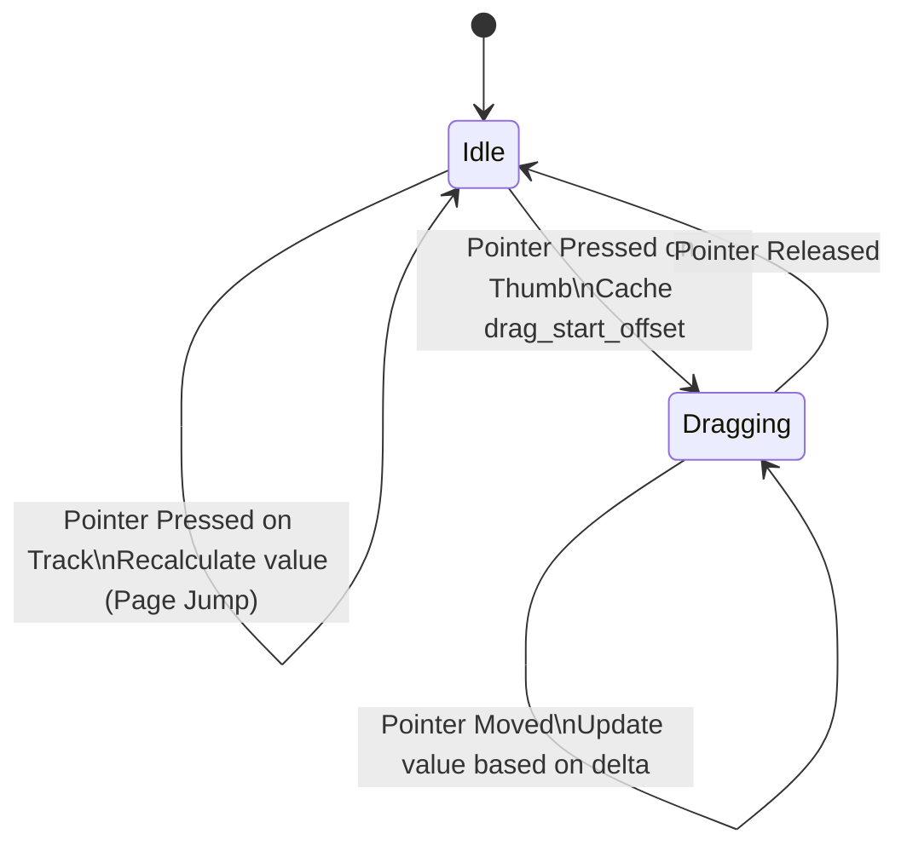

# DataGrid & ScrollBar Virtualization Design and Methodology

This document details the architectural methodology, mathematical formulas, state machine flows, style engine bindings, and performance profiling strategies behind the `ScrollBar` and `DataGrid` UI components.

---

## 1. Architectural Philosophy: Retained Mode Composed Controls

The OOEY GUI engine strictly mandates **retained mode rendering via scene-graph composition**, avoiding procedural drawing APIs (like canvas lines or pixel buffers) within widget classes. 

### Composable Design Pattern
The `ScrollBar` and `DataGrid` widgets are designed by combining existing low-level building blocks:
* **ScrollBar**: Composes a background track (`RectPrimitive`) and a slider handle (`RoundedRectPrimitive`).
* **DataGrid**: Composes a background plate (`RoundedRectPrimitive`), column division lines (`LinePrimitive`), column header text blocks (`TextPrimitive`), viewport cells (`RectPrimitive` backgrounds and `TextPrimitive` labels), and two sub-instances of `ScrollBar` (vertical and horizontal).

This composition model guarantees that when elements are placed or moved, the layout and geometry caching subsystems automatically track updates via bounding boxes without custom graphics code.

---

## 2. ScrollBar Mechanics: State Machine and Math

The `ScrollBar` maintains scrolling state across user input events.

### Value to Coordinate Mapping
Let:
* $V$ be the current scroll value ($V \in [\text{min\_val}, \text{max\_val}]$)
* $P$ be the page size (visible window size)
* $L_{\text{track}}$ be the total length of the scrollbar bounds (height for vertical, width for horizontal)

To prevent the scroll handle from moving past the end of the scrollable data, the value is clamped:
$$V_{\text{clamped}} = \max\left(\text{min\_val}, \min\left(V, \text{max\_val} - P\right)\right)$$

The visual length of the thumb ($L_{\text{thumb}}$) is proportional to the page visibility ratio:
$$L_{\text{thumb}} = \max\left(12, \min\left(L_{\text{track}}, \frac{L_{\text{track}} \times P}{\text{max\_val} - \text{min\_val}}\right)\right)$$

The visual starting coordinate of the thumb ($C_{\text{thumb}}$) is computed by mapping the clamped value linearly onto the scrollable track range:
$$\text{Range}_{\text{scrollable}} = L_{\text{track}} - L_{\text{thumb}}$$
$$\text{Ratio} = \frac{V_{\text{clamped}} - \text{min\_val}}{(\text{max\_val} - P) - \text{min\_val}}$$
$$C_{\text{thumb}} = \text{bounds.start} + \text{Ratio} \times \text{Range}_{\text{scrollable}}$$

```
+----------------------------------- L_track -----------------------------------+
|  track start                                                      track end   |
|  [===]=========================[=== THUMB ===]=========================[===]  |
|                                |<- L_thumb ->|                                |
|  |<-------- C_thumb ---------->|                                              |
+-------------------------------------------------------------------------------+
```

### Drag Input State Machine
The `ScrollBar` implements `IInteractive::on_pointer_event` as a state machine:



1. **Page Jump (Track Click)**: Clicking on the track outside the thumb recalculates the value to center the thumb under the click location:
   $$\text{click\_offset} = C_{\text{pointer}} - \text{bounds.start}$$
   $$\text{target\_ratio} = \frac{\text{click\_offset} - \frac{L_{\text{thumb}}}{2}}{\text{Range}_{\text{scrollable}}}$$
   $$V_{\text{new}} = \text{min\_val} + \text{target\_ratio} \times (\text{max\_val} - P - \text{min\_val})$$
2. **Thumb Dragging**:
   - On **Pressed** on the thumb, $\text{drag\_start\_offset} = C_{\text{pointer}} - C_{\text{thumb}}$ is saved.
   - On **Moved** during drag, the current coordinate is translated to a value:
     $$C_{\text{target}} = C_{\text{pointer}} - \text{bounds.start} - \text{drag\_start\_offset}$$
     $$\text{Ratio} = \text{clamp}\left(\frac{C_{\text{target}}}{\text{Range}_{\text{scrollable}}}, 0.0, 1.0\right)$$
     $$V_{\text{new}} = \text{min\_val} + \text{Ratio} \times (\text{max\_val} - P - \text{min\_val})$$
   - Updates trigger `on_value_changed` callbacks, which alert parent containers.

### 2.3 Collapsed Sizing and Rendering Culling

When a scrollbar is not needed by its parent viewport (e.g. inside `ScrollContainer` when content height fits the viewport, or `DataGrid` when row/column count fits constraints), the layout manager positions it using collapsed layout bounds:
$$\text{bounds}_{\text{collapsed}} = \text{Rect}\{0, 0, 0, 0\}$$

To prevent rendering artifacts:
1. **Early Draw Termination**: The `ScrollBar::draw` function checks bounds dimensions before initiating drawing recursion. If either dimension is collapsed, it returns immediately without drawing track or thumb primitives:
   ```cpp
   void ScrollBar::draw(ooey::IRenderTarget& target) const {
       if (bounds_.width <= 0 || bounds_.height <= 0) {
           return;
       }
       View::draw(target);
   }
   ```
2. **Min-Size Overrides Prevention**: Without this early check, because the control clamps thumb handles to a minimum of 12px for cursor visibility, track/thumb primitives would be computed with positive dimensions (e.g. `Rect{2, 0, 4, 12}`) and render at physical position `(0, 0)`.

---

## 3. DataGrid Viewport Virtualization

Datagrids frequently render thousands of records. Allocating scene graph nodes (views, labels, buttons) for all records immediately degrades frame times and increases memory overhead. `DataGrid` solves this via two-dimensional virtualization.

### Row Virtualization (Vertical Recycling)
Instead of instantiating layout nodes for every data row, the `DataGrid` allocates a fixed pool of UI primitives matching the viewport capacity:

Let:
* $H_{\text{grid}}$ be the grid bounding box height.
* $H_{\text{row}}$ be the height of a single row.
* $H_{\text{header}}$ be the header row height.
* $B_{\text{hscroll}}$ be the horizontal scrollbar height (12px if visible, 0px otherwise).

The capacity of visible rows ($N_{\text{rows}}$) is calculated as:
$$N_{\text{rows}} = \max\left(1, \frac{H_{\text{grid}} - H_{\text{header}} - B_{\text{hscroll}}}{H_{\text{row}}}\right)$$

```
+-------------------------------------------------------------+ --
| Header (PID, Name, CPU, RAM, State)                         |  | H_header
+-------------------------------------------------------------+ --
| Row Index: scroll_offset_y + 0                              |  |
+-------------------------------------------------------------+  |
| Row Index: scroll_offset_y + 1                              |  | N_rows * H_row
+-------------------------------------------------------------+  |
| Row Index: scroll_offset_y + 2                              |  |
+-------------------------------------------------------------+ --
| [======= Horizontal Scrollbar =======]                      |  | B_hscroll
+-------------------------------------------------------------+ --
```

* **Visual Recycler Pool**: The `DataGrid` instantiates a 2D vector of primitives `cell_texts_[N_rows][N_columns]`.
* **Zero-Allocation Scroll Updates**: When a vertical scroll event fires, `scroll_offset_y_` updates. The grid loops through the visible rows and calls `set_text` on the cached primitive labels:
  $$\text{cell\_texts\_}[r][c]\rightarrow\text{set\_text}(\text{data}[\text{scroll\_offset\_y\_} + r][c])$$
  Because the structural layout hierarchy remains unchanged, layout cached nodes are reused, avoiding CPU-heavy garbage collection and layout reflow steps.

### Column Culling (Horizontal Clipping)
To handle broad datasets with dozens of columns, the grid limits layout computations to the visible window:
Let:
* $X_{\text{col}}$ be the starting X position of a column relative to the grid origin.
* $W_{\text{col}}$ be the width of that column.
* $S_x$ be the current horizontal scroll offset.

The column coordinate relative to the screen is:
$$X_{\text{screen}} = X_{\text{col}} - S_x$$

A column is culled if it falls outside the viewport bounds:
$$\text{Cull}_{\text{col}} = \left(X_{\text{screen}} + W_{\text{col}} < X_{\text{grid}}\right) \lor \left(X_{\text{screen}} > X_{\text{grid}} + W_{\text{viewport}}\right)$$

If $\text{Cull}_{\text{col}}$ is true, the grid skips allocating or positioning cell backgrounds and texts for that column.

### Grid Divider Styling & Drawing Order (Z-Order Layout)

To avoid layout clipping and visual overlapping:
1. **Z-Order Drawing Hierarchy:** DataGrid child elements are cleared and added to the scene graph in a strict layering sequence:
   * **Level 1 (Lowest):** Main grid background (`bg_`) and header background (`header_bg_`).
   * **Level 2:** Cell backgrounds (`cell_bgs_`).
   * **Level 3:** Grid column and row separator lines (`column_dividers_` and `row_dividers_`). Drawing these on top of cell backgrounds prevents cell fills from overlapping and hiding the lines.
   * **Level 4:** Header separator and vertical dividers (`header_dividers_`).
   * **Level 5:** Text labels (`header_texts_` and `cell_texts_`), ensuring text is never obscured.
   * **Level 6 (Highest):** Scrollbars (`v_scroll_` and `h_scroll_`).
2. **Procedural Line Styles:** Separation lines support customizable style parameters (`LineStyle::Solid`, `LineStyle::Dashed`, and `LineStyle::Dotted`). If dashed or dotted styles are selected, `LinePrimitive` builds segmented vertex arrays in its geometry cache. This supports custom dashed/dotted patterns natively across all render backends (Software, OpenGL, and Vulkan) with a single draw call.
3. **Styling Parameters:** The following properties are exposed on the `DataGrid` and integrated with the MVVM-C theme style system:
   * `show_column_lines` / `show_row_lines` (Visibility toggles)
   * `column_line_thickness` / `row_line_thickness` (Widths in pixels)
   * `column_line_color` / `row_line_color` (Custom stroke colors)
   * `column_line_style` / `row_line_style` (Solid, Dashed, or Dotted enum settings)

---

## 4. MVVM-C Theming Integration

The system stylesheet engine applies style rules down the scene graph tree.

```
          ThemeManager
               |
         (Active Theme)
               |
         Root Layout View
               |
    +----------+----------+
    |                     |
DataGrid (Style: "list-box")
    |
    +--> ScrollBar (Style: "scrollbar") -> Track (fill_color), Thumb (stroke_color)
    +--> Cell Texts (text_color)
```

1. **Hierarchy Propagation**: When a theme updates, `View::set_theme_manager` propagates the manager to all child nodes, calling `apply_style` on elements that match style names.
2. **Dynamic Color Derivation**: To preserve visual readability across varied themes, `DataGrid` derives secondary colors and updates text colors dynamically from the theme style properties:
   * **Zebra Row Alternation**:
     $$\text{Color}_{\text{zebra}} = \text{Color}_{\text{base}} + \delta\quad(\delta = \{5, 5, 5\})$$
   * **Header Background Color**:
     $$\text{Color}_{\text{header}} = \text{Color}_{\text{base}} + \delta\quad(\delta = \{15, 15, 20\})$$
   * **Header & Row Text Colors**: The header text color (`header_text_color_`) and cell text colors are automatically assigned to match `Style::text_color`, guaranteeing readable contrast against the derived background plates across both light and dark themes.
3. **ScrollBar Styles Mapping**:
   * `ScrollBar::apply_style` maps the stylesheet properties directly:
     * $\text{Track Color} = \text{Style.fill\_color}$
     * $\text{Thumb Color} = \text{Style.stroke\_color}$

---

## 5. Telemetry Profiling & Optimization Strategy

During profiling of the `hello_sysinfo` dashboard, runtime memory bloat (~100MB RAM footprint) was analyzed and optimized.

### Bottleneck: File Stream Allocations in /proc
Previously, reading per-process state executed:
1. `std::filesystem::directory_iterator` sweep of `/proc`.
2. Opened `/proc/[pid]/comm` to get the binary name.
3. Opened `/proc/[pid]/status` to parse `State` and `VmRSS`.

This logic opened and closed up to 1,000 files every second. Each file stream open allocated internal buffers on the heap, triggering continuous page faults.

### Solution: Single-Pass stat Parsing
The optimized system monitoring loop opens only a single file per process: `/proc/[pid]/stat`.
This file exposes space-separated fields:
```
pid (filename) state ppid pgrp session tty_nr tpgid flags minflt cminflt majflt cmajflt utime stime ...
```
1. **Parentheses Extraction**: Since process names can contain spaces (e.g., `(sd-pam)`), the parser locates the first `(` and the last `)` characters to extract the process name.
2. **Position Indexing**: The remaining tokens are parsed using a single `std::stringstream`, extracting CPU ticks (`utime`, `stime`), process `state`, and `rss_pages` directly:
   $$\text{Memory}_{\text{bytes}} = \text{rss\_pages} \times 4096$$

### CPU % Calculation Math & Normalization
Process CPU utilization is calculated by tracking process tick deltas relative to real elapsed time:
$$\Delta\text{ticks} = \left(\text{utime}_{\text{new}} + \text{stime}_{\text{new}}\right) - \left(\text{utime}_{\text{old}} + \text{stime}_{\text{old}}\right)$$
$$\Delta\text{time}_{\text{seconds}} = t_{\text{new}} - t_{\text{old}}$$
$$\text{CPU}_{\text{unnormalized}} = \frac{\Delta\text{ticks} / \text{TicksPerSecond}}{\Delta\text{time}_{\text{seconds}}} \times 100.0$$

To ensure that the displayed CPU percentage never exceeds 100% (which can naturally happen for multi-threaded processes on multi-core systems), the value is normalized by the logical processor count and clamped:
$$\text{CPU}_{\text{normalized}} = \text{clamp}\left(\frac{\text{CPU}_{\text{unnormalized}}}{\text{std::thread::hardware\_concurrency()}}, 0.0, 100.0\right)$$

* $\text{TicksPerSecond}$ is fetched via OS configuration: `sysconf(_SC_CLK_TCK)` on Linux or $10^7$ ticks per second on Windows.

### Dynamic Cache Garbage Collection
To prevent stale process data from leaking memory over time, the tick tracking table `ticks_cache_` is scrubbed of dead keys at the end of each telemetry gathering pass. Any key in `ticks_cache_` not found in the active PID list is evicted.
