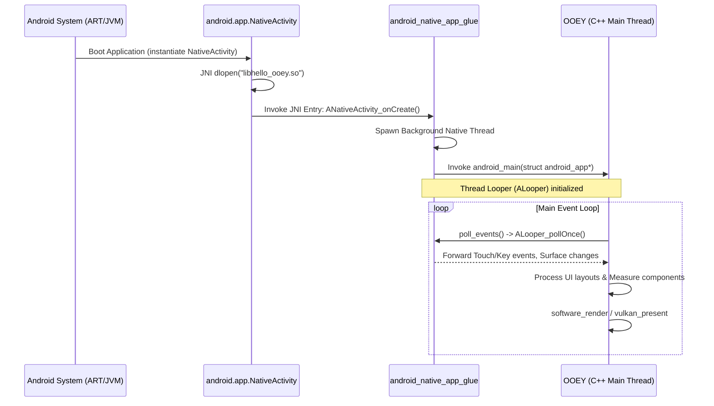

# OOEY Android Native Porting Guide (Pure C++ without Android Studio)

This document provides a comprehensive technical walkthrough explaining the architecture, lifecycle mechanics, build pipeline, and deployment steps for running pure C++ OOEY applications on Android without the overhead of Android Studio.

---

## 1. Under the Hood: C++ to Android Mechanics

Standard Android applications boot inside the Dalvik or ART Java Virtual Machine, invoking Java-based `Activity` classes. To build a C++ application that interacts directly with the screen and input without custom Java classes, OOEY uses the **Android NDK NativeActivity** model.

### Architectural Diagram



### The Three Core Layers

1. **Java Wrapper (`android.app.NativeActivity`)**: The Android OS instantiates this standard system class on boot. NativeActivity calls `System.loadLibrary()` to load our compiled shared library (`.so`), dynamically resolves the entry point `ANativeActivity_onCreate`, and hands over execution.
2. **NDK Glue Layer (`android_native_app_glue`)**: The NDK provides this static library. It intercepts standard Java-side lifecycle callbacks (window created/destroyed, focus lost/gained, touchscreen events) and pushes them into a thread-safe looper queue (`ALooper`). It spawns a dedicated native background thread for the C++ application, preventing the JVM UI thread from freezing.
3. **C++ Application (`android_main`)**: The native thread executes `android_main(struct android_app* state)`. Here, the application instantiates the window backend, configures callbacks, and enters the game-loop-style polling frame loop.

---

## 2. Compilation Mechanics & Toolchain

Android runs on diverse hardware platforms. Cross-compilation translates our C++20 code into target-specific assembly instructions.

### Target Architectures (ABIs)
When cross-compiling, you must choose the appropriate Application Binary Interface (ABI):
* **`arm64-v8a`**: Default for modern Android phones and tablets (64-bit ARM).
* **`armeabi-v7a`**: Older 32-bit ARM devices.
* **`x86_64`**: Android Emulators running on Intel/AMD desktop CPUs.

### The Toolchain File
CMake performs cross-compilation by utilizing the NDK toolchain file (`android.toolchain.cmake`). This file overrides standard compiler lookups, mapping compiler bindings to target Clang and linking tools provided in the NDK:

```bash
-DCMAKE_TOOLCHAIN_FILE=${ANDROID_NDK_HOME}/build/cmake/android.toolchain.cmake
```

### Key Compilation Flags Set by the Toolchain:
* **`-fPIC` (Position Independent Code)**: Mandatory for shared libraries. It allows the binary to be loaded anywhere in RAM.
* **`-std=c++20`**: Configures Clang to compile modern C++ features.
* **`--sysroot`**: Sets header and library search roots to NDK platform folders instead of host `/usr/include`.

---

## 3. Step-by-Step Compilation & Packaging Pipeline

Creating a deployable APK from C++ source files involves several discrete build tools. Below is an explanation of what each command does in the build process.

```
+------------------+     +-------------------+     +------------------+     +-----------------+
|   Compile C++    |     |  Package Assets   |     |    Align Zip     |     |   Sign Package  |
|  CMake + Compiler| --> |   aapt package    | --> |     zipalign     | --> |    apksigner    |
| (Creates .so)    |     | (Creates raw APK) |     |  (Aligns bytes)  |     | (Signs payload) |
+------------------+     +-------------------+     +------------------+     +-----------------+
```

### 1. Compile C++ Shared Library
Cross-compiles the source into a shared object library (`.so`) using CMake:
```bash
cmake -B build_android_arm64 -G Ninja \
      -DCMAKE_TOOLCHAIN_FILE=${ANDROID_NDK_HOME}/build/cmake/android.toolchain.cmake \
      -DANDROID_ABI=arm64-v8a \
      -DANDROID_PLATFORM=android-30
cmake --build build_android_arm64 --target hello_ooey
```

### 2. Package Assets and Binaries (`aapt`)
The **Android Asset Packaging Tool (`aapt`)** compiles resource layouts, XML declarations, and asset directories, compiling them into a single zip-like layout.
* The `-M` flag specifies the manifest file declaring the shared library to load.
* The `-I` flag includes `android.jar` (providing base system runtime bindings).
* The `-F` flag outputs the unaligned, unsigned base APK:
```bash
aapt package -f -M android_build/AndroidManifest.xml \
             -S android_build/res \
             -I ${ANDROID_HOME}/platforms/android-30/android.jar \
             -F build_android_arm64/app-unsigned.apk \
             build_android_arm64/apk
```

### 3. Byte Alignment (`zipalign`)
The Android OS runs apps directly out of the APK file to conserve RAM. **`zipalign`** is an archive alignment tool that ensures all uncompressed data (like fonts and images) starts on 4-byte boundaries:
```bash
zipalign -f 4 build_android_arm64/app-unsigned.apk build_android_arm64/app-aligned.apk
```
> [!IMPORTANT]
> Byte alignment allows the OS to map files directly via `mmap()` rather than copying them into RAM first, dramatically reducing memory usage on mobile devices.

### 4. Package Signing (`apksigner`)
Android requires all installed APKs to be cryptographically signed by a developer certificate. **`apksigner`** signs the aligned APK using v2 (APK Signature Scheme v2) and v3 signatures, protecting the integrity of the binary:
```bash
apksigner sign --keystore my-key.keystore \
               --ks-key-alias ooey_key \
               --out build_android_arm64/app.apk \
               build_android_arm64/app-aligned.apk
```

### 5. Deployment and Debugging (`adb`)
The **Android Debug Bridge (`adb`)** communicates with a connected device or emulator to upload the package, install it, and stream runtime logs:
```bash
# Install to device
adb install -r build_android_arm64/app.apk

# View log messages printed via NativeActivity
adb logcat -s OOEY_ANDROID:I
```

---

## 4. CMake Target Consolidation

Since examples must build as shared libraries on Android but executables on desktop platforms, OOEY defines the `add_ooey_executable` macro in the root `CMakeLists.txt`:

```cmake
# Helper function to define an executable or an Android shared library
function(add_ooey_executable name)
    if(ANDROID)
        add_library(${name} SHARED ${ARGN})
    else()
        add_executable(${name} ${ARGN})
    endif()
endfunction()
```

This abstracts target compilation type away from target definitions, meaning you can compile the entire examples folder on Android without changing any codebase files.

---

## 5. System Architecture Integrations

### Asset Loading via JNI
Traditional file systems use paths like `/home/user/image.png`. On Android, resources are packed inside the APK.
OOEY abstracts this via `ooey::read_asset()`:

```cpp
std::vector<uint8_t> read_asset(const std::string& path) {
#ifdef OOEY_BUILD_ANDROID
    if (android::g_asset_manager) {
        AAsset* asset = AAssetManager_open(android::g_asset_manager, path.c_str(), AASSET_MODE_BUFFER);
        if (asset) {
            size_t size = AAsset_getLength(asset);
            std::vector<uint8_t> buffer(size);
            AAsset_read(asset, buffer.data(), size);
            AAsset_close(asset);
            return buffer;
        }
    }
#endif
    // Desktop fallback...
}
```

### Optional Fontconfig Mode
Standard Linux rendering relies on Fontconfig for system TTF resolution. On Android, OOEY loads FreeType but bypasses Fontconfig initialization, mapping labels to Android's native scalable Roboto TTF font:
* `Regular`: `/system/fonts/Roboto-Regular.ttf`
* `Bold`: `/system/fonts/Roboto-Bold.ttf`

### Energy-Saving Event Polling
To avoid draining device battery, C++ event loops must not spin at 100% CPU when in the background. The `WindowBackend` checks the window state. When backgrounded or minimized, it uses a blocking `-1` timeout on the `ALooper` poll thread, going to sleep until the OS issues a resume or creation event.

### Window Buffer Format Synchronization
By default, the Android system may allocate `ANativeWindow` buffers in formats other than 32-bit RGBA (such as 16-bit RGB_565). To prevent memory access violations (`SIGSEGV` / `SEGV_ACCERR`) when copying standard 32-bit pixel buffers into the native window via raw pointer arithmetic in `memcpy`, the backend must explicitly configure the buffer geometry:
```cpp
ANativeWindow_setBuffersGeometry(native_window_, width_, height_, WINDOW_FORMAT_RGBA_8888);
```
This configuration must be updated during both window creation and window resize commands to keep the native window's buffer format in lockstep with the software rasterizer.

---

## 6. Project Manifest Configuration

Every APK requires a manifest declaring permissions, hardware requirements, and target modules.

### `AndroidManifest.xml` Template
```xml
<?xml version="1.0" encoding="utf-8"?>
<manifest xmlns:android="http://schemas.android.com/apk/res/android"
    package="com.ooey.app"
    android:versionCode="1"
    android:versionName="1.0">

    <uses-feature android:name="android.hardware.touchscreen" android:required="true" />

    <!-- Pure native activities require hasCode="false" (no Java bytecode) -->
    <application 
        android:label="OOEY App" 
        android:hasCode="false"
        android:theme="@android:style/Theme.NoTitleBar.Fullscreen">

        <!-- NativeActivity interceptor -->
        <activity android:name="android.app.NativeActivity"
            android:label="OOEY App"
            android:configChanges="orientation|screenSize|keyboardHidden"
            android:exported="true">
            
            <!-- Declares the C++ .so shared library name to load (sans lib prefix/suffix) -->
            <meta-data android:name="android.app.lib_name" android:value="hello_ooey" />
            
            <intent-filter>
                <action android:name="android.intent.action.MAIN" />
                <category android:name="android.intent.category.LAUNCHER" />
            </intent-filter>
        </activity>
    </application>
</manifest>
```

---

## 7. Command-Line Packaging Script (`build_apk.sh`)

Save this script as `build_apk.sh` in the project root to automate compiling, alignment, signing, and ADB installation.

```bash
#!/bin/bash
set -e

# Configuration (adjust paths to match your system)
ABI="arm64-v8a"
API_LEVEL="30"
BUILD_DIR="build_android_${ABI}"
APK_DIR="android_build"

if [ -z "$ANDROID_HOME" ] || [ -z "$ANDROID_NDK_HOME" ]; then
    echo "ERROR: Please export ANDROID_HOME and ANDROID_NDK_HOME env variables."
    exit 1
fi

echo "=== 1. Compiling Shared Library via NDK toolchain ==="
cmake -B ${BUILD_DIR} \
      -G Ninja \
      -DCMAKE_TOOLCHAIN_FILE=${ANDROID_NDK_HOME}/build/cmake/android.toolchain.cmake \
      -DANDROID_ABI=${ABI} \
      -DANDROID_PLATFORM=android-${API_LEVEL} \
      -DCMAKE_BUILD_TYPE=Release

cmake --build ${BUILD_DIR} --target hello_ooey

echo "=== 2. Structuring APK directory ==="
mkdir -p ${BUILD_DIR}/apk/lib/${ABI}
if [ -f "${BUILD_DIR}/examples/libhello_ooey.so" ]; then
    cp ${BUILD_DIR}/examples/libhello_ooey.so ${BUILD_DIR}/apk/lib/${ABI}/
else
    cp ${BUILD_DIR}/lib/libhello_ooey.so ${BUILD_DIR}/apk/lib/${ABI}/
fi

# Copy assets if any
if [ -d "assets" ]; then
    cp -r assets ${BUILD_DIR}/apk/
fi

echo "=== 3. Running aapt packaging ==="
aapt package -f -M ${APK_DIR}/AndroidManifest.xml \
             -S ${APK_DIR}/res \
             -I ${ANDROID_HOME}/platforms/android-${API_LEVEL}/android.jar \
             -F ${BUILD_DIR}/app-unsigned.apk \
             ${BUILD_DIR}/apk

echo "=== 4. Running zipalign (4-byte optimization) ==="
zipalign -f 4 ${BUILD_DIR}/app-unsigned.apk ${BUILD_DIR}/app-aligned.apk

echo "=== 5. Generating signing certificate (if missing) ==="
if [ ! -f my-key.keystore ]; then
    keytool -genkeypair -v \
            -keystore my-key.keystore \
            -alias ooey_key \
            -keyalg RSA \
            -keysize 2048 \
            -validity 10000 \
            -storepass password \
            -keypass password \
            -dname "CN=ooey, OU=dev, O=ooey, L=Earth, S=Universe, C=US"
fi

echo "=== 6. Signing APK package ==="
apksigner sign --ks my-key.keystore \
               --ks-key-alias ooey_key \
               --ks-pass pass:password \
               --key-pass pass:password \
               --out ${BUILD_DIR}/app.apk \
               ${BUILD_DIR}/app-aligned.apk


echo "=== 7. Build complete! ==="
echo "APK location: ${BUILD_DIR}/app.apk"

if [ "$1" == "--install" ]; then
    echo "=== 8. Deploying to active device ==="
    adb install -r ${BUILD_DIR}/app.apk
fi
```

---

## 8. Hardware-Accelerated Rendering via Vulkan

By default, OOEY uses hardware-accelerated rendering via Vulkan on Android. 

### Architecture
We subclass the Android `WindowBackend` class into `VulkanWindowBackend` to handle Vulkan initialization and surface mapping. This separation ensures the core event routing and input mapping are not cluttered with Vulkan APIs.

### Setup & Creation
1. **Instance Extensions**: The backend enables the `VK_KHR_surface` and `VK_KHR_android_surface` extensions on instance startup.
2. **Surface Binding**: When the native activity creates the window (`ANativeWindow*`), the backend binds it to a Vulkan surface:
   ```cpp
   VkAndroidSurfaceCreateInfoKHR create_info{};
   create_info.sType = VK_STRUCTURE_TYPE_ANDROID_SURFACE_CREATE_INFO_KHR;
   create_info.window = native_window_;
   vkCreateAndroidSurfaceKHR(instance_, &create_info, nullptr, &vk_surface_);
   ```
3. **Target Pipeline**: Re-creates a `VulkanRenderTarget` bound to the surface, which uses push constants to translate pixel coords into normalized device coordinates (NDC) dynamically in the shader.

### Runtime Controls & Overrides
You can choose the rendering backend or enable diagnostics at runtime using environment variables:
* **Backend Selection (`OOEY_ANDROID_BACKEND`)**:
  - `vulkan` (Default): Uses the `VulkanWindowBackend` hardware-accelerated pipeline.
  - `software`: Forces the app to bypass Vulkan and use CPU-based rasterization.
* **Validation Layers (`OOEY_VULKAN_VALIDATION`)**:
  - Set to `1` to query and enable `VK_LAYER_KHRONOS_validation` inside the Vulkan instance and device configurations (requires the Vulkan validation layers to be installed on the device).

### Graceful Fallback
If Vulkan initialization fails (e.g. because of driver incompatibilities or missing surface layers), the backend logs the error and dynamically toggles the `use_software_fallback_` flag. Subsequent frames are automatically routed to the CPU rasterizer, maintaining layout compliance and preventing application crashes.

