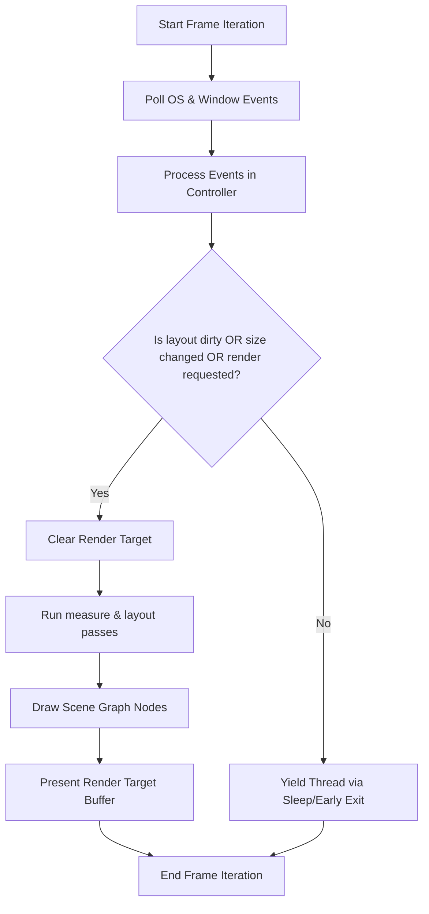

# Event-Driven Rendering & Idle Throttling

To minimize CPU usage, power consumption, and memory footprint while retaining maximum visual responsiveness during user interactions, the OOEY framework utilizes an event-driven main rendering loop coupled with adaptive throttling and telemetry deferral.

---

## 1. Architectural Strategy: Event-Driven Rendering

Historically, the rendering loop ran layout solvers and rasterization pipelines continuously (at VSync frequency or uncapped speed) regardless of whether the visual contents of the window had changed. Running CPU-heavy text drawing and vector graphics calculations repeatedly on static screens wasted hardware resources.

To solve this, the application loop checks three primary criteria to determine whether a render pass is required:

1.  **Layout Invalidation (`layout_dirty`)**: When view properties change (such as `set_text()` on a `Label` or scroll offsets in `ScrollContainer`), they invoke `invalidate_layout()`. This marks the view hierarchy as dirty by setting `is_layout_clean_ = false` and `is_measure_clean_ = false`. These dirty flags propagate recursively to the root view.
2.  **Dimension Modifications (`size_changed`)**: When the physical window size changes (e.g., due to user resize drag operations or DPI changes), the window reflows.
3.  **Explicit Invalidation (`needs_render_`)**: Explicitly requested rendering passes, such as the initial frame load or theme changes.

If none of these criteria are met, the rendering pipeline (buffer clearing, layout calculations, draw command dispatching, and graphics presentation) is skipped.



---

## 2. Idle Throttling and VSync Alignment

### The VSync Beating Problem
When no rendering is scheduled, the application yields its execution thread to avoid busy-waiting. Initially, a standard frame duration sleep of `16ms` was applied. 

However, sleeping for the full frame duration beats destructively against the hardware graphics card VSync interval (~16.6ms):
1.  During active pointer drags, the application renders a frame and calls `present()`, which blocks until the next hardware VSync tick (e.g., for 12ms).
2.  Upon returning, the next iteration is immediately entered. If no new events have arrived yet, `should_render` resolves to `false`, and a `16ms` sleep is triggered.
3.  During this 16ms sleep, the display's VSync deadline occurs and passes. The application is suspended, completely missing the frame refresh.
4.  Once awake, the application processes the pending input, renders, and calls `present()`, which must now wait another 16ms for the *next* VSync interval.
5.  This cuts the active frame rate in half (from 60 FPS to 30 FPS or lower), making scrolling and resizing feel extremely laggy and stuttery.

### The 1ms Yield Solution
To align with the display refresh cycle while minimizing CPU usage, the idle sleep duration is set to **`1ms`** on desktop targets. 
*   A `1ms` sleep successfully suspends the execution thread, yielding CPU time to the operating system scheduler and dropping idle core utilization to ~0%.
*   Waking up every `1ms` ensures that incoming OS events are polled at a high frequency. When a pointer drag or resize configuration event arrives, it is processed within a maximum of 1ms of latency.
*   The application renders on time for the upcoming VSync deadline, ensuring a fluid 60 FPS rendering cycle during interactions.

---

## 3. WebAssembly (Emscripten) Considerations

On WebAssembly (`__EMSCRIPTEN__`) targets, the browser manages frame scheduling asynchronously via `emscripten_set_main_loop_arg` (delegating to the browser's native `requestAnimationFrame` loop). 

Since the browser thread is single-threaded, calling `std::this_thread::sleep_for` blocks the browser's execution context, resulting in warnings and UI freezes. Therefore, WebAssembly builds skip the sleep instruction completely and return immediately on idle frames, letting the browser's native `requestAnimationFrame` loop to schedule frames optimally.

---

## 4. Active Interaction Telemetry Deferral and Background Dispatching

System monitoring dashboards (such as `hello_sysinfo`) perform periodic data updates (e.g., once per second). 

### The Problem: Synchronous UI Blocking
Gathering system telemetry involves crawling the `/proc` directory structure and parsing `/proc/[pid]/stat` for hundreds of running processes. This IO-bound crawling is synchronous and takes 50–100ms. If this telemetry scan fires on the main UI thread during an active user interaction, the main thread freezes, interrupting pointer drag inputs and causing the window resize loop to lock up.

### The Architectural Solution
To eliminate these stutters entirely while keeping code clean and platform-neutral:

1. **Background Threading**: All telemetry metric scans and `/proc` directory parsing are offloaded to an asynchronous background worker thread inside the `SystemMonitorViewModel`.
2. **Safe Main-Thread Dispatching**: The `Application` implements a thread-safe task queue. When the background thread finishes polling metrics, it marshals the final property updates to the main thread via `Application::get_instance()->dispatch(...)`.
3. **Interaction Deferral**: The background worker queries `Application::get_instance()->is_user_interacting()` and defers triggering new CPU-heavy telemetry collections during active user interactions.

```cpp
bool Application::is_user_interacting() const {
    // 1. User is holding mouse button down (dragging or scrolling)
    if (!input_manager_.get_active_pointers().empty()) {
        return true;
    }
    // 2. Cooldown period (1.5s) after the last window resize event
    auto now = std::chrono::steady_clock::now();
    auto elapsed = std::chrono::duration<float>(now - last_resize_time_).count();
    if (elapsed < 1.5f) {
        return true;
    }
    return false;
}
```

### Main-Thread Dispatcher Implementation

To marshal updates from the background thread to the UI rendering thread, the `Application` class manages a task queue protected by a mutex:

```cpp
// application.hpp
class Application {
public:
    static Application* get_instance();
    void dispatch(std::function<void()>&& task);
    ...
private:
    static Application* instance_;
    std::mutex dispatcher_mutex_;
    std::vector<std::function<void()>> dispatcher_tasks_;
};
```

During each frame iteration, before running any layout or rendering passes, the main thread drains and executes all dispatched tasks:

```cpp
// application.cpp
void Application::run_iteration() {
    if (!running_) {
        return;
    }

    std::vector<std::function<void()>> local_tasks;
    {
        std::lock_guard<std::mutex> lock(dispatcher_mutex_);
        local_tasks = std::move(dispatcher_tasks_);
    }
    for (auto& task : local_tasks) {
        if (task) {
            task();
        }
    }
    ...
}
```

In the `SystemMonitorViewModel`, the background thread executes the loop:

```cpp
void SystemMonitorViewModel::run_worker() {
    while (running_) {
        // Sleep in small 100ms intervals to respond quickly to shutdown requests
        for (int i = 0; i < 10 && running_; ++i) {
            std::this_thread::sleep_for(std::chrono::milliseconds(100));
        }
        if (!running_) break;

        // Skip gathering telemetry if user is actively interacting
        if (gooey::Application::get_instance() && gooey::Application::get_instance()->is_user_interacting()) {
            continue;
        }

        // ... Gather CPU, RAM, Disk, and Process List metrics in background ...

        // Safely marshal the property updates back to the main UI thread
        auto* app = gooey::Application::get_instance();
        if (app) {
            app->dispatch([this, cpu_str, ram_str, disk_str, rows = std::move(rows)]() mutable {
                this->cpu_text.set(std::move(cpu_str));
                this->cpu_desc.set(std::move(cpu_desc_str));
                this->ram_text.set(std::move(ram_str));
                this->ram_desc.set(std::move(ram_desc_str));
                this->disk_text.set(std::move(disk_str));
                this->disk_desc.set(std::move(disk_desc_str));
                this->process_rows.set(std::move(rows));
            });
        }
    }
}
```

This decoupled, multithreaded architecture keeps the UI rendering at a fluid 60 FPS under all conditions. Heavy telemetry calculations never run on the UI thread, and layout updates are queued synchronously and safely.

### Property Change Rendering Triggers

In addition to OS input events (which are processed in the controller and trigger redrawing via `had_input`), property changes in ViewModels represent state updates that must be reflected visually.

To ensure that setting a property (e.g. updating clock hands in `hello_clock_sinusoid` or transitioning between pages in `hello_wizard`) automatically schedules a redraw, the `Property::set` method calls the free function `gooey::request_render()`:

```cpp
// property.hpp
namespace gooey {
    void request_render();
}

template <typename T>
void Property<T>::set(T new_value) {
    value_ = std::move(new_value);
    notify();
    gooey::request_render();
}
```

This helper function retrieves the current `Application` instance and schedules a visual refresh pass:

```cpp
// application.cpp
void request_render() {
    if (Application::get_instance()) {
        Application::get_instance()->request_render();
    }
}
```

This clean abstraction bridges MVVM viewmodel state updates directly to the rendering loop without creating compile-time circular dependencies between the header files.

### Wayland Non-Blocking Event Starvation & Resolution

On Wayland targets (`ooey/src/platform/wayland/window_backend.cpp`), event polling behaves differently than on X11:
1. **The Issue**: A traditional Wayland client reads and dispatches events from the compositor socket inside the buffer presentation (`present()`) cycle when swapping buffers. When we transitioned to event-driven idle throttling (where the rendering loop sleeps during idle periods and does not call `present()`), no new events were read from the Wayland socket. Consequently, `poll_events()` only called `wl_display_dispatch_pending()`, which processed already-queued events but never pulled new mouse clicks, drags, key presses, or configuration events from the socket connection. This caused the application to immediately freeze upon going idle.
2. **The Remedy**: To solve this socket starvation without CPU busy-waiting, we updated `WindowBackend::poll_events()` to implement a robust, non-blocking Wayland socket polling loop using `<poll.h>` and Wayland's thread-safe display read API:

```cpp
bool WindowBackend::poll_events() {
    if (!display_ || should_close_) {
        return false;
    }

    // Flush outgoing requests to the compositor
    wl_display_flush(display_);

    // Dispatch any events already in the client-side queue
    wl_display_dispatch_pending(display_);

    // Read new events from the display socket without blocking
    int fd = wl_display_get_fd(display_);
    struct pollfd pfd;
    pfd.fd = fd;
    pfd.events = POLLIN;
    pfd.revents = 0;

    if (wl_display_prepare_read(display_) == 0) {
        // Non-blocking poll
        int ret = poll(&pfd, 1, 0);
        if (ret > 0 && (pfd.revents & POLLIN)) {
            if (wl_display_read_events(display_) < 0) {
                return false; // Error reading events
            }
        } else {
            wl_display_cancel_read(display_);
        }
    }

    // Dispatch any newly read events
    wl_display_dispatch_pending(display_);
    return true;
}
```

This ensures that incoming user gestures are pulled immediately from the OS socket even when the rendering loop is throttled, allowing the application to wake up, re-render, and remain fully interactive.
