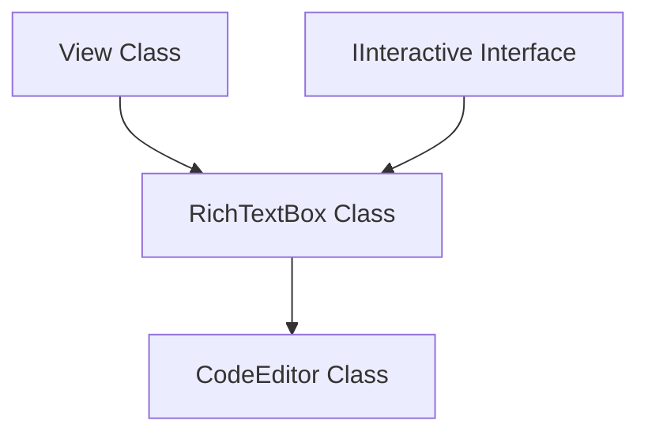

# Decoupled RichText Formatting & CodeEditor Architecture

This document details the architectural decisions, class hierarchies, formatting APIs, style-aware coordinate scaling, and rendering mechanics used to implement the general-purpose `RichTextBox` control, the derived `CodeEditor` control, and the `hello_notepad` application.

---

## 1. Decoupled Class Decoupling & Formatting API

To support a wide range of multiline text rendering and editing requirements, the text workspace is strictly split into a layout-and-formatting engine (`RichTextBox`) and a syntax-highlighting specialization (`CodeEditor`).



### RichTextBox base class
`RichTextBox` is a syntax-agnostic, general-purpose text editor control. It has absolutely zero knowledge of lexers, tokens, programming keywords, or syntax types. It manages carets, scrollbars, text selection, and keyboard/mouse edits. It exposes a public formatting API:

```cpp
struct TextFormat {
    Color color;
    FontWeight weight{FontWeight::Normal};
    FontStyle style{FontStyle::Normal};
    int size{0}; // 0 means default font size
};

struct FormatRange {
    int start_col{0};
    int end_col{0};
    TextFormat format;
};
```

#### Formatting API Endpoints:
* `clear_formats()`: Resets all text formatting to default.
* `clear_line_formats(int line_idx)`: Clears formatting of a specific line (invoked automatically during line editing).
* `apply_format(int line_idx, int start, int end, const TextFormat& format)`: Appends a styled run to a line.
* `set_line_formats(int line_idx, const std::vector<FormatRange>& formats)`: Sets formatting ranges for a line.

### CodeEditor Derived Class
`CodeEditor` is a specialized control that inherits from `RichTextBox`:
* Enforces `show_line_numbers = true`.
* Houses all tokenizer types (`TokenType`, `HighlightedToken`, `ISyntaxHighlighter`, `CppSyntaxHighlighter`).
* Automatically registers `CppSyntaxHighlighter` on construction.
* Overrides the virtual `update_formatting()` method called by `RichTextBox` whenever the text changes. Inside this override, the C++ lexer parses the modified lines, maps token types to colors/weights, and applies them to the parent text box using the formatting APIs.

---

## 2. Text Segment Splitting Algorithm

To render formatted text or measure boundaries, lines of text are dynamically split into styled runs. The `split_line_into_segments()` algorithm iterates through the active `FormatRange`s of a line, filling gaps with default styles:

```cpp
struct StyledSegment {
    std::string text;
    TextFormat format;
};

static std::vector<StyledSegment> split_line_into_segments(
    const std::string& line, 
    const std::vector<FormatRange>& formats, 
    const TextFormat& default_format) {
    
    std::vector<StyledSegment> segments;
    int current_col = 0;
    int line_len = static_cast<int>(line.size());

    // Sort formats to ensure sequential processing
    auto sorted_formats = formats;
    std::sort(sorted_formats.begin(), sorted_formats.end(), [](const FormatRange& a, const FormatRange& b) {
        return a.start_col < b.start_col;
    });

    for (const auto& run : sorted_formats) {
        int start = std::max(current_col, std::min(run.start_col, line_len));
        int end = std::max(start, std::min(run.end_col, line_len));

        if (start > current_col) {
            segments.push_back({line.substr(current_col, start - current_col), default_format});
        }
        if (end > start) {
            segments.push_back({line.substr(start, end - start), run.format});
        }
        current_col = end;
    }

    if (current_col < line_len) {
        segments.push_back({line.substr(current_col, line_len - current_col), default_format});
    }

    if (segments.empty()) {
        segments.push_back({"", default_format});
    }

    return segments;
}
```

---

## 3. Style-Aware Coordinate Mapping

A key problem with text formatting is that characters may have different styles, weights, or sizes, meaning character width varies. Measuring the width of a prefix string using a single default font leads to caret and selection positioning errors.

`RichTextBox` solves this by computing a style-aware X offset:

```cpp
int RichTextBox::get_column_x_offset(int line_idx, int col) const {
    if (line_idx < 0 || line_idx >= static_cast<int>(lines_.size())) return 0;
    const std::string& line = lines_[line_idx];
    const auto& formats = (line_idx < static_cast<int>(line_formats_.size())) ? line_formats_[line_idx] : std::vector<FormatRange>{};
    
    TextFormat default_fmt{default_text_color, FontWeight::Normal, FontStyle::Normal, font_.size};
    auto segments = split_line_into_segments(line, formats, default_fmt);
    
    int x_offset = 0;
    int current_col = 0;
    
    for (const auto& seg : segments) {
        int seg_len = static_cast<int>(seg.text.size());
        if (current_col + seg_len <= col) {
            Font font = font_;
            font.weight = seg.format.weight;
            font.style = seg.format.style;
            if (seg.format.size > 0) font.size = seg.format.size;
            x_offset += FontEngine::measure_text(seg.text, font).width;
            current_col += seg_len;
        } else {
            int prefix_len = col - current_col;
            if (prefix_len > 0) {
                Font font = font_;
                font.weight = seg.format.weight;
                font.style = seg.format.style;
                if (seg.format.size > 0) font.size = seg.format.size;
                x_offset += FontEngine::measure_text(seg.text.substr(0, prefix_len), font).width;
            }
            break;
        }
    }
    return x_offset;
}
```

This method is used during pointer event hit-testing, caret drawing, and selection highlights rendering, guaranteeing pixel-perfect mouse alignment.

---

## 4. Text Selection Engine

A good coding environment requires robust text selection using both keyboard navigation and mouse gestures.

### Mouse Selection & Dragging
The mouse selection follows a state machine tracking the `Pointer& e`:
1. **Pressed:** If the user clicks inside the text area, the style-aware offset maps the pixel coordinate to a text column. If Shift is not held down, the selection anchor is set to the current cursor position, clearing any prior selection.
2. **Moved:** If `dragging_selection_` is active, the cursor updates to the current mouse coordinate. If the cursor position differs from the anchor, `has_selection_` is set to `true`.
3. **Released:** Disables `dragging_selection_`.

---

## 5. High-Level Selection & Copy/Paste APIs

To support clipboard synchronization, `RichTextBox` exposes a pair of programmatic APIs:

### `get_selected_text()`
Returns the substring corresponding to the selected range. If the selection spans multiple lines, the method slices each line accordingly and joins them with newlines.

### `insert_text()`
Inserts new text at the cursor position, automatically overwriting/deleting any active selection first:
1. **Delete Selection:** If `has_selection_` is true, the selected ranges are erased from `lines_`. Spliced line fragments are merged, and the cursor is relocated to the selection start.
2. **Splice Input:** Split incoming text into individual lines and splice them into the document structure.
3. **Housekeeping:** Triggers `update_formatting()`, syncs the scrollbar, and invalidates layout.
