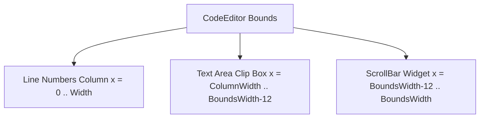

# RichText Code Editor & Syntax Highlighting Implementation

This document details the architectural decisions, data structures, state machine algorithms, and rendering mechanics used to implement the customizable `CodeEditor` control and the `hello_notepad` application.

---

## 1. Lexical Analysis & Extensible Highlighting Engine

A performant code editor must parse and highlight source code dynamically as the user types without stalling the UI thread. The framework achieves this by separating the text document representation from the lexer rules.

### Extensible Highlighter Interface
The `ISyntaxHighlighter` interface decouples syntax highlighting logic from the rendering widget. Custom highlighting systems (e.g., C++, HTML, Python) can be added simply by implementing the base class:

```cpp
struct HighlightedToken {
    std::string text;
    TokenType type;
};

class ISyntaxHighlighter {
public:
    virtual ~ISyntaxHighlighter() = default;
    virtual std::vector<HighlightedToken> highlight(const std::string& line, int start_state, int& out_end_state) = 0;
};
```

### State-Based Multiline Comment Lexing
Standard regex-based or line-local tokenizers fail when handling syntax structures that span multiple lines, such as C++ block comments (`/* ... */`). Re-lexing the entire file on every keypress is too expensive for large documents.

To resolve this, the highlighting engine implements **incremental state-based lexing**:
1. Every line `N` is associated with a cached `start_state` (stored in `line_start_states_[N]`), representing the lexer's state at the beginning of the line.
2. The tokenizer returns the tokens for line `N` and computes an `out_end_state` (e.g., `0` for normal, `1` for inside a multiline comment block).
3. The end state of line `N` becomes the cached `start_state` of line `N+1`.
4. When text changes, the editor updates the states sequentially:
   ```cpp
   void CodeEditor::update_line_states() {
       if (line_start_states_.size() != lines_.size()) {
           line_start_states_.resize(lines_.size(), 0);
       }
       int state = 0;
       for (size_t i = 0; i < lines_.size(); ++i) {
           line_start_states_[i] = state;
           int next_state = state;
           if (highlighter_) {
               highlighter_->highlight(lines_[i], state, next_state);
           }
           state = next_state;
       }
   }
   ```

### C++ Lexer Logic
The `CppSyntaxHighlighter` tokenizes input lines using a single-pass state machine parsing character by character:
* **String and Character Literals:** Handles escape sequences (e.g. `\"`, `\\`) inside string bounds `"` and `'` to prevent premature literal termination.
* **Preprocessor Directives:** Identifies words beginning with `#` (e.g., `#include`, `#define`) if they occur at the beginning of a statement.
* **Identifiers, Keywords, and Types:** Isolates alphanumeric blocks and verifies them against static `std::unordered_set<std::string>` lookups. Types (e.g. `int`, `double`, `std::string`) are colored distinctly from keywords (e.g. `if`, `return`, `class`).
* **Numbers:** Automatically lexes decimal, float, and hexadecimal numeric literals.

---

## 2. Caret Coordinate Space & Hit-Testing

Determining the exact cursor position when clicking the text or navigating with keys is critical.

### Clicking to Move the Caret
When the user clicks the text-editor bounds, we map the absolute screen pointer coordinate `(e.x, e.y)` to a logical document coordinate `(cursor_line_, cursor_col_)`:

1. **Resolve Line Index:**
   $$\text{clicked\_line} = \text{scroll\_line\_} + \frac{e.y - \text{text\_area\_y}}{\text{line\_height}}$$
   The line height is computed dynamically as the text character height plus a vertical margin offset (e.g., 4 logical pixels). The result is clamped between `0` and `lines_.size() - 1`.

2. **Resolve Column Index:**
   Since variable-width fonts are supported, we cannot simply divide the X offset by a fixed character width. Instead, we perform a **prefix distance optimization**:
   We iterate through all possible split columns in the selected line, measuring the width of the prefix string using the static font engine. The column index that yields the minimum distance to the click X position is selected:
   ```cpp
   int clicked_col = 0;
   int min_dist = 999999;
   for (size_t col = 0; col <= line.size(); ++col) {
       std::string prefix = line.substr(0, col);
       int char_x = text_area_x + FontEngine::measure_text(prefix, font_).width;
       int dist = std::abs(e.x - char_x);
       if (dist < min_dist) {
           min_dist = dist;
           clicked_col = col;
       }
   }
   ```

### Cursor Rendering
The caret is drawn as a thin vertical rectangle overlay at the pixel coordinates corresponding to the active character index. The X coordinate is calculated using the width of the substring up to the cursor:
$$\text{cursor\_x} = \text{text\_area\_x} + \text{FontEngine::measure\_text}(\text{line.substr}(0, \text{cursor\_col\_})).$$

---

## 3. Document Manipulation & State Machine

Editing lines of text requires updating the underlying vector of strings (`std::vector<std::string> lines_`) and handling edge cases cleanly.

### Text Insertion & Text Event Routing
Standard character insertions are captured by the platform's `TextEvent` (which pushes Unicode codepoints mapped to UTF-8 characters) rather than raw hardware keystrokes. Characters are spliced directly at the cursor offset:
```cpp
lines_[cursor_line_].insert(cursor_col_, text_to_insert);
cursor_col_ += text_to_insert.size();
```

### Deletion and Line Merging
Deleting text behaves differently based on caret position:
* **Backspace (within line bounds):** Erases the character at `cursor_col_ - 1` and decrements `cursor_col_`.
* **Backspace (at line start `cursor_col_ == 0`):** Slices the current line and appends it to the end of the preceding line. The line vector is shrunk, and the cursor moves to the splice index.
* **Delete (within line bounds):** Erases the character directly at the cursor (`cursor_col_`).
* **Delete (at line end):** Pulls the contents of the succeeding line `N+1` and merges it into the end of line `N`, removing line `N+1` from the document.

### Newline Split & Auto-Indentation
When Return/Enter is pressed:
1. The line is split into a prefix and suffix at `cursor_col_`.
2. The indentation prefix (spaces and tabs) of the current line is measured.
3. A new line containing `indentation + suffix` is inserted below.
4. The cursor updates to point to the start of the text on the new line: `cursor_col_ = indentation.size()`.

---

## 4. Viewport Composition & Focus Management

The `CodeEditor` implements custom viewport clipping, child scrollbar layouts, and focus tracking.



### Composition and Layout Routing
The `CodeEditor` inherits from `View` and manages a vertical `ScrollBar` child view.
During the layout pass (`do_layout`), the editor positions the scrollbar on the right margin (`12px` wide) and invokes its public `layout()` method to compute its internal coordinates:

```cpp
void CodeEditor::do_layout(Rect bounds) {
    bounds_ = bounds;
    View::do_layout(bounds);
    if (scrollbar_) {
        scrollbar_->layout(Rect{bounds.x + bounds.width - 12, bounds.y, 12, bounds.height});
    }
    sync_scrollbar();
}
```

### Caret Clipping and Scissor Rectangles
During rendering, drawing operations must not bleed out of the editor's text area (e.g., when scrolling horizontal text margins). The editor pushes the calculated text area bounding box onto the render target's clipping stack using `push_clip(text_area_bounds)` before rendering tokens/carets, popping it with `pop_clip()` when complete.

### Focused Element Validation
To prevent the blinking cursor or focus-outline from drawing when the user clicks elsewhere, the editor performs a type-safe focus lookup against the controller:
```cpp
bool is_focused = false;
if (Application::get_instance() && Application::get_instance()->get_controller()) {
    auto* controller = dynamic_cast<gooey::mvvmc::Controller*>(Application::get_instance()->get_controller());
    if (controller && controller->get_focused_element().get() == this) {
        is_focused = true;
    }
}
```

---

## 5. Notepad Application Architecture

The `hello_notepad` application combines layout controls, text inputs, buttons, and file streams into a fully functional text editor.

* **File Stream Integration:** Reads file contents using `std::ifstream` and populates the `CodeEditor` via `set_text()`, and writes modified text using `std::ofstream` back to the disk.
* **Component Composition:** Integrates a `TextBox` for filepath selection, a pair of `Button` elements for load/save commands, and the `CodeEditor` workspace inside a unified application window.
