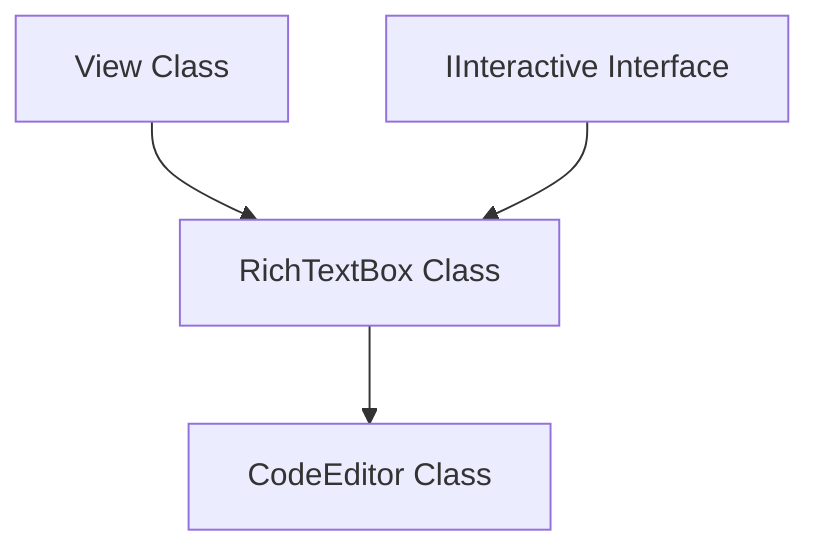

# RichText Code Editor & Syntax Highlighting Implementation

This document details the architectural decisions, class hierarchies, state machine algorithms, and rendering mechanics used to implement the general-purpose `RichTextBox` control, the derived `CodeEditor` control, and the `hello_notepad` application.

---

## 1. Class Hierarchy and Layout Flexibility

To support a wide range of multiline text rendering and editing requirements, the text workspace is divided into a general-purpose base class and specialized configurations.



### RichTextBox Base Class
`RichTextBox` is the core multiline text editor control that implements standard text layouts, caret tracking, text selection, vertical scrolling composition, and custom event handlers:
* **Focus Check:** Queries the active focused element from the `Controller` dynamically during draws to toggle blinking carets.
* **Line Number Toggling:** Includes a public `show_line_numbers` boolean. If set to `false`, the line-numbers column and divider lines collapse, shifting the text workspace dynamically.
* **Syntax Highlighter Slot:** Exposes a `set_syntax_highlighter()` slot allowing the user to supply custom parsing engines.

### CodeEditor Derived Class
`CodeEditor` is a specialized subclass configured for software development:
* Enforces `show_line_numbers = true`.
* Automatically attaches the `CppSyntaxHighlighter` on construction.

---

## 2. Text Selection Engine

A good coding environment requires robust text selection using both keyboard navigation and mouse gestures.

### Mouse Selection & Dragging
The mouse selection follows a state machine tracking the `PointerState`:
1. **Pressed:** If the user clicks inside the text area, the cursor updates. If Shift is not held down, the selection anchor is set to the current cursor position, clearing any prior selection:
   $$\text{anchor\_line\_} = \text{cursor\_line\_}, \quad \text{anchor\_col\_} = \text{cursor\_col\_}, \quad \text{has\_selection\_} = \text{false}$$
   Then, `dragging_selection_` is enabled.
2. **Moved:** If `dragging_selection_` is active, the cursor updates to the current mouse coordinate. If the cursor position differs from the anchor, `has_selection_` is set to `true`.
3. **Released:** Disables `dragging_selection_`.

### Keyboard Selection
The editor supports Shift key state tracking:
* Since `KeyEvent` does not natively store a modifier mask in the framework, `on_key_event` intercepts the Left/Right Shift keys (`0xFFE1` and `0xFFE2` keysyms) and stores their state in a `shift_pressed_` boolean.
* When executing navigation keys (Arrows, Home, End, PageUp/PageDown) while `shift_pressed_` is `true`, the selection anchor is initialized (if not already selecting) and the cursor moves to form the selection boundary.
* If navigation keys are pressed without Shift, the selection is cleared.

### Selection Coordinates Resolution
To draw selection highlights or retrieve selected text, selection boundaries are sorted sequentially so that the starting point is guaranteed to precede the ending point:

```cpp
void RichTextBox::get_selection_ordered(int& start_line, int& start_col, int& end_line, int& end_col) const {
    if (!has_selection_) {
        start_line = end_line = cursor_line_;
        start_col = end_col = cursor_col_;
        return;
    }
    if (anchor_line_ < cursor_line_) {
        start_line = anchor_line_; start_col = anchor_col_;
        end_line = cursor_line_; end_col = cursor_col_;
    } else if (anchor_line_ > cursor_line_) {
        start_line = cursor_line_; start_col = cursor_col_;
        end_line = anchor_line_; end_col = anchor_col_;
    } else {
        start_line = end_line = anchor_line_;
        start_col = std::min(anchor_col_, cursor_col_);
        end_col = std::max(anchor_col_, cursor_col_);
    }
}
```

---

## 3. High-Level Selection & Copy/Paste APIs

To support clipboard synchronization, `RichTextBox` exposes a pair of programmatic APIs:

### `get_selected_text()`
Returns the substring corresponding to the selected range. If the selection spans multiple lines, the method slices each line accordingly and joins them with newlines:
```cpp
std::string RichTextBox::get_selected_text() const {
    if (!has_selection_) return "";
    int start_line, start_col, end_line, end_col;
    get_selection_ordered(start_line, start_col, end_line, end_col);
    if (start_line == end_line) {
        return lines_[start_line].substr(start_col, end_col - start_col);
    }
    std::string result = lines_[start_line].substr(start_col) + "\n";
    for (int l = start_line + 1; l < end_line; ++l) {
        result += lines_[l] + "\n";
    }
    result += lines_[end_line].substr(0, end_col);
    return result;
}
```

### `insert_text()`
Inserts new text at the cursor position, automatically overwriting/deleting any active selection first:
1. **Delete Selection:** If `has_selection_` is true, the selected ranges are erased from `lines_`. Spliced line fragments are merged, and the cursor is relocated to the selection start.
2. **Splice Input:** Split incoming text into individual lines and splice them into the document structure.
3. **Housekeeping:** Triggers `update_line_states()`, syncs the scrollbar, and invalidates layout.

---

## 4. Notepad Application Layout & Copy/Paste Routing

In the `hello_notepad` example, these new APIs are linked directly to "Copy" and "Paste" commands:

```
+-----------------------------------------------------------------+
|  [ filepath input box ]  [Load]  [Save]  [Copy]  [Paste]         |
+-----------------------------------------------------------------+
|  1 | #include <iostream>                                       |
|  2 | int main() {                                               |
|  3 |     std::cout << "Hello!" << std::endl;                     |
|  4 | }                                                          |
+-----------------------------------------------------------------+
```

When **Copy** is clicked:
```cpp
copy_btn->on_click = [this]() {
    clipboard_ = code_editor_->get_selected_text();
};
```

When **Paste** is clicked:
```cpp
paste_btn->on_click = [this]() {
    if (!clipboard_.empty()) {
        code_editor_->insert_text(clipboard_);
    }
};
```

---

## 5. Rendering Selection Highlights

Selection ranges are highlighted dynamically during the text rendering pass. For each visible line `l`, if the line intersects the sorted selection bounds:
1. We determine the selected segment start and end columns for line `l`.
2. We measure the X coordinate of the prefix string (`prefix = line.substr(0, sel_col_start)`).
3. We measure the width of the selected string (`selected = line.substr(sel_col_start, sel_col_end - sel_col_start)`).
4. We draw a translucent blue highlight rectangle under the text token:

```cpp
int sel_x = text_area_x + target.measure_text(prefix, font_).width;
int sel_w = target.measure_text(selected, font_).width;
Rect highlight_rect{sel_x, current_y, sel_w, char_h};
draw_rect(highlight_rect, selection_color);
```
