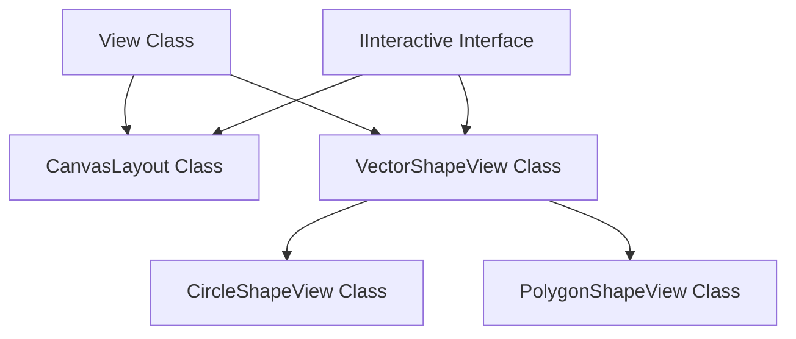

# Canvas Layout & Vector Paint Implementation

This document details the architectural decisions, class hierarchies, mathematical calculations, interaction state machines, and rendering mechanics used to implement the `CanvasLayout` container, the `VectorShapeView` controls, and the `hello_paint` vector drawing application.

---

## 1. Class Hierarchy and Layout Mechanics

The absolute vector layout system utilizes the existing `View` layout pass in the OOEY framework combined with a custom interactive container and shape views.



### CanvasLayout Class
`CanvasLayout` is a container control designed to hold absolutely positioned child views:
* **Event Interception:** Inherits from both `View` and `IInteractive`. If a click misses all shape children, `on_pointer_event` captures the pointer and forwards raw events via the `on_canvas_pointer` callback.
* **Layout bounds:** In `do_layout()`, it establishes its screen-space `layout_bounds`. When placing children with `is_absolute = true`, the base `View` automatically translates the child's relative `absolute_bounds` to screen space using the canvas offset and padding.

---

## 2. Interactive Vector Shapes Engine

All vector shapes derive from `VectorShapeView`, which manages selection states, interaction handles, and pointer events.

### Selection Box & Handles Rendering
When `is_selected_` is active, `VectorShapeView::draw()` renders a selection rectangle directly on top of the shape boundaries, along with four corner handles:

* **Selection Border:** Positioned exactly at `layout_bounds`.
* **Resize Handles:** Four `8x8` white squares with a blue outline positioned at:
  * **Top-Left (TL):** `(x - hs/2, y - hs/2)`
  * **Top-Right (TR):** `(x + w - hs/2, y - hs/2)`
  * **Bottom-Left (BL):** `(x - hs/2, y + h - hs/2)`
  * **Bottom-Right (BR):** `(x + w - hs/2, y + h - hs/2)`

### Interaction State Machine
When `on_pointer_event()` is called with `PointerState::Pressed`:
1. **Handle Hit Testing:** If the shape is selected, we check if the click intersects any of the four corner handles (using a expanded `12x12` bounding box for friendly touch target scaling). If matched, `interaction_mode_` is set to `Resizing` and `resize_handle_` is cached.
2. **Body Hit Testing:** If no handles are clicked, we run the virtual `hit_test(px, py)` method. If it succeeds, `interaction_mode_` becomes `Dragging` and the selection is activated.
3. **Tracking Delta:** The coordinate `(e.x, e.y)` is cached in `last_pointer_x_` / `last_pointer_y_` to calculate relative motion deltas.

```
+--[TL Handle]-----------------------[TR Handle]--+
|                                                 |
|                                                 |
|                   Shape Body                    |
|                (Drag to Move)                   |
|                                                 |
|                                                 |
+--[BL Handle]-----------------------[BR Handle]--+
```

When `PointerState::Moved` is received, we calculate the delta `dx = e.x - last_pointer_x_` and `dy = e.y - last_pointer_y_`:
* **Dragging:**
  $$\text{absolute\_bounds.x} \mathrel{+}= dx, \quad \text{absolute\_bounds.y} \mathrel{+}= dy$$
* **Resizing:**
  Bounds adjustment depends on which handle is active:
  * **TL (0):**
    $$\Delta x \mathrel{+}= dx, \ \Delta w \mathrel{-}= dx, \quad \Delta y \mathrel{+}= dy, \ \Delta h \mathrel{-}= dy$$
  * **TR (1):**
    $$\Delta w \mathrel{+}= dx, \quad \Delta y \mathrel{+}= dy, \ \Delta h \mathrel{-}= dy$$
  * **BL (2):**
    $$\Delta x \mathrel{+}= dx, \ \Delta w \mathrel{-}= dx, \quad \Delta h \mathrel{+}= dy$$
  * **BR (3):**
    $$\Delta w \mathrel{+}= dx, \quad \Delta h \mathrel{+}= dy$$
  
  We then enforce a minimum bounding box size of $15 \times 15$ pixels to prevent shape flipping or negative dimensions.

---

## 3. Shape Subclasses and Vertex Scaling

### `CircleShapeView`
* **Geometry:** Represented by a centered `CirclePrimitive`.
* **Hit-Test:** Checks if the point lies within the radius:
  $$(px - \text{cx})^2 + (py - \text{cy})^2 \le r^2$$
* **Resize Layout:** In `do_layout()`, the radius is calculated as:
  $$r = \frac{\min(\text{width}, \text{height})}{2}$$

### `PolygonShapeView`
* **Geometry:** Represented by a `PolygonPrimitive`.
* **Normalized Vertices:** To support layout-independent scaling, vertices are stored as normalized coordinates $(rx_i, ry_i) \in [0.0, 1.0]$ relative to the shape's initial bounding box:
  $$rx_i = \frac{x_i - \text{min\_x}}{\text{width}}, \quad ry_i = \frac{y_i - \text{min\_y}}{\text{height}}$$
* **Resizing Resolution:** In `do_layout()`, the vertices are scale-resolved back to screen space:
  $$\text{screen\_pt}_i = (\text{bounds.x} + rx_i \cdot \text{bounds.width}, \ \text{bounds.y} + ry_i \cdot \text{bounds.height})$$
* **Hit-Test:** Executes the classic ray-casting algorithm (even-odd rule) to check if a point lies within the polygon:

```cpp
bool is_point_in_polygon(Point p, const std::vector<Point>& poly) {
    int n = poly.size();
    bool inside = false;
    for (int i = 0, j = n - 1; i < n; j = i++) {
        if (((poly[i].y > p.y) != (poly[j].y > p.y)) &&
            (p.x < (poly[j].x - poly[i].x) * (p.y - poly[i].y) / (float)(poly[j].y - poly[i].y) + poly[i].x)) {
            inside = !inside;
        }
    }
    return inside;
}
```

---

## 4. Drawing Gestures and Tool State Machine

The drawing mode is governed by an active tool state machine (`PaintTool`):

### Draw Circle Tool
1. **Pressed:** Saves `start_point = (e.x, e.y)`, maps it to canvas-local coordinates, and creates a `CircleShapeView` with a radius of $2\text{px}$. Interaction on this shape is disabled (`set_interaction_enabled(false)`) so it does not capture subsequent dragging.
2. **Moved:** Calculates the distance between the cursor and `start_point` to derive the radius:
   $$r = \sqrt{dx^2 + dy^2}$$
   Adjusts the bounding box to:
   $$\text{absolute\_bounds} = (\text{cx} - r, \ \text{cy} - r, \ 2r, \ 2r)$$
3. **Released:** Finalizes the shape, enabling interaction and adding it to the canvas registry. If the radius is smaller than $5\text{px}$, it is discarded.

### Draw Polygon Tool
1. **Pressed:** Appends the clicked screen point to `temp_poly_points`. Appends a duplicate cursor point to represent the floating vertex. Creates/updates a semi-transparent `PolygonPrimitive` preview added directly to the canvas.
2. **Moved:** Modifies the last vertex of the preview to match the current cursor, showing a real-time guideline from the last clicked point to the mouse.
3. **Finalize (Finish Polygon / Enter Key):** Converts all screen coordinates to canvas-local coordinates, instantiates a permanent `PolygonShapeView`, cleans up the preview primitive, and registers the shape.

---

## 5. Paint Workspace Layout

The `hello_paint` executable constructs a clean, responsive workbench:
* **Root Container:** A `Row` holding the left sidebar and right drawing area.
* **Sidebar:** A `SidebarPanel` (220px fixed width Column) drawing a dark-grey card background (`Color{30, 30, 35}`). It houses tool switches, delete buttons, fill/stroke color palette buttons (arranged in grids), and stroke thickness controls.
* **Canvas Board:** A `CanvasContainer` expanding to match the rest of the window. It frames the interactive `CanvasLayout` in a sleek dark-slate boundary.
* **Status Bar:** Displays coordinates, selection details, and operation guides.
