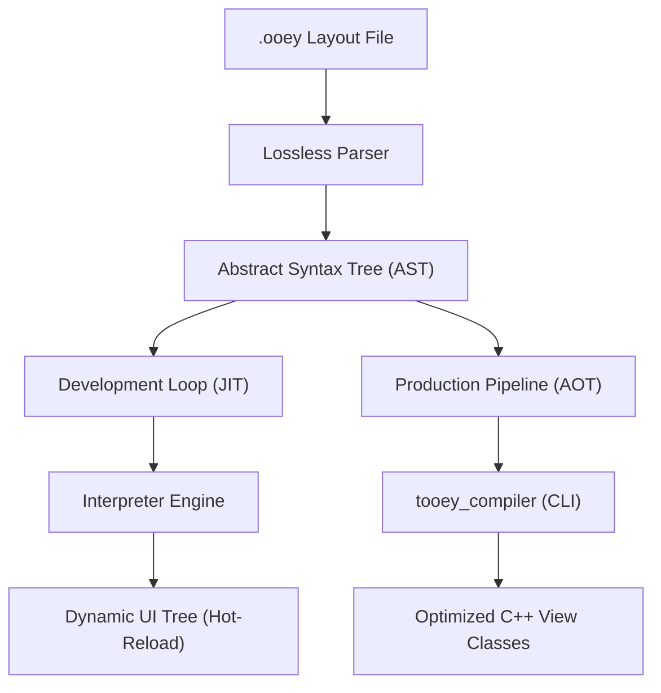

# The Ooey Layout System: Specification & Implementation Details

The Ooey Layout System is an AI-first, high-performance layout engine for a cross-platform C++ UI framework designed to satisfy three major requirements:
1. **Human Readability**: Zero visual boilerplate (no rigid closing tags, minimal XML/JSON noise).
2. **AI-First Blueprinting**: A predictable, indentation-based syntax that fits cleanly in LLM context windows.
3. **Hybrid Execution Pipeline**: Supports dynamic Just-In-Time (JIT) hot-reloading for development and Ahead-Of-Time (AOT) C++ code generation for production.

---

## 1. Core Architecture & Execution Pipeline



### A. The JIT (Just-In-Time) Developer Loop
A cross-platform file watcher monitors `.ooey` layout files. Upon saving, the engine reconstructs the UI tree. The view maintains separation from the ViewModel state, meaning that hot-reloaded views automatically re-subscribe to surviving data properties without resetting the application state.

### B. The AOT (Ahead-Of-Time) Production Pipeline
An offline command-line tool parses `.ooey` files during the build loop and generates optimized C++ `.hpp`/`.cpp` files. Direct, type-safe data bindings and event slots are generated to bypass reflection dictionaries and string hash lookups entirely.

---

## 2. Syntax & Language Blueprint

### Key Rules
- **Indentation Scoping**: Strict 4-space increments determine parent-child hierarchies instead of closing brackets or tags.
- **Colon Scoping (`:`)**: A trailing colon marks the start of a block of children or multiline property declarations.
- **Explicit Handle Prefixes**:
  - `@binding.variableName` $\rightarrow$ Connects to a reactive property in the C++ ViewModel.
  - `@signal.functionName` $\rightarrow$ Connects interactive event callbacks.
  - `@theme.tokenName` $\rightarrow$ References global styling tokens.
- **Native AI Nodes**: Layout blocks starting with `AI: "prompt"` are captured to guide generative sub-layouts.

### EBNF Grammar Specification
```ebnf
(* Structural Layout Primitives *)
Document            = { Line } ;
Line                = [ Indentation ] [ Element | AttributeAssignment | StyleBlock | ImportStatement | Comment ] NewLine ;
Indentation         = { " " } ; (* Enforce strict 4-space indentation increments *)

(* Node Declarations *)
Element             = Identifier [ IdAssignment ] [ PropertyInlineList ] [ BlockIndicator ] ;
IdAssignment        = "id=" Identifier ;
BlockIndicator      = ":" ;

(* Properties & Attributes *)
PropertyInlineList  = { PropertyInline } ;
PropertyInline      = Identifier "=" Value ;
AttributeAssignment = Identifier ":" Value ;

(* Property Values & Expressions *)
Value               = StringLiteral | NumericLiteral | BooleanLiteral | ArrayLiteral | TokenReference ;
TokenReference      = BindingRef | SignalRef | ThemeRef | ClassRef ;

BindingRef          = "@binding." Identifier ;
SignalRef           = "@signal." Identifier [ "(" [ StringLiteral ] ")" ] ;
ThemeRef            = "@theme." Identifier ;
ClassRef            = "." Identifier ;

ArrayLiteral        = "[" Value { "," Value } "]" ;
StringLiteral       = '"' { Character } '"' ;
NumericLiteral      = [ "-" ] Digit { Digit } [ "." Digit { Digit } ] [ "px" | "%" | "em" ] ;
BooleanLiteral      = "true" | "false" ;

(* Infrastructure Elements *)
ImportStatement     = "use" Identifier { "." Identifier } ;
Comment             = "//" { Character } ;
Identifier          = Letter { Letter | Digit | "_" | "-" } ;
```

---

## 3. Tokenizer and Parser Mechanics

### Tokenizer States
The lossless lexer scans character ranges to yield structural spans:
- `TOKEN_INDENT`: Scopes elements by depth.
- `TOKEN_USE`: Captures namespace imports.
- `TOKEN_ELEMENT`: Identifies capital-letter UI views (e.g. `VBox`, `Button`, `Label`).
- `TOKEN_ID_ASSIGN`: Explicit element name override (`id=foo`).
- `TOKEN_BINDING` & `TOKEN_SIGNAL`: Prefix-based ViewModel integration tokens.
- `TOKEN_AI_BLOCK`: Encapsulates AI developer prompts.

### Indentation-Based Stack Parser
The parser processes tokens line-by-line using an explicit indentation stack:
```python
def parse_ooey_stream(tokens):
    root = AstNode(type="Root")
    node_stack = [(root, -1)] # (NodePtr, IndentLevel)
    
    for line in tokens.split_lines():
        if line.is_empty_or_comment(): continue
        
        current_indent = line.get_indentation_spaces()
        parent_node, parent_indent = get_active_scope(node_stack, current_indent)
        
        if line.is_ai_block():
            parent_node.ai_hint = line.extract_string_payload()
            continue
            
        if line.is_attribute_assignment():
            key, val = line.parse_assignment()
            parent_node.properties[key] = val
        
        elif line.is_element_declaration():
            new_node = AstNode(type=line.element_type, id=line.id)
            new_node.properties.merge(line.parse_inline_properties())
            parent_node.children.append(new_node)
            
            if line.ends_with_colon():
                node_stack.append((new_node, current_indent))

def get_active_scope(stack, current_indent):
    while stack and stack[-1][1] >= current_indent:
        stack.pop()
    return stack[-1]
```

---

## 4. AST JSON Validation Schema

Every parsed layout compiles into an AST matching the following JSON schema target:

```json
{
  "$schema": "https://json-schema.org/draft/2020-12/schema",
  "title": "OoeyLayoutAST",
  "type": "object",
  "properties": {
    "nodeType": { "type": "string" },
    "id": { "type": "string" },
    "aiHint": { "type": "string" },
    "properties": {
      "type": "object",
      "additionalProperties": {
        "type": "object",
        "properties": {
          "type": { 
            "type": "string", 
            "enum": ["String", "Number", "Boolean", "Binding", "Signal", "Theme"] 
          },
          "rawData": { "type": "string" }
        },
        "required": ["type", "rawData"]
      }
    },
    "children": {
      "type": "array",
      "items": { "$ref": "#" }
    }
  },
  "required": ["nodeType", "properties", "children"]
}
```

### Mapping Blueprint Example
Given the source `Button id=btnSubmit text="Go" onClick=@signal.execute:`, the parser outputs:
```json
{
  "nodeType": "Button",
  "id": "btnSubmit",
  "aiHint": "",
  "properties": {
    "text": {
      "type": "String",
      "rawData": "Go"
    },
    "onClick": {
      "type": "Signal",
      "rawData": "execute"
    }
  },
  "children": []
}
```

---

## 5. Final Implementation Details (The Nitty-Gritty)

The C++ parser implementation is contained within the `tooey` static library target and incorporates several core mechanisms:

### A. Sibling Component Resolution (Cross-File Reference Checks)
To support file-based layout modularity and reuse, `Parser::parse()` accepts an optional directory path representing the source file's parent folder.
- The parser queries the file system using `std::filesystem::directory_iterator` to find all available `.ooey` files in that directory.
- Sibling filenames are registered as custom component types.
- When an element is matched to a custom component type (e.g. `FileMenu`):
  1. The AST node is marked as `isCustomComponent = true`.
  2. The custom component class name is registered into the AST root's `customIncludes` to automate dependency imports (`#include "FileMenu.hpp"`).
- During AOT generation, instantiation of custom components automatically deduces the ViewModel's sub-getter method using a CamelCase to snake_case naming converter. For example, `FileMenu` calls `viewModel->get_file_menu_view_model()`.

### B. Strongly-Typed Template Bindings (`operator<<=`)
To enable direct bindings with zero dynamic runtime lookups, the library implements compile-time SFINAE detection templates inside [binding.hpp](file:///home/corey/code/ooey/tooey/include/tooey/binding.hpp):
- Checks if the target UI control possesses `set_value()`, `set_text()`, or `set_label_text()` methods.
- Generates a static-typed binding:
  ```cpp
  template <typename Control, typename T>
  void operator<<=(std::shared_ptr<Control> control, gooey::mvvmc::Property<T>& property);
  ```
- Subscribes to the property and directly updates the control on changes. Non-string types are automatically converted to strings (e.g., via `std::to_string()`) when bound to text-based controls (like `Label`).

### C. Automated Two-Way Reactive Synchronization
Interactive UI elements (like `ScrollBar` or `TextBox`) require bidirectional state updates:
- **Data $\rightarrow$ UI (Forward Direction)**: Solved through `control <<= viewModel->property`.
- **UI $\rightarrow$ Data (Reverse Direction)**: Generated code automatically connects the widget's event field (e.g., `on_value_changed` or `on_text_changed`) to set the ViewModel property value:
  ```cpp
  textbox->on_text_changed = [viewModel](const std::string& val) {
      viewModel->textProperty.set(val);
  };
  ```

### D. Offline CLI compiler (`tooey_compiler`)
The offline generator compiles `.ooey` views directly during compile time:
- **Invocation**: `tooey_compiler <input_file.ooey> <output_dir> [class_name] [viewmodel_class]`
- Generates strongly-typed layout instantiation blocks, connection lambdas, and adds children to parent containers in C++ classes.
- Links statically with the main GUI application. All code bindings are resolved at build-time.

### E. Nested List Item Templates & View Composition
To render custom layouts, lists inside `.ooey` files can contain nested child scopes (indicated by indentation) that serve as visual templates. For example:
```
ListControl id=todoList items=@binding.taskList:
    Row id=itemRow height=40:
        CheckBox id=taskCheck checked=@binding.taskList.completed text=@binding.taskList.text
```
The AOT compiler parses the nested template elements and compiles them into a strongly-typed factory loop. The list control's item height is automatically derived from the layout template's root height property.

### F. SFINAE-based Direct Value Setting (`set_control_value`)
To assign item properties directly within the factory loop without establishing reactive bindings for every single cell (which would incur overhead), the compiler generates direct assignment calls wrapped in a compile-time helper:
```cpp
template <typename Control, typename T>
void set_control_value(std::shared_ptr<Control> control, const T& val);
```
This utility utilizes SFINAE type traits to dispatch to the appropriate control method (e.g. `set_checked`, `set_text`, `set_label_text`, or `set_value`) with built-in string conversion support.

### G. Leak-Free Weak Pointer Lifetime Management
In lists where templates generate custom sub-controls and interactive signals, lambda captures are strictly managed to prevent memory leaks and circular reference chains:
1. **Control Capture**: The container control is captured as a `std::weak_ptr` inside the collection's data-bind lambda, locking only when setting new item views.
2. **ViewModel Capture**: Event callbacks inside row items capture a weak reference to the view model (`weak_viewModel`), ensuring that visual elements do not keep view models alive if the view hierarchy is destroyed.
3. **Item Update Propagation**: Two-way bindings inside item templates directly fetch the model vector, update the item at index `i`, and trigger the reactive property's `.set()` method.