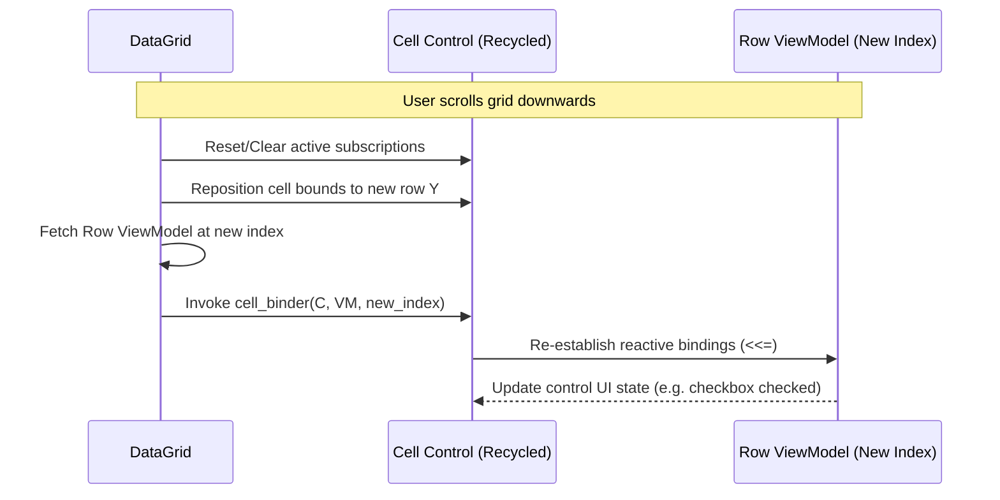

# Refactoring DataGrid: Interactive Custom Cells and MVVM Integration

This document outlines the architectural plan to refactor the `DataGrid` control in the `gooey` library. The primary objective is to transition the grid from a read-only text viewer into a highly flexible, interactive data editor. By enabling cells to render arbitrary `GooeyElement` controls (e.g., `CheckBox`, `TextBox`, `Button`, or nested layouts) while preserving two-dimensional viewport virtualization, we establish a robust foundation for editing rich tabular datasets under the Model-View-ViewModel (MVVM) paradigm.

---

## 1. Limitations of the Current Architecture

The existing `DataGrid` design is optimized for simple, static data display. It suffers from several architectural constraints that prevent interactive data editing:

* **Text-Centric Cells**: Cells are internally represented as `TextPrimitive` objects. There is no mechanism to compose interactive controls like checkboxes, dropdowns, or buttons.
* **String-Only Data Source**: The grid receives data as a flat `std::vector<std::vector<std::string>>`. This decouples the grid from structured domain models and type-safe data.
* **Lack of User Input Routing inside Cells**: The input handler (`on_pointer_event` / `on_key_event`) only handles grid-level scrolling and header selection. Interactive controls placed in cells cannot receive focus or respond to keystrokes and pointer presses natively.
* **No MVVM Synchronization**: There is no path for cell-level edits to automatically synchronize back to the underlying ViewModel properties.

---

## 2. Refactored DataGrid Architecture

To enable custom controls, we will leverage the engine's existing scene graph composition. Because `DataGrid` inherits from `GooeyNode`, it can act as a parent container for other `GooeyElement` instances.

```
       +---------------------------------------------+
       |                  DataGrid                   |
       +---------------------------------------------+
                              |
        +---------------------+---------------------+
        |                                           |
+---------------+                           +---------------+
|  v_scroll_    |                           |  h_scroll_    |
+---------------+                           +---------------+
        |                                           |
        +---------------------+---------------------+
                              |
             (Pool of Visible Custom Elements)
                              |
        +---------------------+---------------------+
        |                     |                     |
+---------------+     +---------------+     +---------------+
| Cell (0, 0)   |     | Cell (0, 1)   |     | Cell (0, 2)   |
| [CheckBox]    |     | [TextBox]     |     | [Button]      |
+---------------+     +---------------+     +---------------+
| Cell (1, 0)   |     | Cell (1, 1)   |     | Cell (1, 2)   |
| [CheckBox]    |     | [TextBox]     |     | [Button]      |
+---------------+     +---------------+     +---------------+
```

### 2.1 Two-Dimensional Recycler Pool for Custom Elements

To maintain high performance over thousands of rows, the grid will virtualize the custom cell elements. Instead of instantiating controls for every cell in the database, the grid maintains a pool size corresponding only to the visible viewport:

$$N_{\text{rows}} = \max\left(1, \frac{H_{\text{grid}} - H_{\text{header}} - B_{\text{hscroll}}}{H_{\text{row}}}\right)$$
$$N_{\text{cols}} = \text{Count of visible columns within viewport width}$$

The grid maintains a 2D recycling array of elements:
```cpp
std::vector<std::vector<std::shared_ptr<GooeyElement>>> cell_elements_;
```

When the user scrolls vertically or horizontally, the grid does **not** allocate new elements. Instead, it repositions the visible elements and invokes their binding updater to refresh their state with the newly exposed data row/column.

### 2.2 Extended Column and Cell Definition

Each column in the grid defines how its cells are created, sized, and bound to data. We refactor `DataGridColumn` to store cell factories and binding handlers:

```cpp
struct DataGridColumn {
    std::string header;
    int width;
    
    // Factory function to instantiate the visual control for this column's cells
    std::function<std::shared_ptr<GooeyElement>()> cell_factory;
    
    // Callback to bind/update the cell control when it binds to a new data row
    std::function<void(const std::shared_ptr<GooeyElement>& cell_element, 
                       const std::any& row_item, 
                       int row_index)> cell_binder;
};
```

* **Default Factory**: If `cell_factory` is omitted, the grid defaults to creating a read-only `Label` control, preserving backwards compatibility.
* **Typeless Data Binding**: The `cell_binder` consumes a `std::any` representing the data item of the row, letting developers bind cell properties directly to fields or properties of their concrete row models.

---

## 3. Integrating with the MVVM Paradigm

The core principle of MVVM is that the View is a passive representation of the ViewModel. For an editable grid, this requires two-way data binding to synchronize state seamlessly.

### 3.1 Row Context Re-binding

When a row scrolls into view, the recycled control must detach from its previous row data and attach to the new row data. 

To manage this cleanly without leaking subscriptions, cell elements will utilize a `SubscriptionSink` that is flushed during the re-binding phase:



### 3.2 Bidirectional Property Syncing

For interactive cells, edits must propagate back to the ViewModel:

#### Example A: CheckBox Cell (Toggling Booleans)
When a checkbox is checked or unchecked by the user, the change is pushed to the property in the Row ViewModel:
```cpp
column.cell_factory = []() {
    return std::make_shared<CheckBox>();
};
column.cell_binder = [](const std::shared_ptr<GooeyElement>& el, const std::any& item, int row_idx) {
    auto checkbox = std::dynamic_pointer_cast<CheckBox>(el);
    auto row_vm = std::any_cast<std::shared_ptr<MyRowViewModel>>(item);
    
    // Clear old subscriptions to prevent memory leaks
    checkbox->clear_bindings();
    
    // Bind View (Checkbox checked state) to VM property (is_completed)
    checkbox->bind(row_vm->is_completed, checkbox, &CheckBox::set_checked);
    
    // Sync edits back: when user clicks checkbox, update ViewModel property
    checkbox->on_checked_changed = [row_vm](bool checked) {
        row_vm->is_completed.set(checked);
    };
};
```

#### Example B: TextBox Cell (Editable Text)
For text entry, we sync the text property back when the user commits the edit (e.g., on Enter key or when losing focus):
```cpp
column.cell_factory = []() {
    return std::make_shared<TextBox>();
};
column.cell_binder = [](const std::shared_ptr<GooeyElement>& el, const std::any& item, int row_idx) {
    auto textbox = std::dynamic_pointer_cast<TextBox>(el);
    auto row_vm = std::any_cast<std::shared_ptr<MyRowViewModel>>(item);
    
    textbox->clear_bindings();
    textbox->bind(row_vm->item_name, textbox, &TextBox::set_text);
    
    // Sync back on edit commit
    textbox->on_text_committed = [row_vm](const std::string& new_text) {
        row_vm->item_name.set(new_text);
    };
};
```

### 3.3 Column-Based ViewModel Architectures

While row-oriented viewmodels (where each list item represents a single cohesive record with attributes) are standard, some application designs require a **column-oriented VM structure**. In these configurations, columns are either dynamic collections of first-class ViewModels themselves, or data is accessed column-wise (e.g., in pivot grids, dynamic spreadsheets, or configuration matrices).

#### Scenario A: Dynamic Column ViewModels (Columns as a Collection)
In layout grids representing spreadsheets or dynamic dashboards, columns can be added, removed, or configured at runtime. The parent `GridViewModel` manages an `ObservableCollection` of `ColumnViewModel` instances:

```cpp
class ColumnViewModel {
public:
    Property<std::string> header_text;
    Property<int> width;
    Property<bool> is_visible;
    Property<ooey::Color> cell_bg_override;
    
    // Defines what template type to render (e.g. "checkbox", "textbox")
    Property<std::string> editor_type; 
};

class GridViewModel {
public:
    // Dynamic columns source
    ObservableCollection<std::shared_ptr<ColumnViewModel>> columns;
    
    // Rows (keys or raw database rows)
    ObservableCollection<std::shared_ptr<RowItem>> rows;
};
```

**Grid Synchronization**:
The `DataGrid` binds to the `columns` property. When a `ColumnViewModel` is added or updated in the collection, the grid inserts the new column, adjusts layout boundaries, invalidates layout caching, and triggers a full viewport redraw.

#### Scenario B: Column-Oriented Data Access (Cell Property Resolution)
For matrix-style spreadsheets or database editors with dynamic schemas, individual cell values are not stored in a flat Row ViewModel. Instead, a cell's state is fetched column-wise.

In this model, when the grid recycled element at `(row_idx, col_idx)` is bound, the `cell_binder` resolves the target observable property from the corresponding `ColumnViewModel` by querying it with the row identifier:

```cpp
// Column binder query model
column.cell_binder = [col_vm = my_column_vm](const std::shared_ptr<GooeyElement>& el, const std::any& row_item, int row_idx) {
    auto textbox = std::dynamic_pointer_cast<TextBox>(el);
    auto row_data = std::any_cast<std::shared_ptr<RowRecord>>(row_item);
    
    textbox->clear_bindings();
    
    // Resolve the specific cell value Property via the Column ViewModel
    // col_vm holds the actual attribute data map or cell resolver logic
    Property<std::string>& cell_value_prop = col_vm->get_cell_property(row_data->id);
    
    // Establish bidirectional binding
    textbox->bind(cell_value_prop, textbox, &TextBox::set_text);
    textbox->on_text_committed = [&cell_value_prop](const std::string& new_text) {
        cell_value_prop.set(new_text);
    };
};
```

This configuration provides maximum layout flexibility. It decouples the grid UI from static data schemas, allowing it to render complex multi-dimensional datasets where cells are bound to dynamic properties resolved column-by-column.

---

## 4. Interactive Event Routing and Focus Management

Because cell elements are standard `GooeyElement` children added to the `DataGrid` node, the GUI engine's core layout and input propagation pipelines handles them natively:

1. **Input Propagation**: When `DataGrid::on_pointer_event` receives a press, it traverses its child list (the visible cells). If a click falls within a cell's layout bounds, the event is routed to that cell control.
2. **Focus Management**: Only one cell can have active keyboard focus (e.g., a `TextBox` in edit mode). The `DataGrid` maintains a reference to the active cell coordinates:
   ```cpp
   struct CellCoord { int row; int col; };
   std::optional<CellCoord> focused_cell_;
   ```

### 4.1 Cell Selection and Edit Lock Mechanics

To support professional, spreadsheet-like workflows, cells enforce a strict **selection and editing state machine**:

* **Modifier-Based Selection (Ctrl + Click)**:
  - If a user clicks a cell while holding the `Ctrl` key, the cell's selection state is toggled: `cell->set_selected(!cell->is_selected())`. This allows selecting/deselecting multiple non-contiguous groups of cells.
  - If the user clicks a cell *without* holding the `Ctrl` key, the grid clears all other active cell selections and selects only the clicked cell.
* **Selection Styling (`is_selected` style)**:
  - When a cell's selection state changes to `true`, the cell applies the `is_selected` style.
  - Visually, the cell renders a high-contrast border outline (e.g. blue, `Color{0, 120, 215}`) and a subtle semi-transparent background tint.
* **Edit Lock (Edit-on-Selected)**:
  - Cells are locked against edits by default. A click on an unselected cell **only** selects it; it does not focus the underlying editor (`TextBox`).
  - To edit a cell, the cell **must already be in a selected state**. Clicking an already-selected cell releases the lock, enters edit mode, and routes focus directly to the underlying `TextBox`, allowing the user to modify the cell's value.

3. **Keyboard Navigation**:
   * **Arrow Keys**: Move the focus cell border around the grid.
   * **Tab Key**: Move focus to the next cell. If it is an editable cell, it places it in edit mode.
   * **Enter Key**: Enter edit mode (focuses the internal text editor) or commits the active edit and moves focus down.
   * **Escape Key**: Cancels the active edit, discarding changes and restoring the original value from the ViewModel.

### 4.2 C++ Implementation of selection and editing state machine

To prevent the child `TextBox` from intercepting click events before the cell can process selection logic, the custom cell control inherits from `GooeyElement` (rather than `GooeyNode`), implementing the `IInteractive` interface to manually route focus and events:

```cpp
class SpreadsheetCell : public gooey::GooeyElement, 
                        public IInteractive, 
                        public std::enable_shared_from_this<SpreadsheetCell> {
public:
    SpreadsheetCell(int row_idx, int col_idx, ...) {
        textbox_ = std::make_shared<gooey::controls::TextBox>();
    }

    void draw(ooey::IRenderTarget& target) const override {
        // If we lost focus elsewhere, exit edit mode automatically
        if (is_editing_) {
            auto* controller = dynamic_cast<gooey::mvvmc::Controller*>(
                Application::get_instance()->get_controller());
            if (controller && controller->get_focused_element().get() != this) {
                is_editing_ = false;
            }
        }

        // Draw selection styling (tint background + high-contrast outline border)
        if (is_selected_) {
            RectPrimitive sel_bg(layout_bounds, ooey::Color{0, 120, 215, 30});
            sel_bg.draw(target);
        }

        if (is_editing_) {
            textbox_->draw(target);
        } else {
            // Render plain text when not editing
            TextPrimitive txt(textbox_->get_text(), Font{"sans-serif", 14}, ...);
            txt.draw(target);
        }

        if (is_selected_) {
            // Render blue outline outline
            LinePrimitive border(..., Color{0, 120, 215}, 2.0f);
            border.draw(target);
        }
    }

    bool on_pointer_event(const Pointer& e) override {
        bool hit = bounds().contains(e.x, e.y);
        if (hit && e.state == PointerState::Pressed) {
            auto& input = Application::get_instance()->get_input_manager();
            bool ctrl = input.is_key_pressed(0xffe3) || input.is_key_pressed(0xffe4);

            if (ctrl) {
                set_selected(!is_selected_);
                is_editing_ = false;
            } else {
                if (!is_selected_) {
                    on_clear_selection_();
                    set_selected(true);
                    is_editing_ = false;
                } else {
                    is_editing_ = true;
                    textbox_->on_pointer_event(e);
                }
            }
            return true;
        }
        return is_editing_ ? textbox_->on_pointer_event(e) : false;
    }

    bool on_key_event(const KeyEvent& e) override {
        if (is_editing_) {
            if (e.state == KeyState::Pressed) {
                if (e.key_code == 0xFF1B || e.key_code == 27) { // Escape: discard & revert
                    textbox_->set_text(original_value_);
                    is_editing_ = false;
                    return true;
                } else if (e.key_code == 0xFF0D || e.key_code == 13) { // Return: commit
                    is_editing_ = false;
                    return true;
                }
            }
            return textbox_->on_key_event(e);
        }
        return false;
    }
};
```

---

## 5. Tooey Layout DSL (`.ooey`) Integration

To make custom cells accessible to developers, the Tooey layout compiler will support declaring cell templates directly in `.ooey` markup.

### 5.1 DSL Syntax

A grid with custom cell elements is declared by nesting templates inside `DataGridColumn` nodes:

```ooey
DataGrid id=taskGrid items=@binding.tasks rowHeight=40:
    DataGridColumn header="Done" width=60:
        CheckBox checked=@binding.tasks.completed
        
    DataGridColumn header="Task Name" width=250:
        TextBox text=@binding.tasks.title
        
    DataGridColumn header="Priority" width=100:
        Label text=@binding.tasks.priority
        
    DataGridColumn header="Actions" width=100:
        Button text="Delete" onClick=@signal.delete_task
```

### 5.2 Compiler Codegen Output

The compiler translates the nested DSL elements into factory and binder lambdas passed to the C++ `DataGrid` instance:

```cpp
// Generated code in TaskView.cpp
taskGrid = std::make_shared<gooey::controls::DataGrid>(ooey::Rect{0, 0, 600, 400}, 40, default_font);

// Column 0: CheckBox
gooey::controls::DataGridColumn col0;
col0.header = "Done";
col0.width = 60;
col0.cell_factory = []() {
    return std::make_shared<gooey::controls::CheckBox>();
};
col0.cell_binder = [](const std::shared_ptr<gooey::mvvmc::GooeyElement>& el, const std::any& item, int row_idx) {
    auto control = std::dynamic_pointer_cast<gooey::controls::CheckBox>(el);
    auto row_data = std::any_cast<TaskItem>(item); // Type extracted from tasks collection
    control->clear_bindings();
    // Setup binding for checkbox checked state
    control->bind(row_data.completed, control, &gooey::controls::CheckBox::set_checked);
};
taskGrid->add_column(col0);

// Column 1: TextBox
gooey::controls::DataGridColumn col1;
col1.header = "Task Name";
col1.width = 250;
col1.cell_factory = []() {
    return std::make_shared<gooey::controls::TextBox>();
};
col1.cell_binder = [](const std::shared_ptr<gooey::mvvmc::GooeyElement>& el, const std::any& item, int row_idx) {
    auto control = std::dynamic_pointer_cast<gooey::controls::TextBox>(el);
    auto row_data = std::any_cast<TaskItem>(item);
    control->clear_bindings();
    control->bind(row_data.title, control, &gooey::controls::TextBox::set_text);
};
taskGrid->add_column(col1);
```

---

## 6. Implementation Milestones

To roll out these grid improvements safely without breaking existing dashboards, we propose a three-stage roadmap:

1. **Core DataGrid API Refactoring**: Refactor `DataGrid` to store and draw `GooeyElement` cell trees instead of hard-coded `TextPrimitive` values. Establish the visible cell recycling pool and layout handlers.
2. **Focus & Keyboard Navigation**: Implement grid-level focus management, keyboard navigation (Arrow keys, Tab, Enter, Escape), and pointer event routing down to interactive cell children.
3. **Tooey Compiler Support**: Extend the layout parser and code generator to compile nested template structures in `.ooey` layout files.
