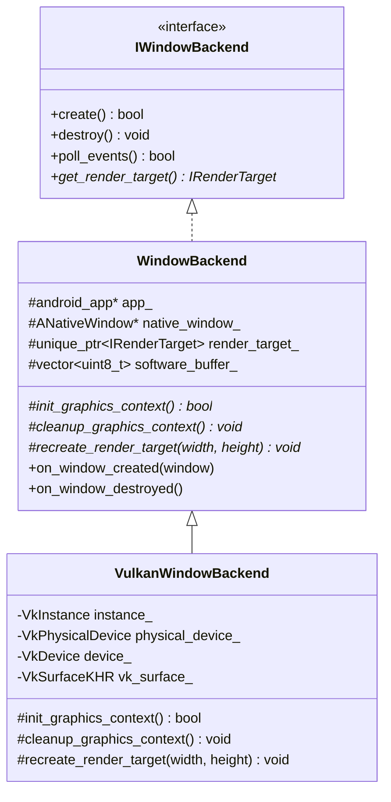

# Android Vulkan Hardware-Accelerated Integration — Technical Deep Dive

**Date:** 2026-06-01  
**Author:** Antigravity AI Coding Assistant  

---

## 1. Architectural Goals & Design Philosophy

Deploying a high-performance C++ UI framework onto Android requires hardware acceleration to ensure smooth animations and layouts. However, a major architectural challenge is achieving this without cluttering the core rendering, layout, or scene graph codebase with platform-specific checks (`#ifdef __ANDROID__` or `if (android)`).

To solve this, OOEY implements a **modular subclassing architecture** modeled after its Wayland platform backend:
* **Decoupled Windowing:** The core `Application` handles generic rendering through the `IWindowBackend` and `IRenderTarget` interfaces.
* **Separation of Concerns:** General Android OS behaviors (lifecycle looper, touch translation, key input routing) are isolated in a base class `WindowBackend`.
* **Graphics API Specialization:** Graphics context setups (Vulkan surface creation, physical device selection, logical device configuration) are offloaded to `VulkanWindowBackend`, a clean, modular subclass.
* **Resilient Fallback Design:** If hardware acceleration (Vulkan) fails to initialize due to driver or validation issues, the application automatically falls back to CPU-based software rasterization, ensuring application stability on all target devices.



---

## 2. Bootstrapping & Lifecycle Routing

Android applications typically launch inside the JVM. Since OOEY is a pure C++ codebase compiled without Android Studio, it relies on the NDK's `NativeActivity` and the `android_native_app_glue` library to receive activity callbacks on a background thread.

### JNI Entry Point & Linker Pruning
The JVM launches `NativeActivity` which uses `System.loadLibrary` to load our compiled shared library (`.so`). It then looks up the entry point symbol `ANativeActivity_onCreate`. 
* **The Issue:** Since no C++ code references `ANativeActivity_onCreate` directly (it is called via JNI reflection from the Java VM), static linkers aggressively prune this symbol during release optimizations, causing a runtime crash on startup: `java.lang.UnsatisfiedLinkError: undefined symbol: ANativeActivity_onCreate`.
* **The Solution:** We added a target link option in `CMakeLists.txt` to force the linker to preserve and export this symbol:
  ```cmake
  target_link_options(ooey INTERFACE "-Wl,-u,ANativeActivity_onCreate")
  ```

### Lifecycle Callback Bridge
The `android_main` function inside `android_main.cpp` stores the native app state globally, registers callback functions (`onAppCmd` and `onInputEvent`), and delegates control to the standard, cross-platform C++ `main()` function:

```cpp
void android_main(struct android_app* state) {
    app_dummy(); // Prevents compiler from stripping the glue library
    ooey::android::g_android_app = state;
    state->onAppCmd = android_handle_cmd;
    state->onInputEvent = android_handle_input;
    main(); // Invokes the user application main()
}
```

The callback function `android_handle_cmd` intercepts lifecycle transitions and forwards them directly to the active `WindowBackend` instance:
* `APP_CMD_INIT_WINDOW` $\rightarrow$ triggers `on_window_created(ANativeWindow*)`
* `APP_CMD_TERM_WINDOW` $\rightarrow$ triggers `on_window_destroyed()`
* `APP_CMD_WINDOW_RESIZED` $\rightarrow$ triggers `on_window_resized()`
* `APP_CMD_DESTROY` $\rightarrow$ triggers `destroy()`

---

## 3. Base Android Window Backend (`WindowBackend`)

The base `WindowBackend` implements all platform-independent NDK event handling, input mapping, and software fallback rendering. 

### Virtual Graphics Hooks
To separate the Android event loop from graphics APIs, we introduced three virtual lifecycle hooks:
```cpp
virtual bool init_graphics_context();
virtual void cleanup_graphics_context();
virtual void recreate_render_target(int width, int height);
```

These functions allow the subclass to bind graphics APIs (like Vulkan) to the native window lifecycles while keeping the base looper clean.

### Native Input Translation
Android touchscreen inputs (Motions) and physical/virtual keyboard inputs (Keys) are mapped to OOEY native structures:
* **Touch Events:** Multi-touch pointer coords and actions (`AMOTION_EVENT_ACTION_DOWN`, `UP`, `MOVE`) are translated to native `Pointer` structures and sent to the `InputManager`.
* **Key Events:** Translated from Android keycodes (e.g., `AKEYCODE_DEL` mapping to backspace `8`, `AKEYCODE_ENTER` to `13`).
* **Text Input:** Physical and virtual keyboard text inputs are reconstructed dynamically by checking the state of standard key-down events alongside the active `AMETA_SHIFT_ON` state to feed unicode codepoints into OOEY text components.

### Energy-Saving Event Polling
To avoid burning battery on mobile devices, the event loop throttles CPU usage depending on activity states:
```cpp
int timeout_ms = (native_window_ == nullptr) ? -1 : 0;
while ((ident = ALooper_pollOnce(timeout_ms, nullptr, &events, (void**)&source)) >= 0) { ... }
```
When the app is minimized or hidden (`native_window_` is null), `ALooper_pollOnce` blocks indefinitely (`-1`), putting the native thread to sleep until the OS issues a resume signal. When visible, it polls instantly (`0`) to process UI animations and layouts at high frame rates.

---

## 4. Vulkan Hardware-Accelerated Subclass (`VulkanWindowBackend`)

The subclass `VulkanWindowBackend` overrides the virtual graphics hooks to bind a Vulkan context to the Android window.

### Vulkan Instance Configuration & Extensions
To render onto an Android screen, Vulkan requires specific platform surface extensions:
1. `VK_KHR_surface` (General Window Surface integration)
2. `VK_KHR_android_surface` (Android Native Window binding support)

These are specified during Vulkan instance creation inside `vulkan_window_backend.cpp`:
```cpp
std::vector<const char*> extensions = {
    VK_KHR_SURFACE_EXTENSION_NAME,
    VK_KHR_ANDROID_SURFACE_EXTENSION_NAME
};
// ...
VkInstanceCreateInfo create_info{};
create_info.ppEnabledExtensionNames = extensions.data();
vkCreateInstance(&create_info, nullptr, &instance_);
```

### Creating the Android Vulkan Surface
When the OS prepares the screen (`APP_CMD_INIT_WINDOW`), the base backend catches the callback and calls `recreate_render_target`. In the Vulkan subclass, this creates a `VkSurfaceKHR` on top of the OS-provided `ANativeWindow*`:
```cpp
VkAndroidSurfaceCreateInfoKHR create_info{};
create_info.sType = VK_STRUCTURE_TYPE_ANDROID_SURFACE_CREATE_INFO_KHR;
create_info.window = native_window_; // The raw ANativeWindow pointer

VkResult res = vkCreateAndroidSurfaceKHR(instance_, &create_info, nullptr, &vk_surface_);
```
Once the surface is bound, the subclass constructs a `VulkanRenderTarget`, which configures the Vulkan swapchain, allocates vertex buffers, and registers shaders to compile directly into hardware-accelerated pipeline draw calls.

### Clean Destructor Sequence
To avoid memory leaks or validation crashes during app closure or backgrounding, resources must be freed in a strict order:
1. Destroy the `VulkanRenderTarget` to release swapchains and framebuffers.
2. Destroy the `VkSurfaceKHR` bound to the window.
3. Teardown the logical `VkDevice`.
4. Destroy the global `VkInstance`.

---

## 5. Memory Safety & Format Synchronization

A major technical issue encountered during testing was a segmentation fault (`SIGSEGV` or `SEGV_ACCERR`) inside `present_software_frame` when using the software rendering fallback.

* **Underlying Cause:** On Android, the OS native window (`ANativeWindow`) defaults to formatting its frame buffer in custom layouts like `RGB_565` (16-bit) to save memory. However, the OOEY rendering engine allocates pixels as standard 32-bit RGBA structures. Copying a 32-bit RGBA pixel array into a 16-bit destination or mismatching buffer dimensions causes memory access alignment exceptions.
* **The Fix:** We synchronized the format and geometry explicitly during creation and resize operations inside the software renderer:
  ```cpp
  ANativeWindow_setBuffersGeometry(native_window_, width, height, WINDOW_FORMAT_RGBA_8888);
  ```
  This guarantees that the OS backbuffer and the framework's internal rasterizer match in dimension and layout, ensuring safe row-by-row memory copies (`memcpy`) without memory violations.

---

## 6. Automatic Software Fallback Mechanics

If Vulkan setup fails—whether due to an incompatible device driver, missing system extensions, or validation failures—the subclass gracefully rolls back to CPU rendering.

```cpp
bool VulkanWindowBackend::init_graphics_context() {
    if (!create_instance(...) || !pick_physical_device() || !create_logical_device(...)) {
        LOGE("Vulkan Android: Vulkan initialization failed. Falling back to Software rendering.");
        use_software_fallback_ = true;
        return WindowBackend::init_graphics_context(); // Invokes base software setup
    }
    return true;
}
```

Subsequent calls check the fallback flag:
```cpp
void VulkanWindowBackend::recreate_render_target(int width, int height) {
    if (use_software_fallback_) {
        WindowBackend::recreate_render_target(width, height); // Software rendering path
        return;
    }
    // ... Vulkan surface & target path ...
}
```

This prevents the app from crashing on older or lower-spec devices, ensuring full compatibility across the Android ecosystem.

---

## 7. Packaging & Deployment Workflow

The entire build pipeline is automated via `build_apk.sh`:

1. **NDK Cross-Compilation:** Compiles the C++20 code into an `arm64-v8a` shared library (`libhello_ooey.so`) using the Android CMake toolchain file:
   ```bash
   cmake -B build_android_arm64-v8a \
         -DCMAKE_TOOLCHAIN_FILE=${ANDROID_NDK_HOME}/build/cmake/android.toolchain.cmake \
         -DANDROID_ABI=arm64-v8a \
         -DANDROID_PLATFORM=android-30
   ```
2. **Resource Packaging (`aapt`):** Zips compiled resources and maps them to standard system bindings.
3. **Archive Byte Alignment (`zipalign`):** Optimizes the APK's files to 4-byte boundaries, enabling the Android OS to read assets directly via `mmap()` to conserve RAM.
4. **App Cryptographic Signing (`apksigner`):** Signs the APK using developer certificate files to verify package integrity.
5. **USB Installation (`adb install`):** Deploys the package to the active connected device over Wi-Fi or USB.
