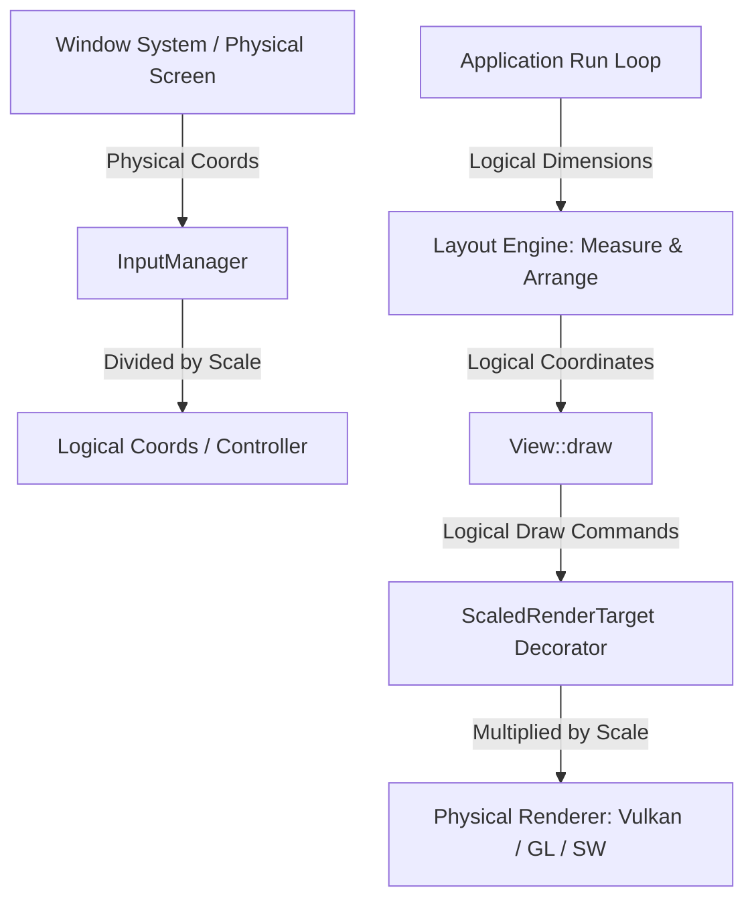

# DPI-Aware Scaling System — Technical Deep Dive

**Date:** 2026-06-01  
**Author:** Antigravity AI Coding Assistant  

---

## 1. Architectural Goals & Problem Statement

High-DPI (Retina, 4K, or high-density mobile) screens have a high density of physical pixels per inch. If a UI framework renders using physical pixel dimensions, text and interactive elements (like buttons, text inputs, lists) become extremely tiny and unusable on these devices (especially Android phones and tablets, which routinely feature 300+ DPI displays).

To solve this, OOEY requires a **DPI-aware scaling mode** that:
* **Adapts Automatically:** Resolves the screen density on high-DPI displays dynamically.
* **Is Easily Configurable:** Can be toggled off or overridden in code or via environment variables.
* **Maintains Separation of Concerns:** Works across all renderers (Vulkan, GL, Software) and platforms (Android, WebAssembly, Wayland, X11) without polluting layout engine or rendering backend code with hardcoded scale multiplication.
* **Ensures Pixel-Accurate Hit Testing:** Scales user pointer/touch coordinates back into logical coordinates so interactive hit testing remains correct.

---

## 2. Design & Architecture

OOEY implements a **decoupled logical-to-physical coordinate mapping** utilizing a decorator design pattern:



### Logical Coordinates for Layout
The application's sizing, positioning, margin, padding, and font sizes are defined and computed entirely in **logical pixels**.
* The `Application` queries the DPI scale factor $S$.
* The physical window size $(W_{phys}, H_{phys})$ is mapped to a logical size:
  $$(W_{logical}, H_{logical}) = \left(\frac{W_{phys}}{S}, \frac{H_{phys}}{S}\right)$$
* The layout engine measures and arranges views using $(W_{logical}, H_{logical})$. All UI components store their layout bounds in logical pixels.

### Renderer-Agnostic Scaling (The Decorator Pattern)
Rather than editing the core software, Vulkan, or OpenGL renderers to support scaling, OOEY introduces `ScaledRenderTarget`. This class implements the `IRenderTarget` interface and acts as a decorator wrapping the actual rendering target:
* **Geometry scaling**: Multiplies vertex coordinates $(x, y)$ by $S$ before passing them to the underlying target.
* **Image scaling**: Scales the destination `Rect` coordinates and sizes by $S$.
* **Text scaling**: Scales the query font size by $S$ before fetching metrics, then scales down the returned physical text size to logical coordinates for the layout engine. During drawing, it scales the font size and draw positions by $S$.

### Input coordinate scaling
When mouse or touch pointer events are pushed to the `InputManager`, they are received in physical screen coordinates. The `InputManager` scales these coordinates down by dividing them by $S$:
$$x_{logical} = \frac{x_{phys}}{S}, \quad y_{logical} = \frac{y_{phys}}{S}$$
This ensures that hit testing against logical view bounds works perfectly out-of-the-box.

---

## 3. Technical Implementation Details

### 1. `IWindowBackend` Extension
A new virtual query was added to `IWindowBackend` that defaults to a scale of `1.0f`:
```cpp
virtual float get_content_scale() const { return 1.0f; }
```

### 2. Platform Autodetection
* **Android**: Uses the NDK `AConfiguration` API to fetch the device's configuration density and divides it by the standard base density ($160$ DPI):
  ```cpp
  float WindowBackend::get_content_scale() const {
      float scale = 1.0f;
      if (app_ && app_->activity && app_->activity->assetManager) {
          AConfiguration* config = AConfiguration_new();
          if (config) {
              AConfiguration_fromAssetManager(config, app_->activity->assetManager);
              int32_t density = AConfiguration_getDensity(config);
              AConfiguration_delete(config);
              if (density > 0) {
                  scale = static_cast<float>(density) / 160.0f;
              }
          }
      }
      return scale;
  }
  ```
* **WebAssembly (Emscripten)**: Queries the browser's device pixel ratio using the Emscripten HTML5 API:
  ```cpp
  float WindowBackend::get_content_scale() const {
      return static_cast<float>(emscripten_get_device_pixel_ratio());
  }
  ```
* **X11**: Queries the root window resource database manager for `Xft.dpi` and falls back to check the `GDK_SCALE` environment variable:
  ```cpp
  float WindowBackend::get_content_scale() const {
      if (display_) {
          XrmInitialize();
          char* resource_manager = XResourceManagerString(display_);
          if (resource_manager) {
              XrmDatabase db = XrmGetStringDatabase(resource_manager);
              if (db) {
                  char* type = nullptr;
                  XrmValue value;
                  if (XrmGetResource(db, "Xft.dpi", "Xft.Dpi", &type, &value)) {
                      if (value.addr) {
                          try {
                              float dpi = std::stof(value.addr);
                              XrmDestroyDatabase(db);
                              if (dpi > 0.0f) {
                                  return dpi / 96.0f;
                              }
                          } catch (...) {}
                      }
                  }
                  XrmDestroyDatabase(db);
              }
          }
      }
      const char* gdk_scale = std::getenv("GDK_SCALE");
      if (gdk_scale) {
          try {
              float scale = std::stof(gdk_scale);
              if (scale > 0.0f) {
                  return scale;
              }
          } catch (...) {}
      }
      return 1.0f;
  }
  ```
* **Wayland**: Queries common Linux desktop scaling environment variables:
  ```cpp
  float WindowBackend::get_content_scale() const {
      const char* gdk_scale = std::getenv("GDK_SCALE");
      if (gdk_scale) {
          try {
              float scale = std::stof(gdk_scale);
              if (scale > 0.0f) {
                  return scale;
              }
          } catch (...) {}
      }
      return 1.0f;
  }
  ```

### 3. Application Lifecycle Setup
Inside `Application::run_iteration()`:
1. Update `InputManager` scale settings.
2. Query physical size and scale it down to logical coordinates.
3. Perform the `measure` and `layout` passes on `root_view_` in logical bounds.
4. Construct `ScaledRenderTarget` wrapping the real target, and pass it to `root_view_->draw()`.

---

## 4. Configuration & Usage

### Enabling / Disabling in Code
DPI-aware scaling is **enabled by default**. To disable or configure it programmatically:
```cpp
Application app;
app.set_dpi_scale_enabled(false); // Disables auto-scaling (defaults to 1.0f)
```

### Easy Overriding via Environment Variables
For testing or runtime overrides across all platforms (desktop Linux, WebAssembly, Android), you can set the `OOEY_SCALE` environment variable:
* Disable scaling:
  ```bash
  export OOEY_SCALE=1.0
  # or
  export OOEY_SCALE=off
  ```
* Force custom scaling:
  ```bash
  export OOEY_SCALE=2.0
  ```
