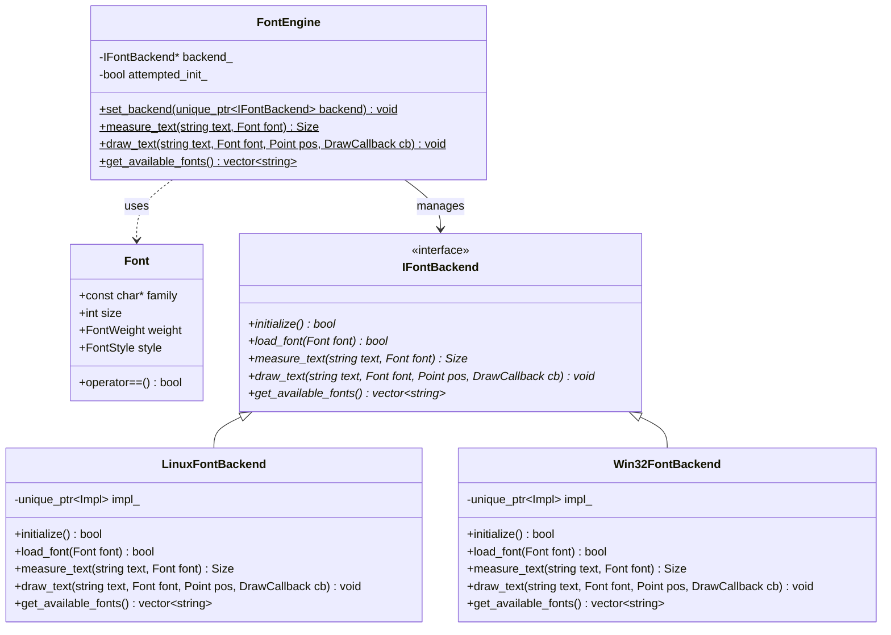

# Font Rendering Subsystem & Cross-Platform Implementation History

## 1. Overview
The Font Subsystem adds modular, cross-platform support for matching, loading, and rendering TrueType/OpenType (.ttf/.otf) fonts in the OOEY framework using native OS libraries, while providing a seamless fallback to the static `BitmapFont` implementation. It guarantees that:
- Core UI layouts are measured and positioned correctly according to actual system font metrics rather than hardcoded sizes.
- Platform-specific font APIs (FreeType/Fontconfig on Linux, DirectWrite on Windows) are decoupled through a clean interface.
- Core rendering code resolves text rasterization via batched alpha-opacity pixel callbacks to minimize GPU state shifts.
- FreeType/Fontconfig libraries are loaded dynamically at runtime via `dlopen`/`dlsym` on Linux to avoid compile-time dependencies or required static libraries.

---

## 2. Architecture



### The Font Specification (`Font`)
Defined in [types.hpp](file:///home/corey/code/ooey/ooey/include/ooey/types.hpp), the `Font` struct defines a typeface configuration using a family name string (`const char*`), size in pixels (`int`), weight (Normal or Bold), and style (Normal or Italic).

### The Font Backend Interface (`IFontBackend`)
Defined in [font_backend.hpp](file:///home/corey/code/ooey/ooey/include/ooey/renderer/font_backend.hpp), this interface mandates the methods needed to match system fonts, load them, obtain text dimensions, and rasterize glyphs. It provides a pixel-callback signature:
`using DrawCallback = std::function<void(int x, int y, int w, int h, uint8_t alpha)>;`

### The Font Subsystem Coordinator (`FontEngine`)
Defined in [font_engine.hpp](file:///home/corey/code/ooey/ooey/include/ooey/renderer/font_engine.hpp), this class serves as the API gateway. It:
1. Dynamically instantiates the default platform backend (`LinuxFontBackend` or `Win32FontBackend`) if not explicitly overridden.
2. Checks backend availability. If the backend is present and successfully matches/loads the font, it uses it.
3. If a font is missing or the backend fails, it falls back to the static `BitmapFont` implementation.

---

## 3. Platform Specific Architectures

### Linux Backend (`LinuxFontBackend`)
Implemented in [linux_font_backend.cpp](file:///home/corey/code/ooey/ooey/src/renderer/linux_font_backend.cpp):
- Dynamically loads `libfontconfig.so.1` and `libfreetype.so.6` at runtime.
- Resolves Fontconfig methods (e.g. `FcInitLoadConfigAndFonts`, `FcFontMatch`) to locate the exact path of a system TrueType/OpenType font that matches the family, weight, and style.
- Resolves FreeType methods (e.g. `FT_New_Face`, `FT_Set_Pixel_Sizes`, `FT_Load_Char`) to load font files, configure raster size, and render glyphs into 8-bit grayscale pixel arrays.
- Employs an internal cache (`loaded_faces_`) to avoid opening the same font file repeatedly.

### Windows Backend (`Win32FontBackend`)
Implemented in [win32_font_backend.cpp](file:///home/corey/code/ooey/ooey/src/renderer/win32_font_backend.cpp):
- Structures a template for DirectWrite/GDI integrations.
- Declares hooks to query the system's `IDWriteFontCollection` to find and draw fonts using OS native APIs.

---

## 4. UI Controls Integration

To support dynamic font scaling and styles, standard UI controls were updated:
- **`Label`**: Uses `FontEngine::measure_text` dynamically inside its constructor, `set_text`, `set_font`, and `measure` methods to support correct sizing under wrap and alignment constraints.
- **`TextBox`**: Updated to support `set_font` and `get_font`. Replaced the hardcoded vertical text offset (previously `16`) in `layout()` with a dynamic height measurement of `FontEngine::measure_text("A", font)` to vertically center any custom-sized font cleanly.
- **`Button`**: Replaced standard calls to `BitmapFont::measure_text` in button layout, labels, and boundaries with dynamic `FontEngine::measure_text` calls.
- **`ListControl`**: Integrated `set_stylize_items(bool)` which dynamically sets the typeface of list items to the font family names they represent.

### Lifetime Safety in ListControl (`keep_alive_family`)
Because the `Font` struct uses a `const char*` for its family name, passing the `.c_str()` of a temporary `std::string` can cause memory dangling. To prevent this in dynamic lists:
- Added a private anonymous-namespace utility `keep_alive_family` inside [list_control.cpp](file:///home/corey/code/ooey/gooey/src/controls/list_control.cpp) using a static `std::unordered_set<std::string>` cache. This guarantees that matched family names remain alive for the entire lifespan of the application.

---

## 5. FreeType Offset Alignment Issue & Resolution

During testing on 64-bit Linux platforms, a segmentation fault was encountered when executing example programs using `LinuxFontBackend`.

### Diagnosis
The issue resulted from a mismatch in structural alignments inside `linux_font_backend.cpp`:
- The FreeType library's definition of `FT_Generic` is:
  ```c
  typedef struct FT_Generic_ {
      void*            data;
      FT_Generic_Finalizer  finalizer;
  } FT_Generic;
  ```
  This is a struct of two pointers, occupying **16 bytes** of memory.
- In our custom definitions of `FT_FaceRec`, `FT_GlyphSlotRec`, and `FT_SizeRec` (used to read fields from FreeType without linking its headers), `FT_Generic` was represented as a single `void* generic;` pointer (**8 bytes**).
- Because of this 8-byte size discrepancy, all subsequent fields (such as `metrics`, `glyph`, and `size`) were shifted by 8 bytes from their expected offsets. Reading pointers like `face_rec->size` returned garbage values, which caused a segmentation fault when dereferenced.

### Resolution
The `generic` fields in all three custom structures in [linux_font_backend.cpp](file:///home/corey/code/ooey/ooey/src/renderer/linux_font_backend.cpp) were corrected from:
```cpp
void* generic;
```
to:
```cpp
void* generic[2];
```
This expanded the field to 16 bytes, correctly aligning all struct offsets with standard FreeType binaries, and fully resolving the segmentation fault.
