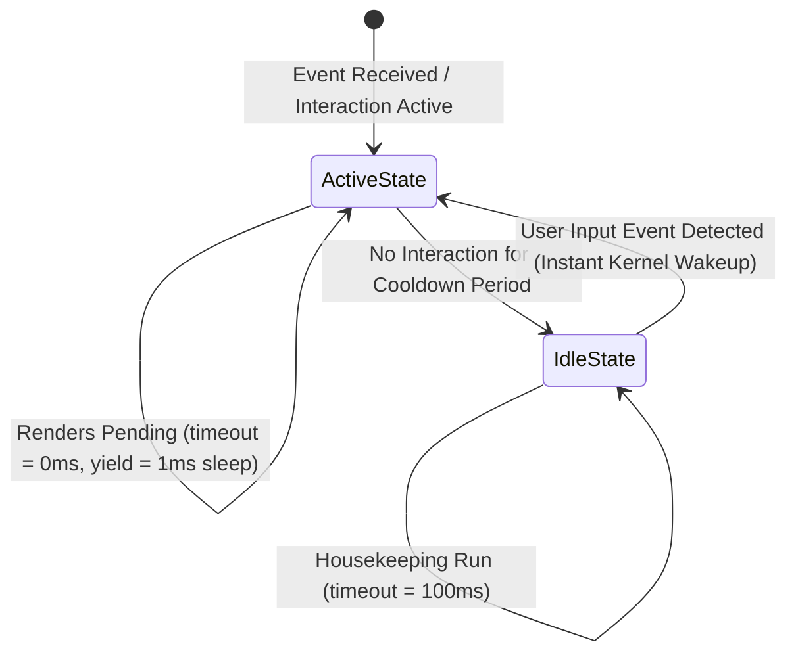

# CPU Idle Throttling & Background Task Dispatching Implementation Log

This document details the performance diagnostics, design patterns, event-loop timings, and socket polling algorithms used to implement the event-driven rendering engine, adaptive CPU idle throttling, and multithreaded telemetry dispatching.

---

## 1. Event-Driven Layout and Rendering Pipeline

Originally, the OOEY framework ran the measurement, layout, and rendering pipelines continuously at maximum refresh speed, even when the window was completely static. This caused high CPU usage and power draw.

To resolve this, we updated the central loop inside [Application::run_iteration](file:///home/corey/code/ooey/gooey/src/application.cpp) to check three criteria before running a layout or rendering pass:

1.  **Layout Invalidation (`layout_dirty`):** Properties modified in views or view models (such as `set_text()` on a `Label` or scroll offsets in [ScrollContainer](file:///home/corey/code/ooey/gooey/include/gooey/controls/scroll_container.hpp)) call `invalidate_layout()`. This marks the view hierarchy as dirty by setting `is_layout_clean_ = false` and `is_measure_clean_ = false`. These dirty flags propagate recursively to the root view.
2.  **Dimension Modifications (`size_changed`):** Resizing the window or changing the DPI scale marks the window boundaries as dirty, requiring layout recalculations.
3.  **Explicit Invalidation (`needs_render_`):** Explicitly requested refreshes, such as initial window loading or theme changes.

If none of these conditions are met, the layout solver and rendering pipeline are skipped, and the framework yields execution.

---

## 2. VSync Beating and Adaptive Idle Throttling Timings

### The VSync Beating Problem
When rendering is skipped, yielding the thread is necessary to avoid busy-loops. However, sleeping for a standard frame duration (e.g., $16\text{ms}$ for $60\text{Hz}$) causes timing conflicts (VSync beating) against the graphics driver's presentation lock:
1.  During pointer drags, the application renders a frame and calls `present()`, which blocks until the next hardware VSync tick (e.g., for $12\text{ms}$).
2.  Once awake, the next iteration is immediately entered. If no new events are in the queue, `should_render` resolves to `false`, and the loop triggers a $16\text{ms}$ sleep.
3.  During this $16\text{ms}$ sleep, the display's VSync deadline occurs and passes. The application is suspended, missing the frame refresh.
4.  The application processes the pending input, renders, and calls `present()`, which must now wait another $16\text{ms}$ for the *next* VSync interval.
5.  This cuts the active frame rate in half (from $60\text{ FPS}$ to $30\text{ FPS}$ or lower), making scrolling and resizing feel extremely laggy.

### The Adaptive Timing Solution
To resolve this, we implemented an adaptive polling state machine that shifts between two timing modes:



1.  **Active/Interacting State (`timeout_ms = 0`):**
    *   Triggered when there are pending renders, active animations, background tasks, or recent user interactions.
    *   The event polling timeout is set to $0\text{ms}$ (non-blocking).
    *   If no rendering is needed on a frame, the thread yields via a **$1\text{ms}$** sleep. This brief sleep yields CPU execution to the OS scheduler, avoiding busy-loops while keeping input latency low ($< 1\text{ms}$).
2.  **Idle State (`timeout_ms = 100`):**
    *   Triggered when the application is completely idle.
    *   The main loop blocks inside the OS kernel's event socket polling call (e.g., `poll`, `select`, or `ALooper_pollOnce`) for up to **$100\text{ms}$**.
    *   If a user event occurs, the kernel immediately wakes up the thread with zero latency, returning it to the active state. If no events occur, the thread wakes up 10 times a second to perform housekeeping, resulting in $\sim 0.0\%$ CPU usage.

---

## 3. Multithreaded Telemetry Deferral and Task Queue

### The Problem: Synchronous UI Blocking
Gathering system telemetry (CPU usage, memory parsing, disk capacities) in the system monitor dashboard (`hello_sysinfo`) involves crawling the `/proc` directory structure for hundreds of running processes. This IO-bound crawling takes $50\text{--}100\text{ms}$. If run on the main UI thread during resizing or drag interactions, it causes visual stutter.

### The Architectural Solution
1.  **Background Threading:** Telemetry metric scans and `/proc` directory parsing are offloaded to an asynchronous background worker thread in the `SystemMonitorViewModel`.
2.  **Interaction Deferral:** The background worker thread queries `is_user_interacting()` and defers triggering new CPU-heavy telemetry collections during active user interactions:
    *   User is holding a mouse button down (dragging or scrolling).
    *   A window resize event occurred within the last 1.5 seconds.
3.  **Thread-Safe Task Queue:** When the background thread finishes gathering metrics, it marshals the final property updates to the main thread via a thread-safe task queue inside the `Application` class:

```cpp
void Application::dispatch(std::function<void()>&& task) {
    std::lock_guard<std::mutex> lock(dispatcher_mutex_);
    dispatcher_tasks_.push_back(std::move(task));
}
```

During each frame iteration, before running any layout or rendering passes, the main thread drains and executes all dispatched tasks:

```cpp
void Application::run_iteration() {
    std::vector<std::function<void()>> local_tasks;
    {
        std::lock_guard<std::mutex> lock(dispatcher_mutex_);
        local_tasks = std::move(dispatcher_tasks_);
    }
    for (auto& task : local_tasks) {
        if (task) task();
    }
    // ... Event polling and layout/render passes ...
}
```

Dispatched tasks update ViewModel `Property` values, which automatically triggers a render request via `Property::set`:

```cpp
template <typename T>
void Property<T>::set(T new_value) {
    value_ = std::move(new_value);
    notify();
    gooey::request_render(); // Marks needs_render_ = true in Application
}
```

---

## 4. Wayland Socket Starvation and Kernel-Level Polling

On Wayland targets (`ooey/src/platform/wayland/window_backend.cpp`), event polling behaves differently than on X11:
-   **The Issue:** Wayland clients read and dispatch events from the compositor socket inside the buffer presentation (`present()`) cycle when swapping buffers. When we transitioned to event-driven idle throttling (where the rendering loop sleeps during idle periods and does not call `present()`), no new events were read from the Wayland socket. Consequently, `wl_display_dispatch_pending()` only processed already-queued events but never pulled new input from the socket, causing the application to freeze.
-   **The Solution:** To solve this socket starvation, we updated `WindowBackend::poll_events(int timeout_ms)` to implement a robust Wayland socket polling loop using `<poll.h>` and Wayland's thread-safe display read API, passing the adaptive timeout to the OS `poll` function:

```cpp
bool WindowBackend::poll_events(int timeout_ms) {
    if (!display_ || should_close_) return false;

    // Flush outgoing requests to the compositor
    wl_display_flush(display_);

    // Dispatch any events already in the client-side queue
    wl_display_dispatch_pending(display_);

    int fd = wl_display_get_fd(display_);
    struct pollfd pfd;
    pfd.fd = fd;
    pfd.events = POLLIN;
    pfd.revents = 0;

    if (wl_display_prepare_read(display_) == 0) {
        // Poll with adaptive timeout (0ms when active, up to 100ms when idle)
        int ret = poll(&pfd, 1, timeout_ms);
        if (ret > 0 && (pfd.revents & POLLIN)) {
            if (wl_display_read_events(display_) < 0) {
                return false; // Error reading events
            }
        } else {
            wl_display_cancel_read(display_);
        }
    }

    // Dispatch any newly read events
    wl_display_dispatch_pending(display_);
    return true;
}
```

This ensures that incoming user gestures are pulled immediately from the OS socket, and the application blocks efficiently on the file descriptor when idle, allowing the thread to sleep in the kernel with zero active CPU usage while remaining completely responsive.
