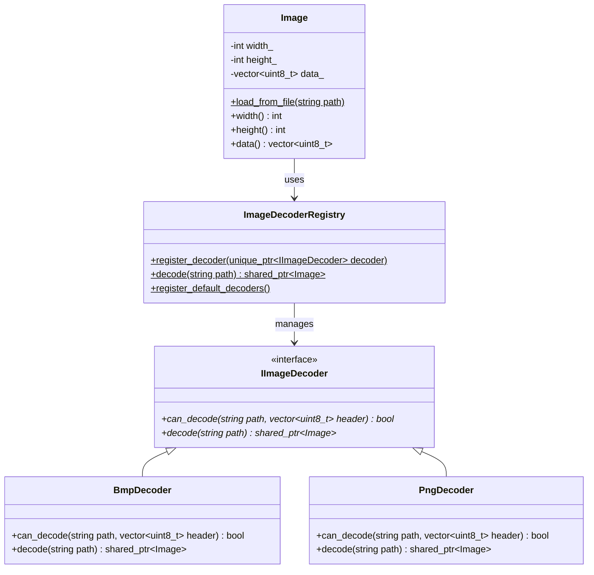

# Image Subsystem Implementation History

## 1. Overview
The Image Subsystem adds modular support for decoding and rendering image assets in the OOEY framework. It guarantees that:
- Images of various formats (BMP, PNG, etc.) are processed uniformly.
- Alpha channels are fully preserved and blended.
- The decoding framework is modular: decoders can be compiled optionally and linked with third-party libraries (e.g. `libpng`) without modifying core framework code.
- Core rendering code remains decoupled from specific formats, handling a unified `Image` pixel buffer abstraction.

---

## 2. Architecture



### The Image Asset Representation (`Image`)
Defined in [image.hpp](file:///home/corey/code/ooey/ooey/include/ooey/renderer/image.hpp), the `Image` class encapsulates the width, height, and a raw pixel data buffer in standard 32-bit `RGBA8888` layout.
Clients call the factory `Image::load_from_file(path)` which delegates format resolution to the registry.

### The Decoder Interface (`IImageDecoder`)
Defined in [i_image_decoder.hpp](file:///home/corey/code/ooey/ooey/include/ooey/renderer/i_image_decoder.hpp), this interface mandates two methods:
1. `can_decode`: Sniffs a 16-byte header to recognize magic bytes/signatures.
2. `decode`: Loads and converts the format into the unified raw `Image` object.

### Signature-Based Sniffing (`ImageDecoderRegistry`)
Defined in [image_decoder_registry.cpp](file:///home/corey/code/ooey/ooey/src/renderer/image_decoder_registry.cpp), the registry reads the first 16 bytes of files to check format signatures (e.g. `BM` for BMP, `\x89PNG\r\n\x1a\n` for PNG), ensuring format safety over fragile file extension checks.

### Modular Format decoders
- **BMP Decoder ([bmp_decoder.cpp](file:///home/corey/code/ooey/ooey/src/renderer/image/bmp_decoder.cpp)):** Built-in decoder supporting uncompressed 24-bit RGB and 32-bit RGBA BMP file structures. It handles bottom-up coordinate layout corrections natively.
- **PNG Decoder ([png_decoder.cpp](file:///home/corey/code/ooey/ooey/src/renderer/image/png_decoder.cpp)):** Conditional decoder compiled only when `libpng` is found by CMake. It wraps native `libpng` handles to translate color palettes, grayscale ranges, transparent keys, and 16-bit depths to normalized RGBA buffers.

---

## 3. Render Target Integration

The pure virtual `draw_image(const Image& image, const Rect& dest_rect)` method was added to the base [IRenderTarget](file:///home/corey/code/ooey/ooey/include/ooey/renderer/i_render_target.hpp) interface.

### Software Rasterizer Blending
Implemented in [software_render_target.cpp](file:///home/corey/code/ooey/ooey/src/renderer/software_render_target.cpp), the software renderer:
- Traverses destination rectangles and maps coordinates back to the source image using nearest-neighbor scaling.
- Applies standard alpha channel math:
  $$C_{\text{out}} = \frac{C_{\text{src}} \times A_{\text{src}} + C_{\text{dest}} \times (255 - A_{\text{src}})}{255}$$
  $$A_{\text{out}} = A_{\text{src}} + \frac{A_{\text{dest}} \times (255 - A_{\text{src}})}{255}$$

### OpenGL Texture Caching
Implemented in [gl_render_target.cpp](file:///home/corey/code/ooey/ooey/src/renderer/gl_render_target.cpp), the target:
- Maintains a texture map `std::unordered_map<const Image*, GLuint>` to compile images to GPU textures once and reuse them.
- Deletes texture resource bindings in its destructor `~GlRenderTarget()`.
- Renders textures using immediate mode texture bindings (`glTexCoord2f`, `glVertex2f`).

### Vulkan Fallback downsampling
Implemented in [vulkan_render_target.cpp](file:///home/corey/code/ooey/ooey/src/renderer/vulkan_render_target.cpp), the target downsamples images to a $32 \times 32$ grid of geometry squares. This prevents buffer overflows and allows headless tests to run successfully without introducing descriptor sets or pipeline layout complexities.

### Window Decoration Offsets
Implemented in [window_chrome.cpp](file:///home/corey/code/ooey/ooey/src/renderer/window_chrome.cpp), `ChromeRenderTarget` shifts the bounding coordinates of `draw_image` by the title bar height and border widths before forwarding the command to target adapters.

---

## 4. UI Layout Integration

The [ImageControl](file:///home/corey/code/ooey/gooey/include/gooey/controls/image_control.hpp) UI component was added. It matches the standard layout system (`measure`, `layout`, and `draw`), allowing images to be placed inside dynamic flex rows, columns, or grids.

---

## 5. CMake Modular Packaging

The project checks for `libpng` conditionally inside `CMakeLists.txt`:
```cmake
option(OOEY_WITH_LIBPNG "Build with PNG support (requires libpng)" ON)
if(OOEY_WITH_LIBPNG)
    find_package(PNG)
endif()

# ...

if(OOEY_WITH_LIBPNG AND PNG_FOUND)
    list(APPEND OOEY_SRCS ooey/src/renderer/image/png_decoder.cpp)
endif()

# ...

if(OOEY_WITH_LIBPNG AND PNG_FOUND)
    target_compile_definitions(ooey PUBLIC OOEY_HAS_PNG)
    target_include_directories(ooey PRIVATE ${PNG_INCLUDE_DIRS})
    target_link_libraries(ooey PUBLIC ${PNG_LIBRARIES})
endif()
```
If `libpng` is absent on the system, the project disables PNG support automatically, falling back cleanly to the built-in BMP decoder.
