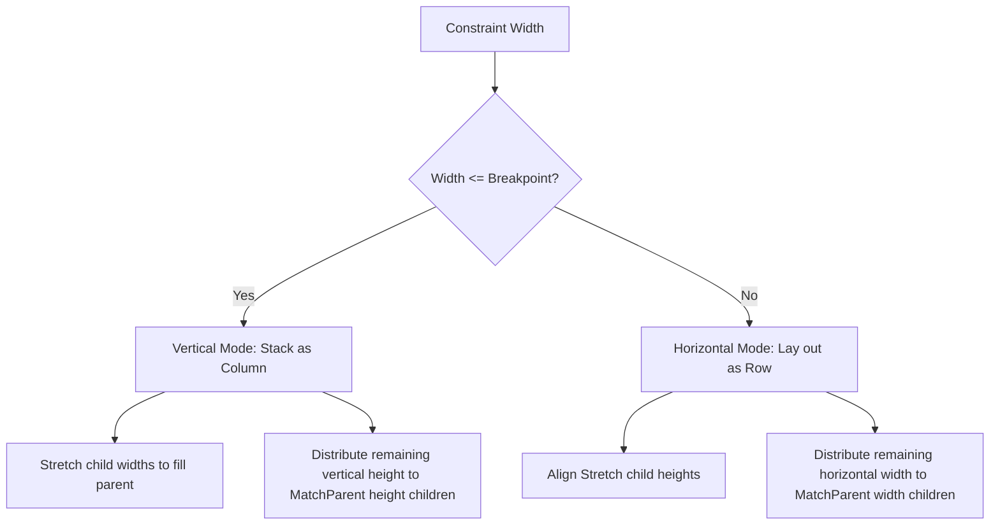

# Responsive All-Screen Display Layout — Technical History Log

**Date:** 2026-06-01  
**Author:** Antigravity AI Coding Assistant  

---

## 1. Context & Problem Statement

Following the successful implementation of native compilation, hardware acceleration (Vulkan/EGL), and high-DPI auto-scaling on Android, we encountered screen usability issues on portrait-aspect mobile screens.

Widescreen layouts designed for landscape desktop ratios (such as the 3-panel system metric cards and the side-by-side process table and theme selector) overflowed horizontally on mobile screens (where logical width is typically 360–540 pixels). Interactive panels clipped, rendering the dashboard unusable on portrait phones.

To resolve this, OOEY required a **responsive layout infrastructure** that could:
* **Reflow Content Automatically:** Adapt layout orientation dynamically as screen bounds change.
* **Avoid Mobile Clipping:** Stack wide rows vertically on narrow displays and fit them safely within the viewport.
* **Proportionally Allocate Stack Heights:** Prevent stacked `MatchParent` height controls (like DataGrid tables) from fighting for space or overflowing, distributing remaining vertical viewport height correctly.
* **Conserve Vertical Space:** Enable items like button lists to arrange compactly (e.g., 2x2 grids) on mobile screens.

---

## 2. Design & Refactoring Details

We introduced a hybrid approach incorporating orientation-aware containers and reflowing flow-panels.

### 2.1 The `AdaptiveStack` Layout
We designed `AdaptiveStack` as a dynamic layout component inheriting from `View` that implements two distinct measure and layout passes:

* **Breakpoint Transition**: Evaluates the incoming constraint width during the measure pass. If it falls below a configurable breakpoint (default: 680px), it transitions to Column mode; otherwise, it operates in Row mode.
* **Height Distribution (Vertical Flex)**: In Column mode, if children have `height.policy == SizePolicy::MatchParent`, the available remaining vertical space (after allocating fixed-height elements) is computed and distributed proportionally. This allows a `DataGrid` scrollable table to size itself cleanly inside a vertical stack on mobile.
* **Width Stretching**: Children with fixed or wrap-content width policies are stretched to fill 100% of the container width (minus padding/margins) to provide high readability on mobile screens.

### 2.2 Reflowing Button Grid (`FlowLayout`)
To optimize the theme selection menu:
* Wrapped the selection buttons inside a `FlowLayout` container inside the card panel.
* Set button widths to `160px`.
* On desktop (available panel width 190px), the 160px buttons stack vertically.
* On mobile (available panel width 340px+), two 160px buttons fit side-by-side. The buttons automatically reflow into a compact 2x2 grid, saving 50% of the vertical height taken by the sidebar on mobile.

### 2.3 Viewport scrolling (`ScrollContainer`)
To support vertical scrolling of the entire dashboard screen on portrait displays, we built the `ScrollContainer` component:
* **Natural Height Measurement**: During measure, the container measures the child layout with unconstrained height. If the child's height exceeds the container's bounds, a scrollbar is initialized and child width is adjusted to fit the viewport.
* **Layout Coordinate Offset**: The container positions the child element offset upwards by `-scroll_offset_y`. All recursive layout bounds are calculated relative to this offset, aligning rendering positions and input routing bounds automatically.
* **Touch & Pointer Drag-to-Scroll**: Overrode `on_pointer_event` to capture clicks and drags. Moving pointer events calculate the vertical delta and adjust scrollbar position and offset values in real-time.
* **Implicit Pointer Capture**: Modified the event loop in `Controller` to track the active press target. Once a widget handles `Pressed`, subsequent `Moved` and `Released` events are locked to it, allowing robust dragging of the scrollbar thumb even if the cursor leaves the scrollbar.
* **Parent Scroll Interception**: Implemented touch-slop swipe detection. When a user touches a button or scrollable grid and drags vertically by $\ge 8$ pixels, the controller intercepts the pointer capture, releases/cancels the child control, and transfers capture to the ancestor `ScrollContainer`. This enables fluid swipe-to-scroll anywhere on mobile touchscreens.
* **Unconstrained Size Fallbacks**: Handled unconstrained heights (e.g. $\ge 50000$px) in `View::resolve_height` and `resolve_width`. When nested inside a scroll viewport, `MatchParent` height properties automatically resolve to their natural content wrap/bounds height, resolving the vertical infinite stretch layout bugs.
* **Stable Leaf Size Resolution (DataGrid Feedback Loop Fix)**: Resolved a positive feedback loop where the scroll container height expanded infinitely. The `DataGrid::do_measure` method originally resolved its unconstrained `MatchParent` height using `bounds_.height`. Since `bounds_.height` is updated during the layout pass to reflect the container-allocated size, it grew frame-by-frame. We updated the measurement to resolve against `absolute_bounds` (the read-only declared size set at construction), matching the stable pattern used by `TextBox` and `ListControl` and eliminating the feedback loop.

---

## 3. Implementation Verification & Testing

### 3.1 Unit Testing (`test_layout.cpp`)
We added dedicated tests validating the layout engine's behavior under different width constraints:
* **`LayoutTest.AdaptiveStackHorizontal`**: Asserts that under widescreen constraints (e.g. 800px width), children are positioned horizontally side-by-side with padding and margin offsets resolved correctly.
* **`LayoutTest.AdaptiveStackVertical`**: Asserts that under narrow constraints (e.g. 400px width), children stack vertically. Verifies that child widths are stretched to fill the viewport and that `MatchParent` height children receive their share of remaining vertical space.
* **`LayoutTest.ScrollContainerNoScroll`**: Verifies that when child heights are small, no scrollbar is shown and layouts occupy standard proportions.
* **`LayoutTest.ScrollContainerWithScrollAndDrag`**: Verifies that when child heights overflow, the scrollbar is loaded, child widths scale down, and dragging pointers adjusts scroll offsets and offset coordinates.
* **`LayoutTest.ScrollContainerControllerInterception`**: Verifies that when a press starts on a child button and drag moves past the threshold, the controller intercepts pointer capture, cancels the button state, and transfers dragging control to the `ScrollContainer`.

### 3.2 Compilation & Packaging
* Built the desktop application targets and successfully passed all **54 unit tests**.
* Re-compiled and packaged the Android target using `./build_apk.sh` to package and sign `build_android_arm64-v8a/app.apk` cleanly.
