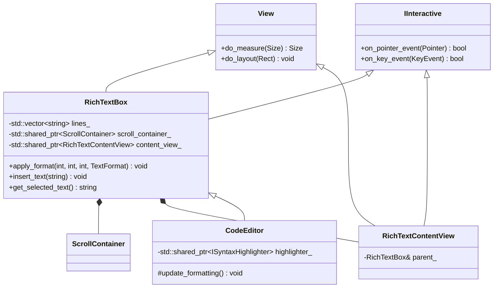
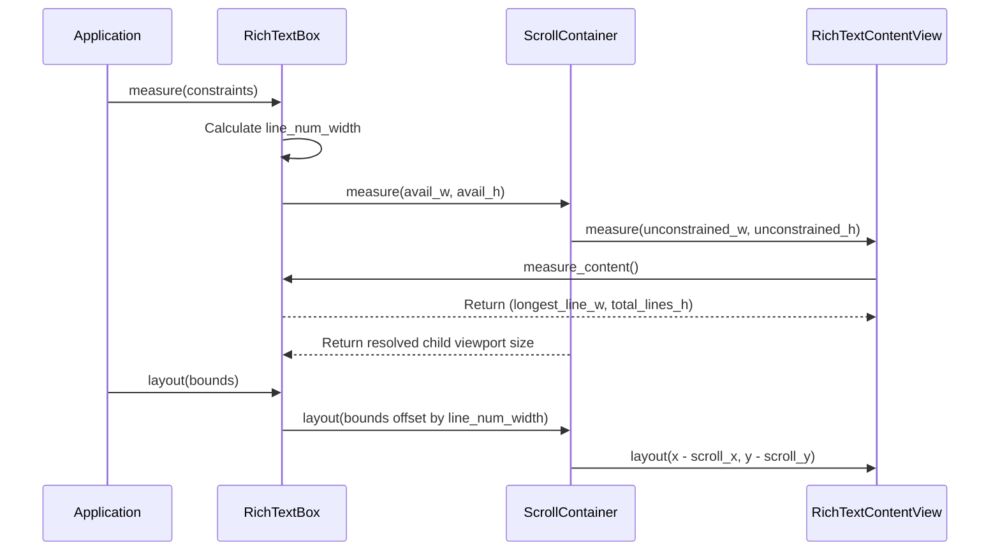

# RichText Control & CodeEditor Refactoring Implementation Log

This document details the architectural redesign, implementation steps, algorithmic calculations, and layout mechanics for the general-purpose `RichTextBox` and its composition with `ScrollContainer` to support advanced editing and syntax highlighting.

---

## 1. Architectural Redesign & Class Decomposition

Originally, `RichTextBox` and `CodeEditor` were combined in a single class that handled text layout, scroll management, and C++ syntax highlighting inline. This made the control inflexible for general-purpose rich text editing.

To resolve this, we separated the codebase into a decoupled hierarchy:



### Decoupled Subcomponents:
1.  **[RichTextBox](file:///home/corey/code/ooey/gooey/include/gooey/controls/rich_text_box.hpp):** Syntax-agnostic core editor. It manages:
    *   Text representation (stored as a `std::vector<std::string>` to keep line mutations fast).
    *   Caret positioning, text selection ranges, and clipboard mutations.
    *   Formatting ranges (`std::vector<std::vector<FormatRange>>`) associated with each line.
2.  **[RichTextContentView](file:///home/corey/code/ooey/gooey/src/controls/rich_text_box.cpp#L73-L111):** An internal helper class inheriting from `View` and `IInteractive`. It acts as the canvas viewport child nested within the scroll container, delegating all rendering and interaction requests directly to the parent `RichTextBox`.
3.  **[CodeEditor](file:///home/corey/code/ooey/examples/codeeditor/code_editor.hpp):** A subclass of `RichTextBox` that overrides `update_formatting()`. Whenever the text changes, it runs the `ISyntaxHighlighter` lexer tokenization on modified lines and translates tokens to specific text colors and styles, using the base class formatting APIs.

---

## 2. ScrollContainer Composition & Nested Layout Flow

We removed all manual scroll offset and scrollbar drawing logic from `RichTextBox` and replaced it with a compostable layout using [ScrollContainer](file:///home/corey/code/ooey/gooey/include/gooey/controls/scroll_container.hpp).

### Composition Initialization
In `RichTextBox::RichTextBox`, the control sets up the child layout structure:
```cpp
scroll_container_ = std::make_shared<ScrollContainer>();
content_view_ = std::make_shared<RichTextContentView>(*this);
scroll_container_->set_child(content_view_);
add_child(scroll_container_);
```

### The Measurement & Layout Pipeline
To prevent line numbers from scrolling horizontally and keep scrollbars sized accurately, the layout pass divides the bounds between the static line-number columns and the scrollable content container:



1.  **Line Number Width Selection:**
    $$W_{\text{line\_num}} = \begin{cases} 
      \max(40, \text{digits} \cdot W_{\text{char}} + 16) & \text{if } \text{show\_line\_numbers} \\
      0 & \text{otherwise}
    \end{cases}$$
2.  **`RichTextBox::do_measure`:** Measures `scroll_container_` with constraints reduced by the line number width ($W_{\text{avail}} = W_{\text{max}} - W_{\text{line\_num}}$).
3.  **`RichTextBox::do_layout`:** Lays out `scroll_container_` at an X coordinate shifted by the line-number gutter width ($X_{\text{viewport}} = X_{\text{bounds}} + W_{\text{line\_num}}$).
4.  **`RichTextContentView::do_measure`:** Requests the content canvas size from `RichTextBox::measure_content`. It queries the character widths of all lines and returns the bounding rectangle representing the complete text size:
    $$W_{\text{content}} = \max_{0 \le i < N} (\text{get\_column\_x\_offset}(i, \text{line\_len}_i)) + 30$$
    $$H_{\text{content}} = N \cdot H_{\text{line}} + 8$$

### Bidirectional Viewport Clamping Resolution

During the two-pass measurement cycle of a nested viewport inside `ScrollContainer`, if a vertical scrollbar is activated, the solver initially attempts to measure the child viewport with a width restricted to the remaining viewport width (`avail_w - 12`). For child views with a size policy other than `MatchParent` (such as `WrapContent` on `RichTextContentView`), measuring with a restricted constraint causes `View::measure` to clamp the resolved width to that constraint:
$$\text{measured\_width} = \min(\text{content\_width}, \text{constraint\_width})$$

Because the resolved child width is clamped to the viewport width, `ScrollContainer` incorrectly concludes that the child's content fits horizontally without overflow, hiding the horizontal scrollbar.

To resolve this, `ScrollContainer::do_measure` resolves layout constraints dynamically. It only clamps the measurement constraints (`cw`, `ch`) to the viewport size if the child's corresponding policy is explicitly set to `MatchParent`:
-   **Width Constraint:**
    $$cw = \begin{cases}
       \max(0, \text{avail\_w} - (\text{needs\_scroll\_y} \ ? \ 12 \ : \ 0)) & \text{if } \text{policy} = \text{MatchParent} \\
       100000 & \text{otherwise}
    \end{cases}$$
-   **Height Constraint:**
    $$ch = \begin{cases}
       \max(0, \text{avail\_h} - (\text{needs\_scroll\_x} \ ? \ 12 \ : \ 0)) & \text{if } \text{policy} = \text{MatchParent} \\
       100000 & \text{otherwise}
    \end{cases}$$

This allows the content view to accurately measure and report its natural unconstrained overflow dimensions to the parent scroll container, properly triggering horizontal scrollbars for wide code lines.

### Invalidation Cache Synchronization

During text entry or format mutations (such as pasting long lines, typing new characters, or splitting lines with the Enter key), the editor must trigger a re-measurement pass. Originally, the control invoked `this->invalidate_layout()` when text changed. 

Because layout invalidation in OOEY propagates strictly **upwards** to parent nodes (rather than downwards to child views), calling `invalidate_layout()` on `RichTextBox` left the child elements—`scroll_container_` and `content_view_` (`RichTextContentView`)—marked as clean (`is_measure_clean_ = true`). Consequently, during the layout pass:
1.  The layout engine queried the parent `RichTextBox`.
2.  `RichTextBox` measured `scroll_container_`.
3.  `ScrollContainer` saw that its measure state was clean and returned its cached, outdated content size immediately, bypassing `do_measure()`.
4.  As a result, changes to line lengths or line counts failed to trigger updates in `needs_scroll_x_` / `needs_scroll_y_`, leaving scrollbars invisible.

To resolve this cache starvation, we introduced a private layout invalidation helper, **`invalidate_content_layout()`**, in `RichTextBox`:
```cpp
void RichTextBox::invalidate_content_layout() {
    if (content_view_) {
        content_view_->invalidate_layout();
    } else {
        invalidate_layout();
    }
}
```

By explicitly calling `invalidate_layout()` on the nested leaf child (`content_view_`), the dirty flags bubble upwards through the entire composite control hierarchy, ensuring that all cached measurement states are cleared:
$$\text{content\_view\_} \longrightarrow \text{scroll\_container\_} \longrightarrow \text{RichTextBox} \longrightarrow \text{Parent Views} \longrightarrow \text{Root}$$

We replaced all internal `invalidate_layout()` calls inside `RichTextBox` (for font changes, line edits, range selections, key events, and clipboard inserts) with `invalidate_content_layout()`. This guarantees that any content changes correctly trigger layout re-evaluations and display the scrollbars dynamically.

---

## 3. Style-Aware Coordinate Mapping & Text Splitting

A major challenge with formatting text (varying font sizes, weights, and styles on the same line) is that characters do not have a uniform width. Measuring a line using a single font size or style will offset carets and highlight rectangles incorrectly.

### The Line Splitting Algorithm
To render and measure lines correctly, `split_line_into_segments()` splits the line string into individual `StyledSegment`s based on `FormatRange`s, filling gaps with default formatting:

```
Source Line: "const int value = 42;"
Ranges:      [0..5]: Keyword(Blue/Bold), [18..20]: Number(Green)
Resulting Segments:
| "const" (Blue/Bold) | " int value = " (Normal) | "42" (Green) | ";" (Normal) |
```

### Style-Aware Column Offset Calculation
The style-aware coordinate translation resolves character offsets by accumulating character widths from each styled run up to the target column:

```cpp
int RichTextBox::get_column_x_offset(int line_idx, int col) const {
    const std::string& line = lines_[line_idx];
    auto segments = split_line_into_segments(line, formats, default_fmt);
    
    int x_offset = 0;
    int current_col = 0;
    
    for (const auto& seg : segments) {
        int seg_len = static_cast<int>(seg.text.size());
        if (current_col + seg_len <= col) {
            // Whole segment lies before target column
            Font font = font_;
            font.weight = seg.format.weight;
            font.style = seg.format.style;
            if (seg.format.size > 0) font.size = seg.format.size;
            x_offset += FontEngine::measure_text(seg.text, font).width;
            current_col += seg_len;
        } else {
            // Target column lies within this segment
            int prefix_len = col - current_col;
            if (prefix_len > 0) {
                Font font = font_;
                font.weight = seg.format.weight;
                font.style = seg.format.style;
                if (seg.format.size > 0) font.size = seg.format.size;
                x_offset += FontEngine::measure_text(seg.text.substr(0, prefix_len), font).width;
            }
            break;
        }
    }
    return x_offset;
}
```

This dynamic calculation ensures that caret rendering and mouse selection highlighting match the text geometry perfectly:
- **Caret X Location:**
  $$X_{\text{caret}} = X_{\text{content\_view}} + 8 + \text{get\_column\_x\_offset}(\text{cursor\_line}, \text{cursor\_col})$$
- **Selection Highlight Bounds:**
  For line $l$ between selection start column $C_1$ and end column $C_2$:
  $$X_1 = X_{\text{content\_view}} + 8 + \text{get\_column\_x\_offset}(l, C_1)$$
  $$X_2 = X_{\text{content\_view}} + 8 + \text{get\_column\_x\_offset}(l, C_2)$$
  $$\text{Highlight Rect} = [X_1, \ Y_{\text{line}}, \ X_2 - X_1, \ H_{\text{line}}]$$

---

## 4. Selection and Clipboard Mutation Engines

`RichTextBox` implements text selection and clipboard operations:

### Selection State Machine
The selection engine tracks two points: the anchor position (`anchor_line_`, `anchor_col_`) and the cursor position (`cursor_line_`, `cursor_col_`).
- **Mouse Drag Selection:** On pointer presses, the anchor and cursor are set to the clicked character column. As the pointer drags, the cursor updates while the anchor remains static, setting `has_selection_ = true`.
- **Keyboard Selection:** Holding the Shift key adjusts the cursor variables while keeping the anchor position constant. Moving without Shift clears the selection.

### Programmatic Clipboard APIs
*   **[`get_selected_text()`](file:///home/corey/code/ooey/gooey/src/controls/rich_text_box.cpp#L318-L335):** Slices lines between the ordered selection coordinates. If the selection spans multiple lines, it joins the fragments with newline characters (`\n`).
*   **[`insert_text(const std::string& text)`](file:///home/corey/code/ooey/gooey/src/controls/rich_text_box.cpp#L337-L397):**
    1.  If `has_selection_` is true, the selection is removed. If it spans a single line, `lines_[line].erase(col, len)` is called. If multiline, the text before the selection on the first line is merged with the text after the selection on the last line, and intermediate lines are deleted from the vector.
    2.  Splits incoming text by newline boundaries.
    3.  Inserts the first line of the new text at the cursor position on the current line, inserts new line strings into the lines vector, and appends remaining suffix text to the final inserted line.
    4.  Triggers `update_formatting()` and refreshes layout.

---

## 5. Viewport Synchronization & Single-line TextBox Scrolling

### Programmatic Viewport Tracking
To keep the caret visible during typing or keyboard navigation, `scroll_cursor_into_view()` maps the cursor's logical coordinates and requests the scroll container to shift its viewport:

```cpp
void RichTextBox::scroll_cursor_into_view() {
    if (scroll_container_) {
        Size char_size = FontEngine::measure_text("A", font_);
        int line_h = char_size.height + 4;
        
        int cx = get_column_x_offset(cursor_line_, cursor_col_);
        int cy = cursor_line_ * line_h;
        
        // Pass cursor boundary box to container
        scroll_container_->scroll_to_visible(Rect{cx, cy, 2, char_size.height});
    }
}
```

The `ScrollContainer` checks if the target box lies outside its current scroll offsets. If it does, it adjusts the offsets with a 20px padding margin to prevent the caret from hugging the edges:

```cpp
if (rect.y < scroll_offset_y_ + top_margin) {
    set_scroll_offset_y(std::max(0, rect.y - top_margin));
} else if (rect.y + rect.height > scroll_offset_y_ + viewport_h - bottom_margin) {
    set_scroll_offset_y(std::max(0, rect.y + rect.height - viewport_h + bottom_margin));
}
```

### Single-line TextBox Auto-scrolling
For single-line `TextBox` controls (which do not use `ScrollContainer`), scrolling is managed using layout offsets:
1.  **Clip Flag Activation:** Set `clip_children = true` in the constructor to keep overflow text from rendering outside the control's bounding box.
2.  **Horizontal Offset Tuning:** In `TextBox::do_layout`, we measure the full text string and compare it against the available text box width:
    $$W_{\text{text}} = \text{measure\_text}(T)$$
    $$W_{\text{avail}} = W_{\text{bounds}} - W_{\text{padding}} - 20$$
    $$\text{scroll\_x} = \begin{cases}
       W_{\text{text}} - W_{\text{avail}} & \text{if } W_{\text{text}} > W_{\text{avail}} \\
       0 & \text{otherwise}
    \end{cases}$$
3.  **Position Shift:** The internal text primitive position is shifted left by `scroll_x`:
    $$X_{\text{primitive}} = X_{\text{bounds}} + W_{\text{left\_padding}} + 10 - \text{scroll\_x}$$
    This automatically scrolls the cursor and newly entered characters into view as typing progresses.
