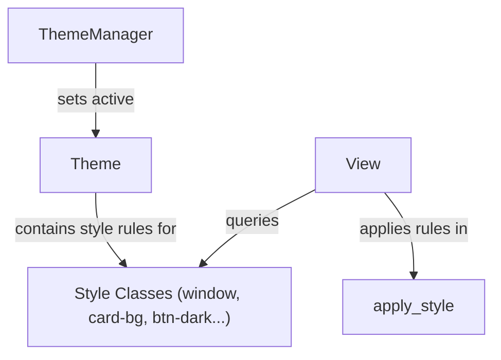

# Real-time System Monitor Dashboard Implementation

## 1. Overview
The **Real-time System Monitor Dashboard** (`hello_sysinfo`) is an example application that showcases OOEY's multi-backend graphics compatibility, the retained-mode scene graph, layout compositions, data binding, and the decoupled Named Style-Name Theme Manager. It provides a visual hardware dashboard showing CPU usage, RAM utilization, available disk space, and a list of running system processes.

---

## 2. Metric Collection Architecture
To query OS performance metrics reliably, the collector runs a cross-platform data pipeline with specific implementations for Linux and Windows:

```
                  +-----------------------------------+
                  |         SystemMonitorViewModel    |
                  +-----------------+-----------------+
                                    |
            +-----------------------+-----------------------+
            | (Linux /proc)                                 | (Win32 Helper APIs)
            v                                               v
  +---------+---------+                           +---------+---------+
  | CPU: /proc/stat   |                           | CPU: GetSystemTimes|
  | RAM: /proc/meminfo|                           | RAM: GlobalMemory |
  | Proc: /proc/[pid] |                           | Proc: Toolhelp32  |
  +---------+---------+                           +---------+---------+
            |                                               |
            +-----------------------+-----------------------+
                                    | (Cross-platform)
                                    v
                       +------------+------------+
                       | Disk: std::filesystem    |
                       +-------------------------+
```

### CPU Utilization
- **Linux**: Reads `/proc/stat` to collect total active cycles versus idle/iowait cycles. The system calculates load using:
  $$\Delta \text{Idle} = \text{Idle}_{\text{curr}} - \text{Idle}_{\text{prev}}$$
  $$\Delta \text{Total} = \text{Total}_{\text{curr}} - \text{Total}_{\text{prev}}$$
  $$\text{CPU \%} = 100.0 \times \frac{\Delta \text{Total} - \Delta \text{Idle}}{\Delta \text{Total}}$$
- **Windows**: Invokes `GetSystemTimes` to fetch idle, kernel, and user times, subtracting idle time from total kernel time to obtain active kernel cycles.

### Memory (RAM) Consumption
- **Linux**: Parses `/proc/meminfo`. It looks for `MemTotal:` and `MemAvailable:` (falling back to `MemFree:` + buffers/cache metrics on older kernels) to determine exact byte counts.
- **Windows**: Invokes the Win32 `GlobalMemoryStatusEx` API to retrieve physical RAM totals and available bytes.

### Available Disk Space
- **Cross-platform**: Employs C++17 `<filesystem>`'s standard `std::filesystem::space(".")` query. It extracts the raw drive capacity and free space bytes, automatically supporting all filesystem configurations without native IOCTL calls.

---

## 3. Real-time Process Harvester
The process listing parses the active process tree to extract running statistics:
- **Linux**: Scans the `/proc` directory, filtering for directories named with numeric PIDs. For each process:
  - Reads `/proc/[pid]/comm` to fetch the executable's short command name.
  - Parses `/proc/[pid]/status` to extract memory usage (`VmRSS:`) and execution state (e.g. `R` (running), `S` (sleeping), `D` (disk sleep)). If VmRSS is unavailable, it calculates memory footprint using page counts from `/proc/[pid]/statm`.
- **Windows**: Creates a process list snapshot using the `CreateToolhelp32Snapshot` API, iterating through active executables via `Process32First` and `Process32Next`, and querying working set memory sizes using `GetProcessMemoryInfo`.
- **Optimization**: To avoid high CPU usage from querying all PIDs on every frame, the ViewModel throttles updates to **once per second** via a delta-time ticker in the rendering callback loop.
- **Data Binding**: The harvester sorts processes in descending order of memory consumption (RSS bytes) and binds the formatted text array directly to the UI's `ListControl`.

---

## 4. Reactive Layout Flow
To ensure efficient use of screen space on varying screen dimensions, the application utilizes OOEY's reactive two-pass layout system rather than static coordinate positioning:
- **Root Card (`StyledPanel`)**: The entire UI is wrapped inside a root `StyledPanel` container (which inherits from `Column`) set to `MatchParent` height and width. This automatically draws the dashboard border frame matching the layout boundaries.
- **Top Row (`Row`)**: Coordinates the three system metrics cards (CPU, RAM, Disk) horizontally. Each metrics card is a `StyledPanel` (`Column`) that lays out its header, numeric value, and description label vertically.
- **Bottom Row (`Row`)**: Allocates space for the primary details, expanding dynamically (`MatchParent` height) to fill the remainder of the vertical screen space.
  - **Process List Column (`Column`)**: Takes a fixed width of `510.0f` and `MatchParent` height, causing the nested process `ListControl` to fill the available height.
  - **Theme Select Column (`StyledPanel`)**: Takes a fixed width of `220.0f` and matches parent height, stacking the toggle buttons vertically.
- **Footer**: Placed at the bottom of the root column with a text label explaining the monitoring metrics.

---

## 5. Theme & Style-Name Configuration
The system leverages OOEY's decoupled theme manager, registering custom style configurations under named classes that map to the views.



### Visual Theme Definitions
1. **Dark (Default)**:
   - Window background: Deep charcoal (`#121216`).
   - Cards: Rounded dark gray containers (`#1C1C21`) with thin borders.
   - Text & Accents: High-contrast white values and cyan/gold highlights.
2. **Light Clean**:
   - Window background: Warm gray/white (`#F2F2F7`).
   - Cards: Pure white containers (`#FFFFFF`) with subtle shadow lines.
   - Text & Accents: Dark charcoal values with deep navy highlights.
3. **Hacker Green**:
   - Window background: Pitch black (`#000000`).
   - Cards: Black blocks with thick phosphor green borders (`#00FF00`) and sharp $90^\circ$ corners.
   - Text & Accents: Monochromatic phosphor green values resembling early CRT terminals.
4. **Soft Lofi**:
   - Window background: Pastel warm cream (`#F6EEE9`).
   - Cards: Soft sepia blocks (`#ECE0DA`) with terracotta text and extra rounded corners ($18\text{px}$ radius).

---

## 6. Theme-Aware Controls Integration

### Dynamic ListBox Styling (`apply_style` in ListControl)
To make listboxes match the selected theme, `ListControl` overrides the `apply_style` virtual hook:
- It maps the theme's card fill and stroke parameters to list boundaries and background primitives.
- It dynamically maps `highlight_bg_color_` to the theme's border color, and `highlight_text_color_` to the theme's base fill color. This ensures that the selected item's highlight adapts beautifully across all themes (e.g., green highlight in Hacker mode, blue in Dark mode, terracotta in Lofi mode) without hardcoding values in the control itself.

### Active Selector Highlight Toggle
To indicate which theme is active without writing procedural C++ logic, the dashboard assigns a specific named class to each toggle button:
- "Dark Mode" button style: `btn-dark`
- "Light Clean" button style: `btn-light`
- "Hacker Green" button style: `btn-hacker`
- "Soft Lofi" button style: `btn-lofi`
In each theme's style registry, the corresponding button style name is mapped to an active visual state (e.g. bright blue fill in Dark mode), while the other three buttons are styled as inactive outlines. Cycling the theme updates all four buttons concurrently, updating their appearance declaratively.

---

## 7. How to Run
To compile and execute the system monitor example:
1. Enter the build directory:
   ```bash
   cd build
   ```
2. Build the project targets:
   ```bash
   make -j4
   ```
3. Run the dashboard executable:
   ```bash
   ./examples/hello_sysinfo
   ```
