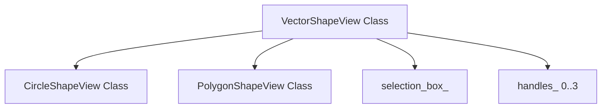
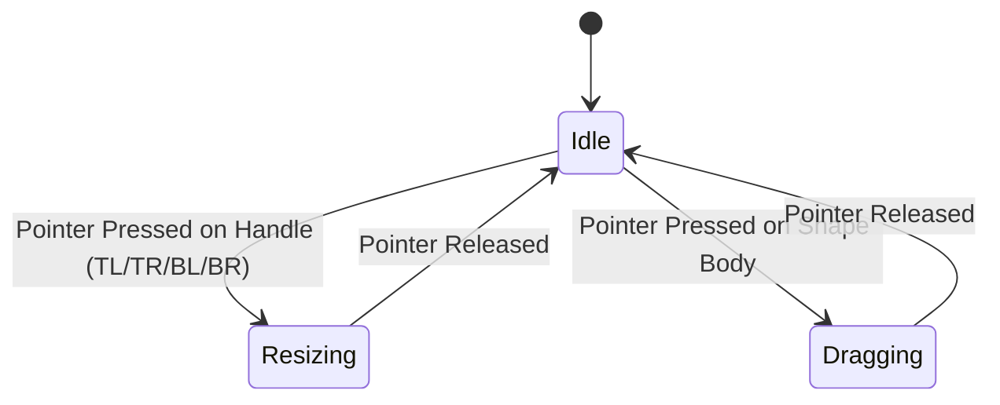

# Vector Paint Application & CanvasLayout Implementation Log

This document details the architectural decisions, interactive coordinate math, resizing state-machine equations, and shape scaling algorithms used to build the absolute-positioned `CanvasLayout` and the vector paint application (`hello_paint`).

---

## 1. Absolute Placement Container & Canvas Event Routing

In the standard OOEY layout engine, child views are positioned sequentially using stack layout algorithms (`Row`, `Column`, `Grid`). To support a drawing canvas, we implemented absolute positioning:

### [CanvasLayout Container](file:///home/corey/code/ooey/gooey/include/gooey/controls/canvas_layout.hpp)
`CanvasLayout` enables absolute vector layouts:
-   **Placement Engine (`do_layout`):** In standard layout views, coordinates are resolved relative to the parent container. When placing children inside `CanvasLayout`, the children are marked with `is_absolute = true`. The layout engine respects their raw `absolute_bounds` and translates them into screen space:
    $$X_{\text{screen}} = X_{\text{canvas}} + X_{\text{child\_absolute}}$$
    $$Y_{\text{screen}} = Y_{\text{canvas}} + Y_{\text{child\_absolute}}$$
-   **Canvas Pointer Capture:** `CanvasLayout` intercepts pointer events. If a click does not hit any child shape control, `on_pointer_event` handles it and fires the `on_canvas_pointer` event callback, allowing the paint program to start drawing gestures.

---

## 2. Interactive Shape Selection & Transformation State Machine

All vector shapes inherit from the abstract base class [VectorShapeView](file:///home/corey/code/ooey/gooey/include/gooey/controls/vector_shape_view.hpp):



### Visual Adorners and Handles
When a shape is selected (`is_selected_ = true`), `VectorShapeView::draw` renders a selection border around the shape bounds along with four resizing handles at the corners:
-   **Resizing Handles:** $8 \times 8$ pixel white squares with a blue outline (`Color{0, 120, 215}`) positioned at:
    *   **Top-Left (TL, Index 0):** $(X - 4, \ Y - 4)$
    *   **Top-Right (TR, Index 1):** $(X + W - 4, \ Y - 4)$
    *   **Bottom-Left (BL, Index 2):** $(X - 4, \ Y + H - 4)$
    *   **Bottom-Right (BR, Index 3):** $(X + W - 4, \ Y + H - 4)$

### Interaction State Transitions
When `on_pointer_event` receives a `Pressed` pointer state, it performs hit-testing in two passes:



1.  **Handle Hit-Testing:** Compares pointer coordinates against the four corner handle areas. We use an expanded $12 \times 12$ bounding box for touch-friendly click targets. If a handle is clicked, the mode transitions to `ShapeInteractionMode::Resizing`, caching the active `resize_handle_` index (0-3).
2.  **Body Hit-Testing:** If no handles match, we call the virtual `hit_test(px, py)` method. If it succeeds, the mode transitions to `ShapeInteractionMode::Dragging` and the shape is selected.
3.  **Coordinate Caching:** Caches the current pointer position in `last_pointer_x_` and `last_pointer_y_` to calculate relative movements.

### Resizing and Dragging Mathematics
Upon receiving a `Moved` event, we calculate the pointer displacement delta:
$$dx = e.x - \text{last\_pointer\_x}$$
$$dy = e.y - \text{last\_pointer\_y}$$

*   **Dragging Mode:** Shifts the bounding box position directly:
    $$X_{\text{new}} = X_{\text{old}} + dx$$
    $$Y_{\text{new}} = Y_{\text{old}} + dy$$

*   **Resizing Mode:** Adjusts the bounding box dimensions based on the active handle:
    *   **TL (Index 0):** Moves the top-left corner, adjusting both position and size:
        $$X \leftarrow X + dx, \quad W \leftarrow W - dx$$
        $$Y \leftarrow Y + dy, \quad H \leftarrow H - dy$$
    *   **TR (Index 1):** Moves the top-right corner, shifting Y position:
        $$W \leftarrow W + dx$$
        $$Y \leftarrow Y + dy, \quad H \leftarrow H - dy$$
    *   **BL (Index 2):** Moves the bottom-left corner, shifting X position:
        $$X \leftarrow X + dx, \quad W \leftarrow W - dx$$
        $$H \leftarrow H + dy$$
    *   **BR (Index 3):** Moves the bottom-right corner, extending both dimensions:
        $$W \leftarrow W + dx$$
        $$H \leftarrow H + dy$$

*   **Boundary Enforcement:** To prevent shapes from flipping (negative dimensions) when dragged past the opposite boundary, the state machine enforces a minimum size of $15 \times 15$ pixels.

---

## 3. Vertex Normalization & Subclass Implementation

To ensure shapes scale correctly when resized, we implemented specialized layout resolution logic in the shape subclasses:

### `CircleShapeView`
*   **Geometry:** Uses a single `CirclePrimitive` child.
*   **Hit-Test Check:** Determines if the pointer is within the circle's radius:
    $$(e.x - \text{cx})^2 + (e.y - \text{cy})^2 \le r^2$$
*   **Layout Resolution:** Resolves the circle's geometry relative to the bounding box:
    $$\text{cx} = X + \frac{W}{2}, \quad \text{cy} = Y + \frac{H}{2}$$
    $$r = \frac{\min(W, H)}{2}$$

### `PolygonShapeView`
If we stored raw absolute vertices, resizing the bounding box wouldn't scale the polygon's vertices. To fix this, we normalize the vertices:

1.  **Normalization during Construction:**
    When the polygon is created, we calculate its bounding box bounds ($X, Y, W, H$). We then store each vertex as a normalized relative ratio $(rx_i, ry_i) \in [0.0, 1.0]$:
    $$rx_i = \frac{x_i - X}{W}$$
    $$ry_i = \frac{y_i - Y}{H}$$
2.  **Scale Resolution in `do_layout`:**
    When the bounds change (due to dragging or resizing), the normalized coordinates are scaled back to screen space:
    $$sx_i = X_{\text{bounds}} + rx_i \cdot W_{\text{bounds}}$$
    $$sy_i = Y_{\text{bounds}} + ry_i \cdot H_{\text{bounds}}$$
    The scale-resolved points are then updated in the underlying `PolygonPrimitive`.
3.  **Ray-Casting Hit-Testing (Even-Odd Rule):**
    Determines if a click falls inside an arbitrary polygon shape. We cast a horizontal ray to the right of the point and count how many edge segments it intersects:

```cpp
bool is_point_in_polygon(Point p, const std::vector<Point>& poly) {
    int n = poly.size();
    if (n < 3) return false;
    bool inside = false;
    for (int i = 0, j = n - 1; i < n; j = i++) {
        if (((poly[i].y > p.y) != (poly[j].y > p.y)) &&
            (p.x < (poly[j].x - poly[i].x) * (p.y - poly[i].y) / (float)(poly[j].y - poly[i].y) + poly[i].x)) {
            inside = !inside;
        }
    }
    return inside;
}
```

---

## 4. Paint Gesture State Machines

`hello_paint` implements drawing state machines for circles and polygons:

### Circle Drawing Mode
1.  **Pressed:** Saves the canvas-local starting point $(X_{\text{start}}, Y_{\text{start}})$ and instantiates a `CircleShapeView` with a radius of 2px. The shape's interaction is disabled during creation to prevent it from intercepting its own creation gestures.
2.  **Moved:** Calculates the distance between the cursor and the starting point:
    $$dx = e.x - X_{\text{start}}, \quad dy = e.y - Y_{\text{start}}$$
    $$r = \sqrt{dx^2 + dy^2}$$
    The shape bounds are set to center around the starting point:
    $$X = X_{\text{start}} - r, \quad Y = Y_{\text{start}} - r, \quad W = 2r, \quad H = 2r$$
3.  **Released:** Enables interaction for the circle and adds it to the canvas. If the radius is smaller than 5px, it is discarded to prevent accidental dot drawings.

### Polygon Drawing Mode
Unlike circles, drawing a polygon requires click-by-click interaction:
1.  **Pressed:** Adds the clicked point to a temporary point list. During active drawing, we add a duplicate point to represent the floating vertex that follows the cursor. A preview `PolygonPrimitive` is created and rendered directly on the canvas.
2.  **Moved:** Updates the floating vertex point to track the cursor coordinate, rendering a real-time guideline.
3.  **Finalization:** Clicking a "Finish Polygon" button or pressing the Enter key converts the accumulated screen coordinates to canvas-local coordinates, instantiates a `PolygonShapeView` containing the vertices, and cleans up the temporary preview drawing.
