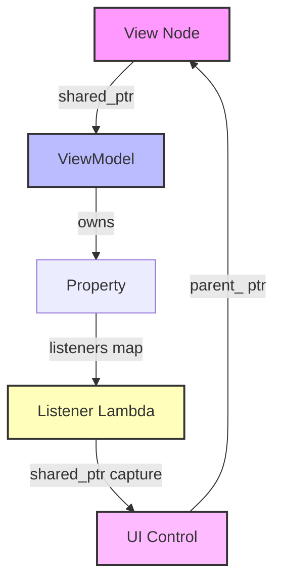
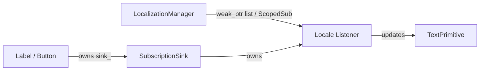

# Rearchitecting OOEY: Design for a Robust, Leak-Free UI Framework

This document outlines the architectural analysis of memory leak vectors in C++ MVVM UI frameworks and details the step-by-step changes required to ensure that developers using the OOEY library cannot easily introduce memory leaks or dangling-pointer edge cases.

---

## 1. Vulnerability Analysis: How Leaks Occur in C++ MVVM

In a traditional garbage-collected language (like C# or Java), cyclic references between the View, ViewModel, and Controls are resolved automatically by the garbage collector. In C++, where lifetimes are managed via reference counting (`std::shared_ptr`) and RAII, cyclic references lead to permanent memory leaks.

There are four primary vectors where reference cycles and leaks are introduced in the OOEY framework:

### Vector A: The View-to-ViewModel Property Binding Cycle
When a View binds a UI control to a ViewModel property, it uses the `bind()` API:
```cpp
bind(vm->volume, [volume_scroll](float val) {
    volume_scroll->set_value(val);
});
```
* **The Cycle**: 
  1. The `View` owns the `volume_scroll` control (via `std::shared_ptr`).
  2. The `bind()` call registers a lambda listener in the `volume` property inside the `ViewModel`.
  3. This lambda captures `volume_scroll` strongly as a `std::shared_ptr`.
  4. The `View` also retains a `std::shared_ptr` to the `ViewModel` to set up bindings.
  5. **Resulting Loop**: `View` $\rightarrow$ `ViewModel` $\rightarrow$ `Property` $\rightarrow$ `Lambda` $\rightarrow$ `ScrollBar` $\rightarrow$ `View`.



### Vector B: ViewModel-Capturing Event Callbacks
UI controls trigger events (e.g., `on_click`, `on_value_changed`) that update ViewModel state. A developer might write:
```cpp
volume_scroll->on_value_changed = [vm](double val) {
    vm->volume.set(val);
};
```
* **The Cycle**:
  1. The `View` owns `volume_scroll`.
  2. The `volume_scroll->on_value_changed` callback captures `vm` strongly.
  3. The `View` owns `vm` (or `vm` owns the view in some configurations).
  4. **Resulting Loop**: `View` $\rightarrow$ `ScrollBar` $\rightarrow$ `on_value_changed` $\rightarrow$ `ViewModel` $\rightarrow$ `View`.

### Vector C: Cyclic Navigation History
Navigation managers (like `NavigationCoordinator`) keep a history of visited pages:
```cpp
std::vector<std::shared_ptr<PageViewModelBase>> history_;
```
If each page ViewModel retains a strong reference back to the coordinator (e.g., to handle transitions):
```cpp
std::shared_ptr<NavigationCoordinator> coordinator_;
```
A cycle is formed: `NavigationCoordinator` $\rightarrow$ `history_` $\rightarrow$ `PageViewModel` $\rightarrow$ `coordinator_` $\rightarrow$ `NavigationCoordinator`. The entire navigation backstack is leaked at exit.

### Vector D: Dynamic View Insertion and Weak Parent Linkage
When container controls (like `ListControl` or `ScrollContainer`) host dynamic child views, clearing or swapping those views can leave dangling references if the parent-child relationships are not properly cleared, or if child controls retain parent views strongly.

---

## 2. Architectural Pivot: The Leak-Free UI Rules

To eliminate these risk vectors, the OOEY framework must adopt four fundamental ownership rules:

```
┌────────────────────────────────────────────────────────┐
│               UNIDIRECTIONAL OWNERSHIP RULE            │
├───────────────────────────┬────────────────────────────┤
│ Ownership Direction (★)  │ Reference Type             │
├───────────────────────────┼────────────────────────────┤
│ Parent View -> Child View │ std::shared_ptr (Strong)   │
│ Child View -> Parent View │ Raw pointer / std::weak_ptr│
│ View -> ViewModel         │ std::shared_ptr (Strong)   │
│ ViewModel -> View/Control │ std::weak_ptr (Weak Only)  │
└───────────────────────────┴────────────────────────────┘
```

1. **Unidirectional View-to-ViewModel Binding**: The View may own the ViewModel, but the ViewModel (and its properties) must **never** hold a strong reference back to the View or any UI controls.
2. **Weak-Binding by Default**: The binding API must enforce capturing UI targets weakly.
3. **Weak-Event Registration**: Event callbacks on UI controls that target the ViewModel or View must be registered using weak-reference helper methods.
4. **Weak Navigation References**: ViewModels must never hold strong references to their parent navigation coordinators.

---

## 3. Detailed Step-by-Step Rearchitecture Plan

### Step 1: Implement Weak-Binding APIs in `GooeyElement`
Add a new set of `bind` overloads to `GooeyElement` that accept a `std::weak_ptr<Target>` and a member function or callback. This ensures that the listener lambda registered in the ViewModel's property only retains a weak reference to the UI control.

#### Implementation in `gooey/include/gooey/mvvmc/gooey_element.hpp`:
```cpp
// Bind a property to a member function of a control using weak reference
template <typename T, typename Target, typename ClassType>
void bind(Property<T>& property, std::weak_ptr<Target> target, void (ClassType::*member_func)(const T&)) {
    static_assert(std::is_base_of_v<ClassType, Target>, "Target must derive from ClassType");
    
    sink_.add(property.subscribe([weak_target = std::move(target), member_func](const T& val) {
        if (auto locked = weak_target.lock()) {
            (locked.get()->*member_func)(val);
        }
    }));
}

// Bind a property to a lambda callback targeting a control weakly
template <typename T, typename Target, typename Func>
void bind_weak(Property<T>& property, std::weak_ptr<Target> target, Func&& callback) {
    sink_.add(property.subscribe([weak_target = std::move(target), callback = std::forward<Func>(callback)](const T& val) {
        if (auto locked = weak_target.lock()) {
            callback(locked.get(), val);
        }
    }));
}
```

* **Usage**:
```cpp
// Safe weak member-function binding
bind(vm->digital_time, std::weak_ptr<Label>(digital_label), &Label::set_text);

// Safe weak lambda binding
bind_weak(vm->hour_angle, std::weak_ptr<LinePrimitive>(hour_hand), [](LinePrimitive* hand, float angle) {
    int ex = static_cast<int>(cx + len_h * std::sin(angle));
    int ey = static_cast<int>(cy - len_h * std::cos(angle));
    hand->set_end({ex, ey});
});
```

---

### Step 2: Implement Safe Event Hooking on Controls
Rearchitect control events (like `Button::on_click` or `ScrollBar::on_value_changed`) to discourage strong lambda captures. Provide standard registration methods that bind weakly.

#### Implementation in `gooey/include/gooey/controls/button.hpp`:
```cpp
class Button : public GooeyElement {
public:
    // ... existing constructors ...

    // Raw std::function callback (kept for backward compatibility, but marked as unsafe)
    std::function<void()> on_click;

    // Safe registration method
    template <typename Target>
    void set_on_click(std::weak_ptr<Target> target, void (Target::*member_func)()) {
        on_click = [weak_target = std::move(target), member_func]() {
            if (auto locked = weak_target.lock()) {
                (locked.get()->*member_func)();
            }
        };
    }

    template <typename Target, typename Func>
    void set_on_click_weak(std::weak_ptr<Target> target, Func&& callback) {
        on_click = [weak_target = std::move(target), callback = std::forward<Func>(callback)]() {
            if (auto locked = weak_target.lock()) {
                callback(locked.get());
            }
        };
    }
};
```

* **Usage**:
```cpp
// Before (Unsafe):
start_btn->on_click = [vm]() { vm->on_start_clicked(); };

// After (Safe):
start_btn->set_on_click(std::weak_ptr<Page1ViewModel>(vm), &Page1ViewModel::on_start_clicked);
```

---

### Step 3: Rearchitect `ListControl` Item View Lifecycles
Ensure that dynamic item views inserted into custom controls are fully tracked and unlinked when modified.

#### Refactoring `ListControl::set_item_views` in `gooey/src/controls/list_control.cpp`:
Ensure that *all* previously set views have their `parent_` relationship severed, regardless of whether they are currently in the active layout children list or scrolled out of view.

```cpp
void ListControl::set_item_views(const std::vector<std::shared_ptr<GooeyElement>>& views) {
    // 1. Sever parent-child linkages for all previous views (preventing dangling parent pointers)
    for (const auto& old_view : item_views_) {
        if (old_view) {
            old_view->set_parent(nullptr);
            remove_child(old_view); // remove if in current active rendering children
        }
    }
    
    // 2. Assign new views and establish linkage
    item_views_ = views;
    for (const auto& view : item_views_) {
        if (view) {
            view->set_parent(this);
            view->set_theme_manager(get_theme_manager());
        }
    }
    
    // 3. Reset scroll and index tracking
    if (selected_index_ >= static_cast<int>(item_views_.size())) {
        selected_index_ = item_views_.empty() ? 0 : static_cast<int>(item_views_.size()) - 1;
    }
    if (scroll_offset_ + visible_count_ > static_cast<int>(item_views_.size())) {
        scroll_offset_ = std::max(0, static_cast<int>(item_views_.size()) - visible_count_);
    }
    
    invalidate_layout();
}
```

---

### Step 4: Strict Compiler/Linter Enforcement with Clang-Tidy
Configure custom `clang-tidy` rules to detect and warn against capturing `std::shared_ptr` or `this` in lambda callbacks within GUI code.

#### Add `clang-tidy` warnings in `.clang-tidy`:
Configure the linter to flag:
- Capturing `this` in lambda expressions inside View constructors (recommend `std::weak_ptr` conversion).
- Capturing `std::shared_ptr` by value in callback lambdas.

```yaml
Checks: '-*,bugprone-*,performance-*,readability-*,cppcoreguidelines-c-copy-assignment-signature,cppcoreguidelines-special-member-functions'
WarningsAsErrors: 'bugprone-use-after-free,bugprone-dangling-handle'
```

---

## 4. Verification Checklists for Developers

When building UI components using the OOEY library, developers should verify against the following checklist to ensure 100% leak-free code:

* [ ] **No Strong Lambda Captures of VMs in Views**: Check that all view click/event handlers capture the ViewModel as a `std::weak_ptr`, or use `set_on_click` to bind callbacks.
* [ ] **No Strong Lambda Captures of UI Controls in Bindings**: Ensure all property bindings use `bind_weak` or pass the `std::weak_ptr` of the target control.
* [ ] **Weak Parent References**: ViewModels that reference parent ViewModels or coordinators must store them in `std::weak_ptr`.
* [ ] **Transient View Destruction**: Verify that views dynamically added to or cleared from containers (`GooeyNode::clear_children()`) have their destructors triggered immediately.

## 5. Eliminating Verbosity: Designing Developer-Friendly, Encapsulated APIs

While safety is critical, requiring developers to write complex `std::weak_ptr` or `std::shared_ptr` template boilerplate for basic UI callbacks and property bindings is a major usability obstacle. 

We can solve this problem using **C++ template argument deduction (CTAD)**, **implicit conversions**, and **overloaded APIs** that completely hide the underlying weak pointer mechanics from the application developer.

### Solution 1: Direct `shared_ptr` Overloads with Implicit Weak Conversion
Instead of forcing the developer to pass a `std::weak_ptr` explicitly, we overload the framework's binding and event registration APIs to accept standard `std::shared_ptr` references directly. Under the hood, the framework automatically converts them to `std::weak_ptr` in the captured lambda closures.

#### Safe, Zero-Boilerplate Event Registration:
```cpp
template <typename Target>
void set_on_click(const std::shared_ptr<Target>& target, void (Target::*member_func)()) {
    // The shared_ptr is converted to a weak_ptr inside the lambda closure automatically
    on_click = [weak_target = std::weak_ptr<Target>(target), member_func]() {
        if (auto locked = weak_target.lock()) {
            (locked.get()->*member_func)();
        }
    };
}
```
* **Developer Code**:
  ```cpp
  // 100% clean, no std::weak_ptr or template typing required
  start_btn->set_on_click(vm, &Page1ViewModel::on_start_clicked);
  ```

#### Safe, Zero-Boilerplate Property Bindings:
We overload the `bind` functions in `GooeyElement` to accept `std::shared_ptr<Target>` directly:
```cpp
template <typename T, typename Target, typename ClassType>
void bind(Property<T>& property, const std::shared_ptr<Target>& target, void (ClassType::*member_func)(const T&)) {
    static_assert(std::is_base_of_v<ClassType, Target>, "Target must derive from ClassType");
    
    sink_.add(property.subscribe([weak_target = std::weak_ptr<Target>(target), member_func](const T& val) {
        if (auto locked = weak_target.lock()) {
            (locked.get()->*member_func)(val);
        }
    }));
}
```
* **Developer Code**:
  ```cpp
  // Binds the digital_time property to digital_label weakly, without explicit weak_ptr construction
  bind(vm->digital_time, digital_label, &Label::set_text);
  ```

---

### Solution 2: The `weak` Template Type Deduction Helper
For lambda bindings where a member function cannot be used directly, we introduce a global type deduction helper function `weak(ptr)` (similar to standard template libraries). This allows constructing a weak pointer without typing its full type template.

#### Helper Implementation:
```cpp
template <typename T>
std::weak_ptr<T> weak(const std::shared_ptr<T>& ptr) {
    return std::weak_ptr<T>(ptr);
}
```

* **Usage in Lambda Bindings**:
  ```cpp
  // Before (Wordy):
  bind_weak(vm->hour_angle, std::weak_ptr<LinePrimitive>(hour_hand), [](LinePrimitive* hand, float angle) { ... });

  // After (Encapsulated and Concise):
  bind_weak(vm->hour_angle, weak(hour_hand), [](LinePrimitive* hand, float angle) {
      hand->set_end(calculate_endpoint(angle));
  });
  ```

---

### Solution 3: Declarative Compiler Integration (`.ooey` Codegen)
Since OOEY includes `tooey_compiler` to compile declarative UI layouts into C++ code, the code generator can automatically generate these weak captures during compilation.

When a developer writes a declarative binding:
```tooey
Button {
    text: "Back",
    on_click: vm.on_back_clicked
}
```
The compiler automatically translates this into the safe, weak-capturing overload:
```cpp
back_btn->set_on_click(vm, &Page1ViewModel::on_back_clicked);
```
This guarantees that UI code built via declarative files has **zero chance** of reference cycles or leaks without the developer ever knowing about weak pointers or C++ memory safety details.

---

## 6. Architectural Comparison

| Feature | Current Architecture | Safe & Verbose | Proposed Encapsulated & Friendly |
| :--- | :--- | :--- | :--- |
| **Property Bindings** | Captures strongly (leaks). | `bind(p, std::weak_ptr<T>(ctrl), ...)` | `bind(p, ctrl, &T::func)` (automatic weak deduction) |
| **Event Callbacks** | `on_click = [vm]() { ... }` | `set_on_click(std::weak_ptr<VM>(vm), ...)` | `set_on_click(vm, &VM::func)` (automatic weak deduction) |
| **Lambda Helpers** | N/A | `std::weak_ptr<Type>(ptr)` (fully typed) | `weak(ptr)` (type-deduced helper) |
| **Layout Codegen** | Generates raw captures. | N/A | Generates safe, weak C++ bindings under the hood. |

---

## 7. Developer Ergonomics: Fluent APIs and Factory Creators

To make the C++ UI framework highly competitive and a joy to write in native code (without relying solely on declarative files), we can implement **Fluent APIs** (method chaining) and **Factory Creators**. This removes the visual noise of `std::make_shared` and nested allocations.

### 1. Static Factory Creator Functions
Instead of verbose raw construction, every control should expose a static `create()` method returning a `std::shared_ptr` to itself.
```cpp
// Verbose
auto btn = std::make_shared<gooey::Button>(ooey::Rect{0, 0, 100, 40}, ...);

// Ergonomic
auto btn = Button::create("Click Me");
```

### 2. Method Chaining (Fluent Builders)
By returning pointers or references to the active control (`GooeyElement*` or `std::shared_ptr<T>`), properties can be configured inline:
```cpp
auto layout = Column::create()
    ->spacing(12)
    ->add(Label::create("Enter Name:")->font("sans-serif", 14))
    ->add(TextBox::create()->placeholder("Type here..."))
    ->add(Button::create("Submit")->set_on_click(vm, &ViewModel::submit));
```
This mirrors the structural hierarchy of the visual tree directly in native C++ code, making the code self-documenting and extremely clean.

---

## 8. AI-Friendly UI Framework Design

With modern software development increasingly assisted or driven by AI Coding Assistants and autonomous agents (like Gemini, Copilot, and Antigravity), UI frameworks should be designed to be **AI-Friendly**. 

AI-friendliness means the API is optimized for LLM readability, structural generation, and automated error-correction loops.

### 1. Strongly-Typed Mappings over String-Based Mappings
Many UI frameworks use string-based dynamic reflection (e.g. `bind("volume", "scroll_bar")`). This is highly error-prone for AI models, which can easily hallucinate property names or make typos.
* **AI-Friendly Pivot**: Use compile-time checked symbols:
  ```cpp
  bind(vm->volume, scroll_bar, &ScrollBar::set_value);
  ```
  If the AI makes a typo, the C++ compiler fails instantly with a clear error pointing to the line number. This allows the AI's agentic loop to parse the compiler error and self-correct immediately, rather than generating code that compiles but fails silently at runtime.

### 2. Hierarchical and Nested Visual Mappings
LLMs excel at generating tree structures (like JSON, XML, or ASTs) but struggle to keep track of state when coordinates and elements are declared imperatively in a flattened, line-by-line sequence.
* **AI-Friendly Pivot**: A fluent nested builder structure allows the AI to generate the entire UI tree in a single, structurally coherent pass:
  ```cpp
  auto root = Panel::create()
      ->size(800, 600)
      ->child(Header::create("Dashboard"))
      ->child(Row::create()
          ->child(Card::create("Metrics"))
          ->child(Card::create("Activity"))
      );
  ```
  This reduces context tracking requirements for the model and guarantees fewer structural layout mistakes.

### 3. Local CLI Declarative Validators
When writing layout templates in a declarative language (like `.ooey` files), AI agents benefit greatly from offline validation tools before initiating compilation.
* **AI-Friendly Pivot**: Provide a fast parser utility (e.g., `tooey_compiler --validate <file>`) that returns structured error JSON if validation fails. The coding agent can execute this in the background to verify its generated markup before attempting full project compilation.

### 4. Boilerplate-Free Component Templates
AI models generate code by matching patterns from their training data and current context. If a framework requires heavy boilerplate (e.g., registering properties in multiple places), the AI is highly likely to omit a step.
* **AI-Friendly Pivot**: Consolidate declarations. If a Property is defined in the ViewModel, it should be auto-registered in the constructor via reflection, rather than requiring manual registry calls.

---

## 9. Runtime Localization (i18n): Architecture and Leak-Free Swapping

Localization is a critical component of professional application design. Standard approaches in the industry include:
- **GNU gettext**: The Unix standard using translation lookup tables (`_("Hello")`). Highly optimized, but difficult to swap at runtime dynamically because string literals are hardcoded and not reactive.
- **Qt's `tr()` and QTranslator**: A string-lookup mechanism. Re-translation is triggered by catching a language-change event in each widget, which manually sets all string properties again.
- **Android String Resources (`R.string.key`)**: A resource compiler generates integer identifiers for keys, allowing rapid resource swaps under dynamic configuration changes.

To bring dynamic, zero-boilerplate runtime localization to the OOEY framework without introducing memory leak risks, we define a **Reactive Localization Architecture**.

### The Localization Leak Vector
In order to change the user interface language dynamically at runtime, all text-containing UI elements (labels, buttons, textboxes) must listen to the global `LocalizationManager` for locale change events. 

However, since the `LocalizationManager` is a global singleton, if a UI control registers a callback on it:
```cpp
// DANGEROUS: Global singleton holds a strong reference closure to the control!
LocalizationManager::get().on_locale_changed.subscribe([this](const std::string& locale) {
    this->update_localized_text();
});
```
The global singleton keeps the control alive indefinitely. When pages are destroyed or closed, the controls leak. If the subscription captures `this` as a raw pointer instead, it crashes with a `use-after-free` segfault when the locale changes after the page is destroyed.

### The Resolution: RAII-Backed Weak Subscriptions
We resolve this leak risk by integrating the dynamic localization listener directly into the control's base `sink_` via `ScopedSubscription`.



1. **Global `LocalizationManager`**:
   Exposes a reactive `active_locale` property and loaded translations:
   ```cpp
   class LocalizationManager {
   public:
       static LocalizationManager& get();
       
       Property<std::string> active_locale{"en_US"};
       
       std::string translate(const std::string& key) {
           return dictionaries_[active_locale.get()][key];
       }
       
   private:
       std::map<std::string, std::map<std::string, std::string>> dictionaries_;
   };
   ```

2. **The `tr` Translation Wrapper**:
   Define a simple wrapper to hold the key:
   ```cpp
   struct LocalizedString {
       std::string key;
       std::vector<std::string> args; // optional format args
       
       explicit LocalizedString(std::string k) : key(std::move(k)) {}
   };
   
   // Global helper for clean syntax
   inline LocalizedString tr(const std::string& key) {
       return LocalizedString(key);
   }
   ```

3. **Auto-Reactive UI Controls**:
   We overload control factory functions to accept `LocalizedString`. When a control receives a `LocalizedString`, it subscribes to locale changes and stores the subscription in its internal `sink_`.
   ```cpp
   class Label : public GooeyElement {
   public:
       static std::shared_ptr<Label> create(LocalizedString localized_text) {
           auto lbl = std::make_shared<Label>();
           lbl->set_localized_text(std::move(localized_text));
           return lbl;
       }
       
       void set_localized_text(LocalizedString text) {
           localized_key_ = std::move(text);
           
           // Automatically update text when active locale changes
           bind(LocalizationManager::get().active_locale, [this](const std::string& /*locale*/) {
               this->set_text(LocalizationManager::get().translate(localized_key_.key));
           });
       }
       
   private:
       LocalizedString localized_key_{""};
   };
   ```
   * **Result**:
     - The subscription is owned by `sink_`. When the `Label` is destroyed, the subscription is automatically canceled, eliminating the leak vector.
     - Swapping languages at runtime is as simple as `LocalizationManager::get().active_locale.set("es_ES");`—all strings on the screen update instantly and automatically.

### Ergonomics & AI-Friendliness
To satisfy both developer productivity and AI-agent compatibility, we support both **String Keys** and **Enum Identifiers**:

* **Enum-Based Keys (Highly AI-Friendly)**:
  For compile-time validation, we map resource keys to a C++ enum:
  ```cpp
  enum class MsgId {
      Welcome,
      StartWizard,
      Exit
  };
  
  // Usage
  auto btn = Button::create(tr(MsgId::StartWizard));
  ```
  This guarantees that the AI agent cannot generate a translation typo or hallucinate a non-existent key, as the C++ compiler will reject the build.

* **String-Based Keys (Ergonomic)**:
  For flexible localizations:
  ```cpp
  auto btn = Button::create(tr("start_wizard"));
  ```
  Both configurations hide all weak pointer, closure, and subscription registration plumbing.

### Declarative Layout Compiler Integration (Localization-by-Default)
To ensure that localization is built directly into the UI design phase rather than being treated as an afterthought, we integrate localization directly into the `.ooey` file layout compiler (`tooey_compiler`).

1. **Native Translation Syntax**:
   Instead of hardcoding raw strings in visual templates, the `.ooey` DSL syntax natively supports a translation marker:
   ```tooey
   Label {
       text: @tr("welcome_message")
   }
   ```
   
2. **Robust Leak-Free Code Generation**:
   The code generator parses the `@tr` marker and generates the safe, RAII-bound C++ localization setup:
   ```cpp
   auto welcome_lbl = Label::create(tr("welcome_message"));
   ```
   Since the generated code utilizes `Label::create(LocalizedString)` and the underlying weak subscription model, the resulting layout is automatically localized and reactive with **zero risk** of memory leaks or dangling pointers.

3. **Build-Time Translation Extraction**:
   During the build process, `tooey_compiler` parses all `.ooey` layout files and extracts every `@tr` localization key.
   - It outputs a master template translation file (e.g., `messages.pot` or `locales/en_US.json`) automatically.
   - If the compiler detects a `@tr("key")` in a layout file that is missing from the translation dictionaries, it triggers a compilation warning or error. This guarantees that missing translations are caught at compile time before any binary is shipped.

---

## 10. Architectural Comparison


| Feature | Current Architecture | Safe & Verbose | Proposed Encapsulated & Friendly |
| :--- | :--- | :--- | :--- |
| **Property Bindings** | Captures strongly (leaks). | `bind(p, std::weak_ptr<T>(ctrl), ...)` | `bind(p, ctrl, &T::func)` (automatic weak deduction) |
| **Event Callbacks** | `on_click = [vm]() { ... }` | `set_on_click(std::weak_ptr<VM>(vm), ...)` | `set_on_click(vm, &VM::func)` (automatic weak deduction) |
| **Lambda Helpers** | N/A | `std::weak_ptr<Type>(ptr)` (fully typed) | `weak(ptr)` (type-deduced helper) |
| **Layout Codegen** | Generates raw captures. | N/A | Generates safe, weak C++ bindings under the hood. |
| **Runtime Localization** | Manual string setting (hard to update dynamically). | Manual subscription callbacks (highly prone to memory leaks). | `tr("key")` parameters automatically wire weak subscriptions internally. |


