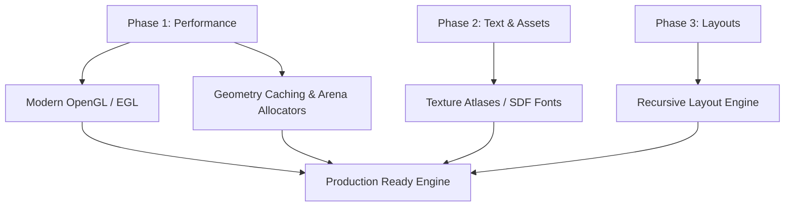

# Architectural Analysis & Technical Roadmap
**Author:** Senior Graphics & UI Software Architect
**Date:** May 29, 2026

This document presents a professional evaluation of the OOEY GUI Engine's architecture. It details what is working well, identifies critical performance and scalability limitations, and provides a clear technical roadmap for long-term project advancement.

---

## 1. What Works Well (Architectural Strengths)

The OOEY GUI Engine possesses several design decisions that align with modern graphical interface development. These elements provide a strong foundation for future expansion.

### A. Decoupled Platform and Rendering Abstractions
- **Structure:** The separation of `IWindowBackend` (window lifecycle, OS events) and `IRenderTarget` (canvas operations) is exceptionally clean.
- **Why it enables expansion:** This modularity permits the engine to support radically different windowing environments (X11, Wayland, raw Linux Framebuffer, Emscripten/WebAssembly) without altering the layout, widget tree, or application logic. Implementing a new platform backend requires implementing only these two core interfaces.

### B. Geometry-Based Retained Scene Graph
- **Structure:** Rendering primitives (e.g., `RectPrimitive`, `CirclePrimitive`, `SinusoidPrimitive`) do not invoke backend-specific APIs. Instead, they compile their visual layouts into a generic `Geometry` structure (containing vertex and index buffers) and submit them to `IRenderTarget::draw_geometry()`.
- **Why it enables expansion:** By restricting the rendering backend API surface to simple `Triangles` and `Lines` draw calls, target implementations remain small and maintainable. This architecture also makes it easy to swap immediate software rasterizers for hardware-accelerated GPU pipelines without changing a single line of widget code.

### C. Reactive MVVM-C Pipeline
- **Structure:** The Model-View-ViewModel-Controller (MVVM-C) implementation uses a reactive `Property<T>` template paired with `ScopedSubscription` lifecycle management.
- **Why it enables expansion:** State changes automatically flow to UI controls without requiring manual, error-prone event wiring. By using template-based subscription sinks, the architecture avoids memory leaks while keeping the API highly readable, expressive, and testable.

### D. Separation of Window backends and UI controls
- **Structure:** The framework is split into `ooey` (low-level driver layer) and `gooey` (high-level UI controls).
- **Why it enables expansion:** This separation allows the low-level platform code to be compiled independently. Embedded systems that do not need buttons, lists, or textboxes can link solely to the core `ooey` library, minimizing final binary footprints.

---

## 2. What Doesn't Work Well (Architectural Bottlenecks)

While the foundation is strong, the current implementation has several bottlenecks that will degrade performance and restrict usability as application complexity increases.

```
+-----------------------------------------------------------------+
|                    Performance Bottlenecks                      |
+-----------------------------------------------------------------+
| Immediate-Mode rendering (X11/GL) -> Dynamic CPU-to-GPU memory  |
|                                      bandwidth bottleneck       |
|                                                                 |
| Per-Frame vector allocations       -> Dynamic memory thrashing  |
|                                      on the stack/heap          |
|                                                                 |
| Pixel-by-pixel font drawing       -> Thousands of draw calls    |
|                                      per text line              |
+-----------------------------------------------------------------+
```

### A. Legacy Immediate-Mode OpenGL (`GlRenderTarget`)
- **Issue:** The OpenGL backend utilizes legacy GL 1.1 immediate-mode loops (`glBegin` / `glEnd` and `glVertex2f`). 
- **The Bottleneck:** This forces CPU-bound serial execution. Pushing vertices one-by-one over the PCIe bus introduces massive driver overhead. For a UI with dozens of widgets and text labels, this results in thousands of draw calls and limits frame rates on modern hardware.

### B. Heap Allocation Pressure in the Render Loop
- **Issue:** On every frame, primitives instantiate a local `Geometry` object and populate `std::vector` buffers for vertices and indices.
- **The Bottleneck:** Calling `std::vector::push_back` continuously causes repeated memory reallocations and heap thrashing during the render pass. This triggers cache misses and degrades performance.

### C. Inefficient Text Rendering Pipeline
- **Issue:** Text is drawn by executing a pixel callback loop from `BitmapFont::draw_text()`:
  ```cpp
  BitmapFont::draw_text(text, font_size, position, [color](int x, int y, int w, int h) {
      // Draws a rectangle for each glyph pixel block
  });
  ```
- **The Bottleneck:** To draw a single character, the renderer submits dozens of individual pixel blocks. A single line of text can result in hundreds of draw commands. Additionally, the fallback font is limited to standard English ASCII characters, preventing localization.

### D. Lack of a Layout Resolution Engine
- **Issue:** Controls are arranged using static coordinate rectangles (`ooey::Rect{50, 50, 300, 30}`).
- **The Bottleneck:** There is no automatic layout manager (like Flexbox, Grid, or anchoring). When the window is resized, controls must be manually repositioned via custom calculations, preventing the creation of responsive user interfaces.

---

## 3. The Technical Roadmap (How to Fix It)

To scale OOEY into a production-grade framework, the following enhancements should be implemented sequentially:



### Phase 1: Modernize the Graphics Pipeline
1. **Modern OpenGL Target (GL 3.3+ / GLES 2.0+):**
   - Replace `glBegin`/`glEnd` loops with Vertex Buffer Objects (VBOs) and Vertex Array Objects (VAOs).
   - Write a unified vertex/fragment shader program to process geometric positions, colors, and textures.
   - Batch rendering commands: concatenate vertex data from multiple primitives into a single buffer and draw them with a single `glDrawElements` call.
2. **EGL Integration:**
   - Implement EGL support for Wayland and Framebuffer backends to move away from software-based `wl_shm` rendering, enabling hardware-accelerated GPU contexts on those platforms.

### Phase 2: Implement Caching & Memory Management
1. **Geometry Caching:**
   - Primitives should cache their compiled vertex/index buffers. A primitive should only recompile its geometry when its bounds, colors, or visual properties change.
2. **Frame Arena Allocators:**
   - Utilize a custom Arena Allocator for temporary frame allocations. Reset the arena's offset pointer at the start of each frame, reducing heap allocation overhead to nearly zero.

### Phase 3: High-Performance Text Rendering
1. **Glyph Texture Atlases:**
   - Render characters into a single texture atlas during initialization.
   - To render text, submit a single quad per character mapped to corresponding UV coordinates. This reduces text rendering overhead to one draw call per text box.
2. **Signed Distance Fields (SDF):**
   - Upgrade the atlas to use Signed Distance Fields (SDF). This allows fonts to be scaled smoothly to high resolutions without pixelation or memory overhead.

### Phase 4: Build a Layout Engine
1. **Layout Pass:**
   - Introduce a dedicated Layout Pass in `gooey::View` that runs before the rendering pass.
2. **Box Model / Flexbox:**
   - Implement a lightweight layout resolver (similar to CSS Flexbox or GUI anchors) that calculates coordinates and bounds dynamically based on parent-child relationships and constraints, enabling responsive design.
